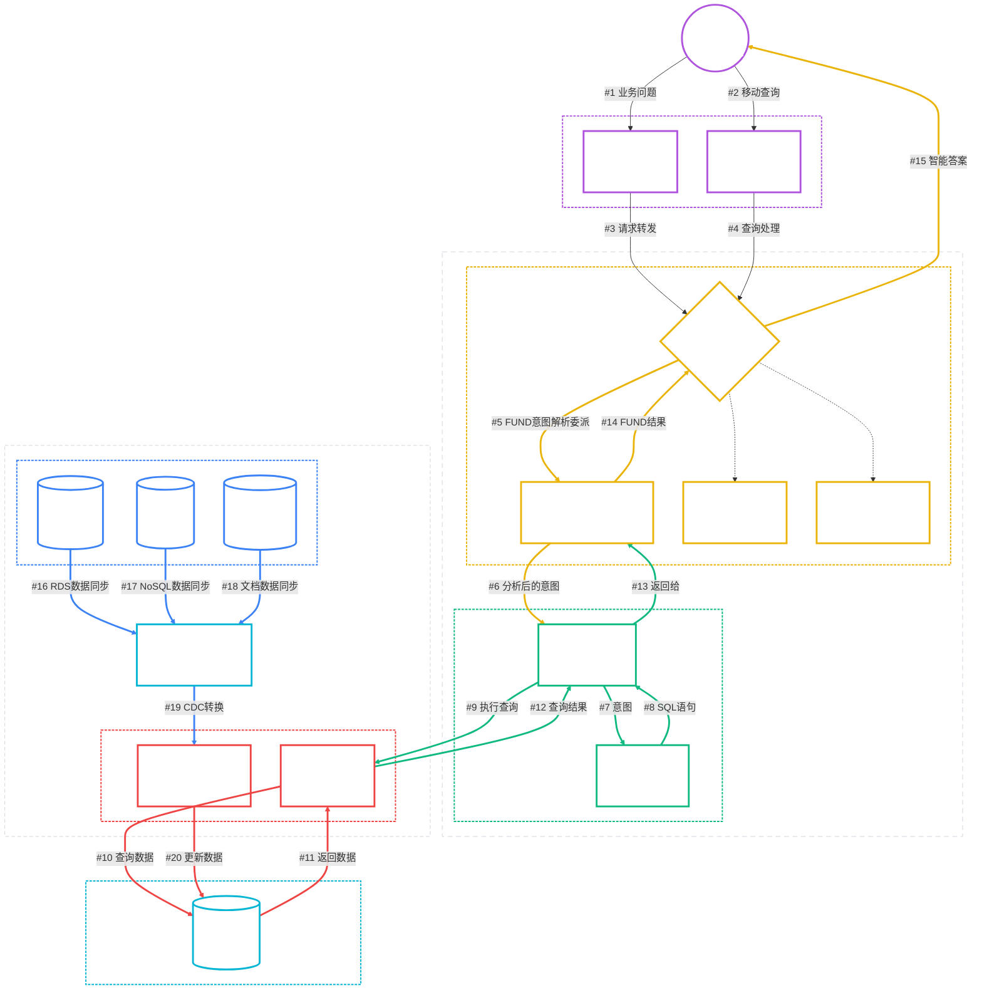

# AI智能决策系统 - Level 1 架构图

**创建日期**: 2025-08-02  
**复杂度级别**: Level 1 - 最高层次系统概览  
**目标受众**: 企业架构师、技术决策者、项目经理  
**用例**: AI智能决策系统顶层架构展示  

## 📋 架构概述

本图展示了AI智能决策系统的最高层次架构，包含用户层、应用层、AI处理层和数据层四个核心层次。系统通过自然语言接口为业务用户提供智能决策支持，实现从业务问题到数据洞察的端到端处理。

## 🏗️ Level 1 系统架构图

## 📊 架构层次分析

### 🏗️ 四层架构设计

| 层次 | 名称 | 职责 | 关键组件 |
|------|------|------|----------|
| **L1** | 👥 用户层 | 用户交互和访问控制 | 业务用户 |
| **L2** | 💻 应用层 | 用户界面和接入管理 | Web界面、移动端 |
| **L3** | 🤖 AI处理层 | 智能分析和决策处理 | AI决策引擎、FUND AGENT、NEW AGENT、OTHER AGENT、FUND MCP |
| **L4** | 📊 数据层 | 数据存储和同步管理 | 统一数据仓库、数据同步、外部系统 |

### 🎯 核心业务流程

#### 主要决策流程 (20步)

##### 核心业务流程（#1-#15）：
1. **#1**: 业务用户 → Web界面（业务问题）
2. **#2**: 业务用户 → APP端（移动查询）
3. **#3**: Web界面 → AI决策引擎（请求转发）
4. **#4**: APP端 → AI决策引擎（查询处理）
5. **#5**: AI决策引擎 → FUND AGENT（FUND意图解析委派）
6. **#6**: FUND AGENT → Text2SQL引擎（分析后的意图）
7. **#7**: Text2SQL引擎 → NL2SQL引擎（意图）
8. **#8**: NL2SQL引擎 → Text2SQL引擎（SQL语句）
9. **#9**: Text2SQL引擎 → 数据库视图（执行查询）
10. **#10**: 数据库视图 → 统一数据仓库（查询数据）
11. **#11**: 统一数据仓库 → 数据库视图（返回数据）
12. **#12**: 数据库视图 → Text2SQL引擎（查询结果）
13. **#13**: Text2SQL引擎 → FUND AGENT（返回给）
14. **#14**: FUND AGENT → AI决策引擎（FUND结果）
15. **#15**: AI决策引擎 → 业务用户（智能答案）

##### 数据同步流程（#16-#20）：
16. **#16**: 外部RDS Sql → 数据同步服务（RDS数据同步）
17. **#17**: 外部NoSQL → 数据同步服务（NoSQL数据同步）
18. **#18**: Statement文档 → 数据同步服务（文档数据同步）
19. **#19**: 数据同步服务 → CDC转换逻辑（CDC转换）
20. **#20**: CDC转换逻辑 → 统一数据仓库（更新数据）
1. **用户提问** → 业务用户通过界面提出自然语言问题
2. **请求路由** → 应用层将请求路由到AI处理层
3. **语言理解** → NL处理模块解析用户意图
4. **查询生成** → Text2SQL引擎生成数据查询
5. **数据检索** → 从统一数据仓库获取相关数据
6. **智能分析** → AI决策引擎分析数据并生成洞察
7. **结果返回** → 将智能答案返回给用户

#### 数据同步流程 (3步)
1. **数据捕获** → 从外部业务系统捕获数据变更
2. **实时同步** → 数据同步服务处理数据转换
3. **数据更新** → 更新统一数据仓库中的业务数据

## 🔧 技术架构特点

### 1. 🎨 分层设计原则
- **职责分离**: 每层专注特定功能领域
- **松耦合**: 层间通过标准接口通信
- **可扩展**: 支持水平和垂直扩展

### 2. 🤖 AI驱动核心
- **自然语言理解**: 支持业务用户直接对话
- **智能决策**: 基于数据的AI推理和分析
- **查询优化**: 自动生成高效的数据查询

### 3. 📊 数据统一管理
- **统一数据仓库**: 集中存储所有业务数据
- **实时同步**: 保证数据的时效性和一致性
- **多源集成**: 支持多个外部业务系统接入

### 4. 💻 多端支持
- **Web集成**: 嵌入现有业务系统
- **移动端**: 独立的AI聊天机器人
- **API接口**: 支持第三方系统集成

## 🔗 相关文档

- [高层架构详细设计](./20250801170000_AI_Decision_System_High_Level_Architecture.md)
- [业务演示文档](./20250801181500_AI_Decision_System_Business_Presentation.md)
- [详细架构设计 - Level 2](./20250801163752_02_Detailed_Architecture_level2.md)
- [实现细节 - Level 3](./20250801163752_03_Implementation_Details_level3.md)

---

**版本**: v1.0
**最后更新**: 2025-08-02
**维护者**: AI架构团队
**文档类型**: Level 1 架构图
