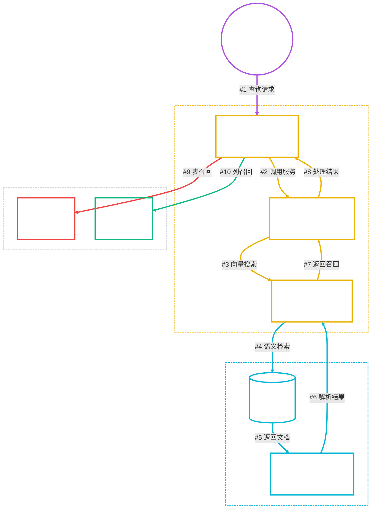
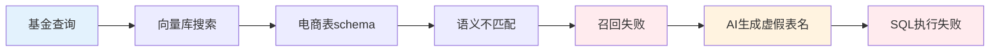
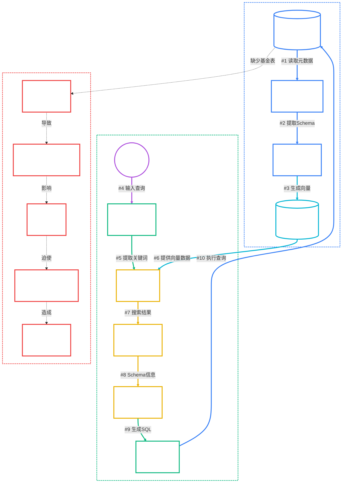

# NL2SQL Schema召回机制深度分析

**创建时间**: 2025-08-10 10:45:00  
**文档类型**: 技术分析  
**分析对象**: Spring AI Alibaba NL2SQL Schema召回流程  

## 📋 目录

- [问题现象](#问题现象)
- [Schema召回原理](#schema召回原理)
- [技术实现分析](#技术实现分析)
- [问题根因分析](#问题根因分析)
- [数据流向图](#数据流向图)
- [解决方案建议](#解决方案建议)

## 🎯 问题现象

### 用户查询
```
查询基金产品的风险等级分布
```

### 系统响应
```
Schema初步召回
开始召回Schema信息...
表信息召回完成，数量: 0 ❌
列信息召回完成，数量: 5 ✅
Schema信息召回完成.
```

### 后续问题
- AI生成虚假表名: `fund_products_table`
- SQL执行失败: 表不存在
- 无法提供有效答案

## 🔄 Schema召回原理

### 核心发现
**NL2SQL的Schema召回不是直接从PostgreSQL数据库获取，而是从Qdrant向量库进行语义搜索！**

### 召回流程



### 数据来源层次

1. **数据库层** (PostgreSQL): 存储实际业务数据
2. **向量库层** (Qdrant): 存储schema的向量化表示
3. **召回层** (Schema Recall): 基于语义搜索召回相关schema
4. **生成层** (AI): 基于召回的schema生成SQL

## 🔧 技术实现分析

### 1. Schema召回节点实现

<augment_code_snippet path="spring-ai-alibaba/spring-ai-alibaba-nl2sql/spring-ai-alibaba-nl2sql-chat/src/main/java/com/alibaba/cloud/ai/node/SchemaRecallNode.java" mode="EXCERPT">
```java
// 智能体特定的schema召回
if (agentId != null && !agentId.trim().isEmpty()) {
    tableDocuments = baseSchemaService.getTableDocumentsForAgent(agentId, input);
    columnDocumentsByKeywords = baseSchemaService.getColumnDocumentsByKeywordsForAgent(agentId, keywords);
} else {
    tableDocuments = baseSchemaService.getTableDocuments(input);
    columnDocumentsByKeywords = baseSchemaService.getColumnDocumentsByKeywords(keywords);
}
```
</augment_code_snippet>

### 2. 向量库搜索实现

<augment_code_snippet path="spring-ai-alibaba/spring-ai-alibaba-nl2sql/spring-ai-alibaba-nl2sql-chat/src/main/java/com/alibaba/cloud/ai/service/simple/SimpleVectorStoreService.java" mode="EXCERPT">
```java
public List<Document> getDocumentsForAgent(String agentId, String query, String vectorType) {
    // 使用智能体向量存储管理器进行搜索
    List<Document> results = agentVectorStoreManager.similaritySearchWithFilter(
        agentId, query, 100, vectorType  // vectorType: "table" 或 "column"
    );
    return results;
}
```
</augment_code_snippet>

### 3. 向量库初始化过程

<augment_code_snippet path="spring-ai-alibaba/spring-ai-alibaba-nl2sql/spring-ai-alibaba-nl2sql-management/src/main/java/com/alibaba/cloud/ai/controller/Nl2sqlForGraphController.java" mode="EXCERPT">
```java
@GetMapping("/init")
public void init(@RequestParam(required = false, defaultValue = "1") Integer agentId) {
    SchemaInitRequest schemaInitRequest = new SchemaInitRequest();
    schemaInitRequest.setDbConfig(dbConfig);
    schemaInitRequest.setTables(Arrays.asList(
        "categories", "order_items", "orders", "products", "users", "product_categories"
    ));
    simpleVectorStoreService.schema(schemaInitRequest);
}
```
</augment_code_snippet>

## 🎯 问题根因分析

### 1. 数据库层面问题

**当前数据库表结构**:
```sql
-- 系统管理表
public | agent                 | table | nl2sql_user
public | business_knowledge    | table | nl2sql_user  
public | semantic_model        | table | nl2sql_user
public | employees             | table | nl2sql_user

-- ❌ 缺少基金业务表
-- 应该有: fund_products, fund_risk_levels, fund_categories 等
```

### 2. 向量库初始化问题

**当前初始化范围**:
- ✅ 电商相关表: `categories`, `orders`, `products`, `users`
- ❌ 基金相关表: 完全缺失

**初始化流程**:
```java
// 1. 读取数据库表结构
List<TableInfoBO> tableInfoBOS = dbAccessor.fetchTables(dbConfig, dqp);

// 2. 向量化存储
vectorStore.add(tableDocuments);
vectorStore.add(columnDocuments);
```

### 3. Schema召回失败链路



### 4. 为什么列召回有5个？

可能的原因分析:
1. **关键词部分匹配**: "产品"关键词与`products`表的列有匹配
2. **语义相似性**: 向量搜索找到了语义相似的通用列
3. **通用字段召回**: `id`, `name`, `status`, `created_at`等通用字段
4. **跨表列聚合**: 从多个电商表中召回了相关列信息

## 📊 数据流向图



## 💡 解决方案建议

### 阶段1: 数据准备 (优先级: 高)

1. **创建基金业务表**
```sql
-- 基金产品表
CREATE TABLE fund_products (
    id SERIAL PRIMARY KEY,
    fund_code VARCHAR(20) UNIQUE,
    fund_name VARCHAR(200),
    risk_level VARCHAR(20),  -- 风险等级
    fund_type VARCHAR(50),
    nav DECIMAL(10,4),       -- 净值
    created_at TIMESTAMP DEFAULT CURRENT_TIMESTAMP
);

-- 风险等级字典表
CREATE TABLE fund_risk_levels (
    level_code VARCHAR(20) PRIMARY KEY,
    level_name VARCHAR(50),
    description TEXT
);
```

2. **插入测试数据**
```sql
INSERT INTO fund_risk_levels VALUES 
('R1', '保守型', '低风险'),
('R2', '稳健型', '中低风险'),
('R3', '平衡型', '中等风险'),
('R4', '积极型', '中高风险'),
('R5', '激进型', '高风险');
```

### 阶段2: 向量库扩展 (优先级: 高)

1. **扩展初始化接口**
```java
@GetMapping("/init-funds")
public void initFunds(@RequestParam(required = false, defaultValue = "1") Integer agentId) {
    SchemaInitRequest schemaInitRequest = new SchemaInitRequest();
    schemaInitRequest.setDbConfig(dbConfig);
    schemaInitRequest.setTables(Arrays.asList(
        "fund_products", "fund_risk_levels", "fund_categories"
    ));
    simpleVectorStoreService.schemaForAgent(String.valueOf(agentId), schemaInitRequest);
}
```

2. **语义映射增强**
```java
// 在semantic_model表中添加基金相关的语义映射
INSERT INTO semantic_model (field_name, synonyms, description, agent_id) VALUES
('risk_level', '风险等级,风险级别,风险分级', '基金产品的风险等级分类', 1),
('fund_name', '基金名称,产品名称,基金产品', '基金产品的名称', 1);
```

### 阶段3: 系统优化 (优先级: 中)

1. **Schema召回增强**
2. **错误处理优化**  
3. **监控和日志完善**

## 📈 预期效果

实施解决方案后的预期召回结果:
```
Schema初步召回
开始召回Schema信息...
表信息召回完成，数量: 2 ✅  (fund_products, fund_risk_levels)
列信息召回完成，数量: 8 ✅  (risk_level, fund_name, level_code等)
Schema信息召回完成.
```

生成的SQL将基于真实表结构:
```sql
SELECT risk_level, COUNT(*) AS 产品数量, 
       ROUND(COUNT(*) * 100.0 / (SELECT COUNT(*) FROM fund_products), 2) AS 占比
FROM fund_products 
GROUP BY risk_level 
ORDER BY 产品数量 DESC;
```

## 🔍 技术深度分析

### 向量库Document结构

Schema信息在向量库中的存储格式:
```json
{
  "id": "table_fund_products",
  "content": "fund_products table with columns: id, fund_code, fund_name, risk_level",
  "metadata": {
    "vectorType": "table",
    "agentId": "1",
    "tableName": "fund_products",
    "schema": "public"
  }
}
```

### 关键类和接口

| 类名 | 职责 | 关键方法 |
|------|------|----------|
| `SchemaRecallNode` | Schema召回节点 | `apply()` |
| `BaseSchemaService` | Schema服务基类 | `getTableDocumentsForAgent()` |
| `SimpleVectorStoreService` | 向量存储服务 | `schemaForAgent()` |
| `AgentVectorStoreManager` | 智能体向量管理 | `similaritySearchWithFilter()` |

### 配置参数

```yaml
# 向量搜索参数
vector:
  search:
    topK: 100              # 最大召回数量
    similarityThreshold: 0.7  # 相似度阈值
    agentIsolation: true   # 智能体隔离
```

## 📋 问题诊断清单

### 数据层检查
- [ ] 数据库中是否存在基金相关表
- [ ] 表结构是否包含风险等级字段
- [ ] 数据是否已正确插入

### 向量库检查
- [ ] 向量库是否已初始化基金schema
- [ ] Document的vectorType是否正确设置
- [ ] agentId隔离是否正常工作

### 召回检查
- [ ] 关键词提取是否准确
- [ ] 向量搜索是否返回结果
- [ ] 相似度阈值是否合适

### SQL生成检查
- [ ] 表名是否与数据库一致
- [ ] 字段名是否正确映射
- [ ] SQL语法是否正确

## 🚀 实施路径

### 第一步: 验证当前状态
```bash
# 检查数据库表
docker exec -it postgresql-nl2sql-mvp1 psql -U nl2sql_user -d nl2sql -c "\dt"

# 检查向量库初始化状态
curl "http://localhost:8065/nl2sql/init?agentId=1"

# 测试Schema召回
curl "http://localhost:8065/nl2sql/stream/search?query=test&agentId=1"
```

### 第二步: 创建基金数据
```sql
-- 执行基金表创建脚本
-- 插入测试数据
-- 验证数据完整性
```

### 第三步: 重新初始化向量库
```bash
# 调用基金schema初始化接口
curl "http://localhost:8065/nl2sql/init-funds?agentId=1"
```

### 第四步: 验证修复效果
```bash
# 测试基金查询
curl "http://localhost:8065/nl2sql/stream/search?query=查询基金产品的风险等级分布&agentId=1"
```

---

**总结**: NL2SQL的Schema召回机制依赖向量库而非直接数据库查询，当前问题的根本原因是缺少基金相关的业务数据和对应的向量化schema信息。解决方案需要从数据准备开始，建立完整的数据链路。

**关键洞察**: 理解向量库作为Schema信息中介的重要性，以及数据准备在NL2SQL系统中的基础地位。
