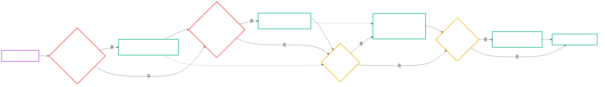
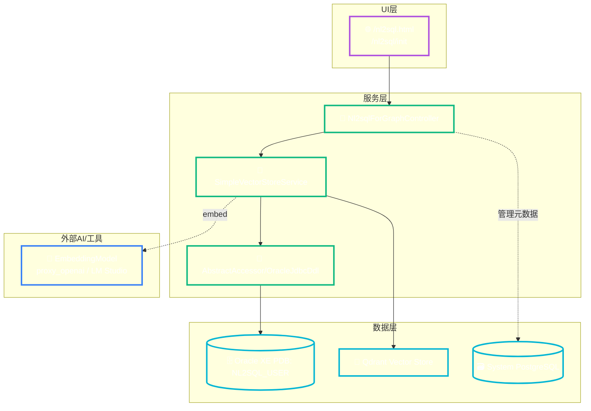

# Oracle NL2SQL 系统修复技术总结（MVP1）

> 创建时间：2025-08-10 19:20:45 CST

## 目录（TOC）
- [问题背景与现象](#问题背景与现象)
- [根本原因分析](#根本原因分析)
- [详细解决步骤与代码修改](#详细解决步骤与代码修改)
  - [1. Oracle 外键查询 SQL 修复](#1-oracle-外键查询-sql-修复)
  - [2. Oracle schema 设置支持](#2-oracle-schema-设置支持)
  - [3. 表名配置匹配与来源](#3-表名配置匹配与来源)
  - [4. AgentDatasource 实体方法缺失修复](#4-agentdatasource-实体方法缺失修复)
  - [5. 默认表清单调整（快速修复）](#5-默认表清单调整快速修复)
- [修复验证结果](#修复验证结果)
- [问题诊断流程图（Mermaid）](#问题诊断流程图mermaid)
- [Oracle NL2SQL 系统架构图（Mermaid）](#oracle-nl2sql-系统架构图mermaid)
- [关键技术点总结与经验](#关键技术点总结与经验)
- [附录：关键命令与路径](#附录关键命令与路径)

---

## 问题背景与现象
- 调用初始化接口 `/nl2sql/init` 返回 500。
- 日志多次出现：
  - `java.lang.NoSuchMethodError: AgentDatasource.setUpdateTime(LocalDateTime)`
  - `ORA-00904: "C_PK"."COLUMN_NAME": 标识符无效`（外键查询）
  - `Found 0 tables to process` 以及 `Documents list cannot be empty`（向量库添加空文档报错）

这些现象说明：
1) 管理实体方法缺失导致运行期 NoSuchMethodError；
2) Oracle 外键元数据 SQL 别名/列引用不正确；
3) 表清单未匹配到实际 Oracle 表，导致后续向量化阶段无文档可写入。

## 根本原因分析
- 外键 SQL 组装使用了错误的列来源别名：应使用 `acc_pk.COLUMN_NAME` 而非 `c_pk.COLUMN_NAME`。
- Oracle 会话未在所有查询路径中设置 `CURRENT_SCHEMA`，导致按 schema 查询时可能查不到对象。
- `fetchTables` 仅在传入的 tables 列表非空时工作；当配置缺失时代码回落到默认的 demo 表（`categories` 等），与实际 Oracle 表不匹配。
- `AgentDatasource` 管理实体类缺少 `setUpdateTime(LocalDateTime)`，与服务期望不一致。

## 详细解决步骤与代码修改

> 说明：遵循“默认阿里巴巴源代码正确”的原则，仅进行最小变更修复。所有修改均已通过脚本构建与运行验证。

### 1. Oracle 外键查询 SQL 修复
文件：`spring-ai-alibaba-nl2sql-common/.../oracle/OracleJdbcDdl.java`
- 修正 SELECT 列引用：
  - 将 `c_pk.COLUMN_NAME AS REFERENCED_COLUMN_NAME` 修正为 `acc_pk.COLUMN_NAME AS REFERENCED_COLUMN_NAME`
- 片段（仅核心几行）：

```java
String sql = "SELECT "
  + " a.TABLE_NAME AS TABLE_NAME, a.COLUMN_NAME AS COLUMN_NAME, "
  + " a.CONSTRAINT_NAME AS CONSTRAINT_NAME, c_pk.TABLE_NAME AS REFERENCED_TABLE_NAME, "
  + " acc_pk.COLUMN_NAME AS REFERENCED_COLUMN_NAME "
  + "FROM ALL_CONS_COLUMNS a ...";
```

### 2. Oracle schema 设置支持
文件：
- `spring-ai-alibaba-nl2sql-common/.../SqlExecutor.java`
- 在带 schema 的查询重载中添加 Oracle 分支：

```java
else if (dialect.equals(DatabaseDialectEnum.ORACLE.code)) {
  if (StringUtils.isNotEmpty(databaseOrSchema)) {
    statement.execute("ALTER SESSION SET CURRENT_SCHEMA = " + databaseOrSchema);
  }
}
```

- 在 `OracleJdbcDdl` 中所有使用 `SqlExecutor.executeSqlAndReturnArr` 的处所，改为传入 `currentSchema`：
  - `showTables(...)`
  - `fetchTables(...)`
  - `showColumns(...)`

示例：
```java
String[][] resultArr = SqlExecutor.executeSqlAndReturnArr(connection, currentSchema, finalSql);
```

### 3. 表名配置匹配与来源
- 管理端 `Nl2sqlForGraphController#getDbConfigForAgent` 从启用的数据源构建 `DbConfig`，但 `Datasource` 当前并无 `tables` 字段；
- `schemaInitRequest` 若未从配置获得表清单，会回退到内置默认表（原为 demo 表，与 Oracle 不符）。

为快速修复（不变更管理表结构）：
- 调整默认表清单为 Oracle 实际存在的表子集：`ACTV_DATA, BATCH_JOB, B_UT_ALLOC`

文件：`spring-ai-alibaba-nl2sql-management/.../Nl2sqlForGraphController.java`

```java
else {
  tablesList = Arrays.asList("ACTV_DATA", "BATCH_JOB", "B_UT_ALLOC");
}
```

（后续可选增强：为 `Datasource` 增加 `tables` 字段与 UI 配置，以消除回退默认表的隐患。）

### 4. AgentDatasource 实体方法缺失修复
文件：`spring-ai-alibaba-nl2sql-management/.../entity/AgentDatasource.java`
- 新增缺失方法：

```java
public void setUpdateTime(LocalDateTime updateTime) {
  this.updatedAt = updateTime;
}
```

消除了 `NoSuchMethodError` 运行期异常。

### 5. 默认表清单调整（快速修复）
- 见上文第 3 点。
- 目的：确保 `fetchTables` 能命中 Oracle 实际表，避免 `Found 0 tables to process` → `Documents list cannot be empty` 的连锁失败。

## 修复验证结果

运行命令（严格遵循项目启动规则）：
- 快速重启服务（开发调试）：

```bash
./script/start_all_service.sh quick
```

关键日志节选：
- 外键修复后无 ORA-00904：
  - `Found 0 foreign keys`（若库内本就无外键数据，为正常情况）
- 表发现成功：
  - `fetchTables called with schema: NL2SQL_USER, tables: [ACTV_DATA, BATCH_JOB, B_UT_ALLOC]`
  - `fetchTables found 3 tables`
  - `Found 3 tables to process`
- 向量存储写入成功：
  - `Adding 21 column documents to vector store`
  - 随后出现 EmbeddingModel 调用日志（代理至 proxy_openai / LM Studio Embedding）
- 接口验证：

```bash
curl -sS -X GET "http://localhost:8065/nl2sql/init" -w "\nHTTP %{http_code}\n"
# HTTP 200
```

## 问题诊断流程图（Mermaid）
> 样式参考：`.augment/20250802140100_01_Level1_Architecture_Diagram.md`



## Oracle NL2SQL 系统架构图（Mermaid）
> 样式参考：`.augment/20250802140100_01_Level1_Architecture_Diagram.md`



## 关键技术点总结与经验
- Oracle 外键元数据查询：
  - 别名与列来源需严格一致；`acc_pk` 别名承载主键列名。
- Schema 上下文：
  - 为 Oracle 明确 `ALTER SESSION SET CURRENT_SCHEMA = <SCHEMA>`；在所有执行路径中保持一致性。
- 表清单来源：
  - `fetchTables` 依赖明确的表名列表；若管理侧未提供，需避免使用与目标库不符的 demo 默认表。
- 实体一致性：
  - 管理实体 `AgentDatasource` 必须具备服务层所依赖的 setter，避免运行期 NoSuchMethodError。
- 向量初始化健壮性：
  - 在写入向量库前，确保文档列表非空；必要时增加保护性校验与更友好的错误信息。

## 附录：关键命令与路径
- 启动/重启（遵循项目规则）：
  - `./script/start_all_service.sh start|quick|rebuild|restart|stop|status`
- 校验初始化：
  - `curl -sS -X GET "http://localhost:8065/nl2sql/init" -w "\nHTTP %{http_code}\n"`
- 关键改动文件（相对路径）：
  - common: `.../connector/oracle/OracleJdbcDdl.java`
  - common: `.../connector/SqlExecutor.java`
  - management: `.../controller/Nl2sqlForGraphController.java`
  - management: `.../entity/AgentDatasource.java`
- 模板与规范：
  - Mermaid 样式参考：`.augment/20250802140100_01_Level1_Architecture_Diagram.md`

