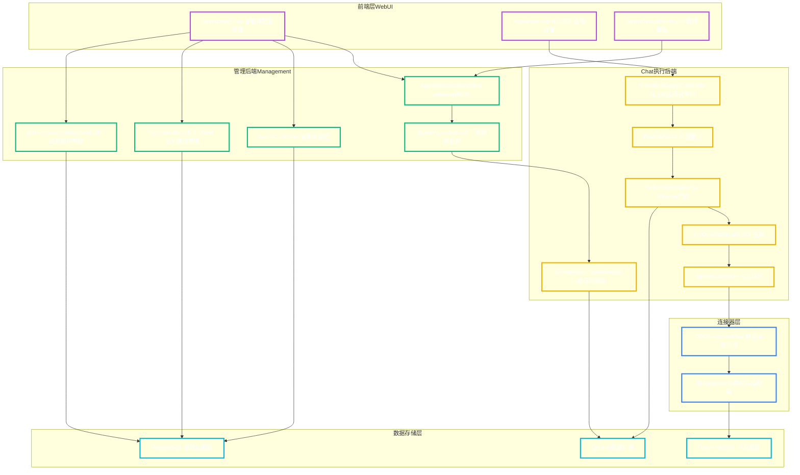
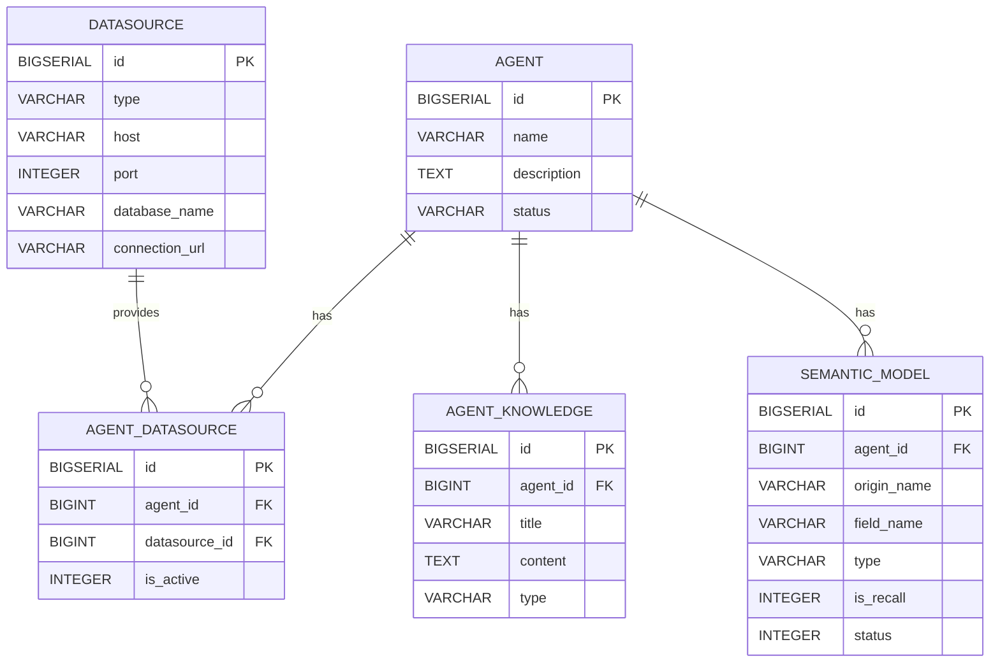
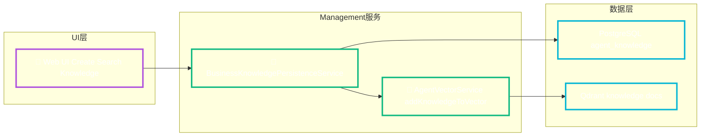
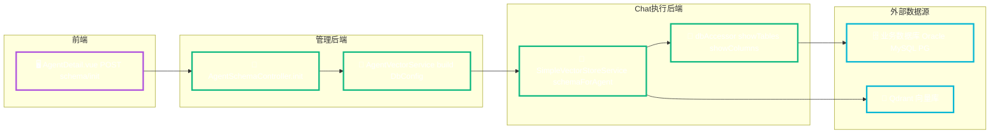
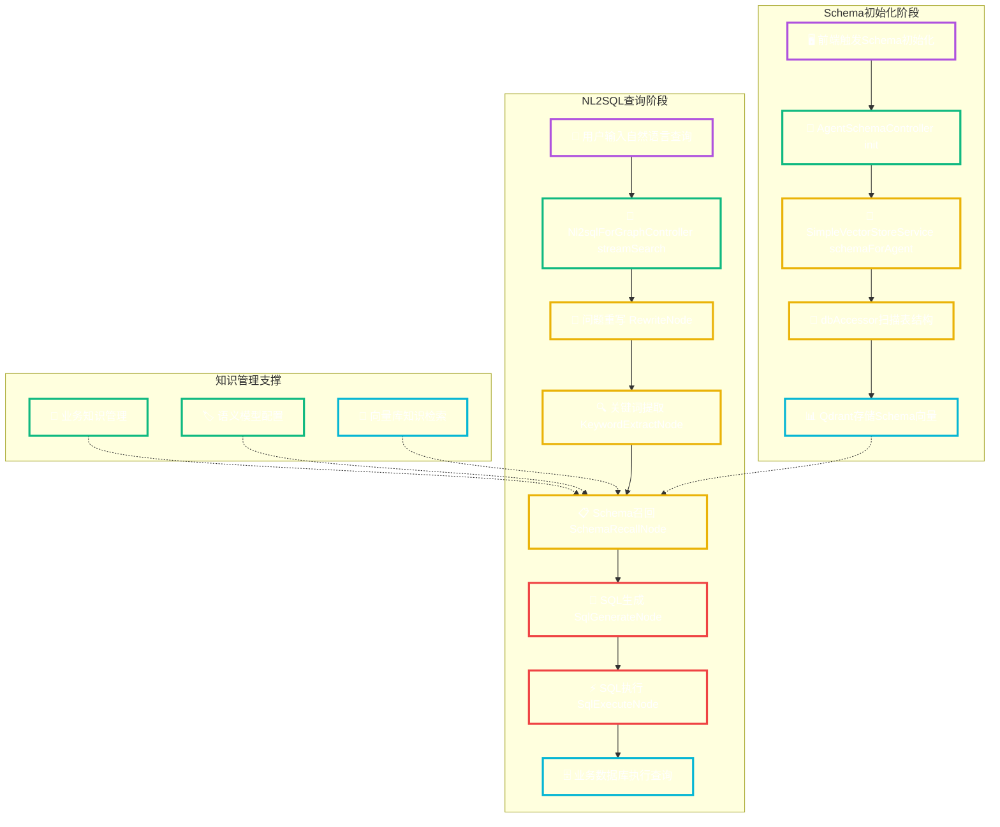

# Alibaba NL2SQL 项目架构设计与端到端数据流（Agent Schema Init 专题）

创建时间：2025-08-10 21:00:30

## 目录（TOC）
- 概览与模块划分
- API层分析（/api/agent/{agentId}/schema/init）
- 前端到后端的调用链路
- 数据库层分析（系统库 + 业务库 + 向量库）
- 业务知识管理（Business Knowledge）架构
- 语义模型配置（Semantic Model）架构
- 端到端流程图（E2E Data Flow）
- 设计模式与架构要点
- 风险点与改进建议

---

## 概览与模块划分

### 系统架构总览图


### 模块职责详述

- **前端（Web UI）**：`spring-ai-alibaba-nl2sql-web-ui`
  - 主要视图：AgentDetail.vue、AgentRun.vue、AgentDebugPanel.vue。
  - 通过 REST API 调用后台管理接口，驱动 Schema 初始化与聊天链路。
- **管理后端（Management）**：`spring-ai-alibaba-nl2sql-management`
  - 控制器：`AgentSchemaController`、`Nl2sqlForGraphController`、业务配置等。
  - 服务：`AgentVectorService`（组装 DbConfig + 调用向量初始化）、知识/语义模型持久化服务等。
- **Chat/执行后端（Chat）**：`spring-ai-alibaba-nl2sql-chat`
  - 向量服务：`SimpleVectorStoreService`（表/列扫描 → Document → VectorStore）。
  - 连接器：`DBConnectionPool`/`AbstractDBConnectionPool` + `dbAccessor`（跨 MySQL/PostgreSQL/Oracle 获取元数据和执行 SQL）。
- **系统数据库（PostgreSQL 容器）**：存放 agent、datasource、agent_datasource、semantic_model、business_knowledge 等系统表。
- **业务数据库（例如 Oracle 容器）**：存放业务数据表（本场景用于扫描 Schema，不落系统库）。
- **向量库（Qdrant 容器）**：存放表/列向量文档（按 Agent 隔离）。

---

## API层分析（/api/agent/{agentId}/schema/init）

- URL（前端侧）：`/api/agent/${agent.id}/schema/init`
- Method：POST
- Headers：`Content-Type: application/json`
- Request Body：
  ```json
  { "datasourceId": number, "tables": ["TABLE_A", "TABLE_B", "..."] }
  ```
- Response Body（成功示例）：
  ```json
  { "success": true, "message": "Schema初始化成功", "agentId": 1000001, "tablesCount": 7 }
  ```
- 错误场景：参数缺失（datasourceId / tables）、数据源不存在、下游连接失败（如 JDBC URL 错误）。

前端调用位置（节选）：
<augment_code_snippet path="spring-ai-alibaba/spring-ai-alibaba-nl2sql/spring-ai-alibaba-nl2sql-web-ui/src/views/AgentDetail.vue" mode="EXCERPT">
```vue
const response = await fetch(`/api/agent/${agent.id}/schema/init`, {
  method: 'POST',
  headers: { 'Content-Type': 'application/json' },
  body: JSON.stringify({ datasourceId: schemaInitForm.selectedDatasource.id, tables: selectedTables.value })
})
```
</augment_code_snippet>

---

## 前端到后端的调用链路

- Controller：
<augment_code_snippet path="spring-ai-alibaba/spring-ai-alibaba-nl2sql/spring-ai-alibaba-nl2sql-management/src/main/java/com/alibaba/cloud/ai/controller/AgentSchemaController.java" mode="EXCERPT">
```java
@PostMapping("/init")
public ResponseEntity<Map<String, Object>> initializeSchema(@PathVariable Long agentId,
        @RequestBody Map<String, Object> requestData) {
  Integer datasourceId = (Integer) requestData.get("datasourceId");
  List<String> tables = (List<String>) requestData.get("tables");
  Boolean result = agentVectorService.initializeSchemaForAgentWithDatasource(agentId, datasourceId, tables);
  // 返回 success / message / agentId / tablesCount
}
```
</augment_code_snippet>

- Service：
<augment_code_snippet path="spring-ai-alibaba/spring-ai-alibaba-nl2sql/spring-ai-alibaba-nl2sql-management/src/main/java/com/alibaba/cloud/ai/service/AgentVectorService.java" mode="EXCERPT">
```java
public Boolean initializeSchemaForAgentWithDatasource(Long agentId, Integer datasourceId, List<String> tables) {
  Datasource ds = datasourceService.getDatasourceById(datasourceId);
  DbConfig db = createDbConfigFromDatasource(ds);
  SchemaInitRequest req = new SchemaInitRequest().setDbConfig(db).setTables(tables);
  return vectorStoreService.schemaForAgent(String.valueOf(agentId), req);
}
```
</augment_code_snippet>

- Vector Store 初始化：
<augment_code_snippet path="spring-ai-alibaba/spring-ai-alibaba-nl2sql/spring-ai-alibaba-nl2sql-chat/src/main/java/com/alibaba/cloud/ai/service/simple/SimpleVectorStoreService.java" mode="EXCERPT">
```java
public Boolean schemaForAgent(String agentId, SchemaInitRequest req) throws Exception {
  DbConfig db = req.getDbConfig();
  DbQueryParameter dqp = DbQueryParameter.from(db).setSchema(db.getSchema()).setTables(req.getTables());
  agentVectorStoreManager.deleteDocumentsByType(agentId, "column");
  agentVectorStoreManager.deleteDocumentsByType(agentId, "table");
  List<TableInfoBO> tables = dbAccessor.fetchTables(db, dqp);
  // 遍历每个表：抽取列、外键，生成 Document，写入向量库
  agentVectorStoreManager.addDocuments(agentId, columnDocuments);
  agentVectorStoreManager.addDocuments(agentId, tableDocuments);
  return true;
}
```
</augment_code_snippet>

- 连接池与失败场景：
<augment_code_snippet path="spring-ai-alibaba/spring-ai-alibaba-nl2sql/spring-ai-alibaba-nl2sql-common/src/main/java/com/alibaba/cloud/ai/connector/AbstractDBConnectionPool.java" mode="EXCERPT">
```java
DataSource ds = CACHE.computeIfAbsent(key, k -> {
  try { return createdDataSource(url, user, pass); }
  catch (Exception e) { throw new RuntimeException("Failed to create DataSource", e); }
});
```
</augment_code_snippet>

---

## 数据库层分析（系统库 + 业务库 + 向量库）

- 系统库（PostgreSQL）：管理智能体、数据源、知识与语义模型等元数据。
<augment_code_snippet path="spring-ai-alibaba/spring-ai-alibaba-nl2sql/spring-ai-alibaba-nl2sql-management/src/main/resources/sql/schema.sql" mode="EXCERPT">
```sql
CREATE TABLE IF NOT EXISTS agent (...);
CREATE TABLE IF NOT EXISTS datasource (...);
CREATE TABLE IF NOT EXISTS agent_datasource (...);
CREATE TABLE IF NOT EXISTS business_knowledge (...);
CREATE TABLE IF NOT EXISTS semantic_model (...);
```
</augment_code_snippet>

- 业务库（如 Oracle）：由 `datasource` 指定；Schema 初始化阶段仅读取（扫描表/列/外键信息），不写入。
- 向量库（Qdrant）：以 `agentId` 维度存储 Document（table/column 两类），用于后续 Schema 召回与 SQL 生成。

### ER 图（系统库关键表）


---

## 业务知识管理（Business Knowledge）架构

- 持久层服务：
<augment_code_snippet path="spring-ai-alibaba/spring-ai-alibaba-nl2sql/spring-ai-alibaba-nl2sql-management/src/main/java/com/alibaba/cloud/ai/service/BusinessKnowledgePersistenceService.java" mode="EXCERPT">
```java
return jdbcTemplate.query(FIELD_GET_BY_AGENT_ID, new Object[]{ agentId }, (rs, n) ->
  new BusinessKnowledge(rs.getObject("id", Long.class), rs.getString("business_term"),
    rs.getString("description"), rs.getString("synonyms"), (rs.getObject("is_recall", Integer.class)==1),
    rs.getString("data_set_id"), rs.getString("agent_id"), rs.getTimestamp("created_time").toLocalDateTime(),
    rs.getTimestamp("updated_time").toLocalDateTime())
);
```
</augment_code_snippet>

- 写入向量库：`AgentVectorService.addKnowledgeToVector(agentId, knowledge)` 将知识转 Document → `agentVectorStoreManager.addDocuments(...)`。

- 业务功能：
  - 知识创建/搜索/按Agent过滤。
  - 支持 is_recall（默认召回）位控制业务知识是否参与检索。

### 业务知识功能架构图


---

## 语义模型配置（Semantic Model）架构

- 持久层服务（布尔转换修复后）：
<augment_code_snippet path="spring-ai-alibaba/spring-ai-alibaba-nl2sql/spring-ai-alibaba-nl2sql-management/src/main/java/com/alibaba/cloud/ai/service/SemanticModelPersistenceService.java" mode="EXCERPT">
```java
Integer isRecallInt = rs.getObject("is_recall", Integer.class);
model.setDefaultRecall(isRecallInt != null && isRecallInt == 1);
Integer statusInt = rs.getObject("status", Integer.class);
model.setEnabled(statusInt != null && statusInt == 1);
```
</augment_code_snippet>

- 功能：
  - 字段同义词（synonyms）、业务描述、默认召回（is_recall）、启用状态（status）等。
  - 在 NL2SQL 流水线中参与 Schema 召回与字段别名匹配，提升生成 SQL 的可读性与准确度。

### 语义模型处理流程图


---

## 端到端流程图（E2E Data Flow：/api/agent/{id}/schema/init）



## 完整NL2SQL执行链路图


```

---

## 设计模式与架构要点

- 分层清晰：UI（Vue）→ Controller（REST） → Service（领域组装/协调） → Connector（dbAccessor + ConnectionPool） → 外部系统（DB/Qdrant）。
- Agent 隔离：向量库文档以 `agentId` 隔离存储；Schema 初始化前清理旧文档（table/column）。
- 多数据库方言：`DBConnectionPool` + `dbAccessor` 适配 MySQL/PostgreSQL/Oracle，统一 `DbConfig`/`DbQueryParameter` 抽象。
- 元数据双存储：系统库保存 Agent/知识/语义模型元数据；业务库保存真实业务表；向量库保存可检索的结构化描述。
- 错误处理：Controller 入参校验；连接池层对 `Failed to create DataSource` 进行保护；日志贯穿（info/debug/trace）。

---

## 语义模型管理API详细分析

### API端点映射
- `/api/fields/agent/{agentId}` - 获取智能体的语义模型列表
- `/api/fields/add` - 新增语义模型
- `/api/fields/enable` - 批量启用语义模型
- `/api/fields/disable` - 批量禁用语义模型

### 语义模型Controller层
<augment_code_snippet path="spring-ai-alibaba/spring-ai-alibaba-nl2sql/spring-ai-alibaba-nl2sql-management/src/main/java/com/alibaba/cloud/ai/controller/SemanticModelPersistenceController.java" mode="EXCERPT">
```java
@GetMapping("/agent/{agentId}")
public ResponseEntity<List<SemanticModel>> getFieldsByAgentId(@PathVariable Long agentId) {
    List<SemanticModel> fields = semanticModelPersistenceService.getFieldByAgentId(agentId);
    return ResponseEntity.ok(fields);
}

@PostMapping("/add")
public ResponseEntity<Void> addField(@RequestBody SemanticModelDTO semanticModelDTO) {
    semanticModelPersistenceService.addField(semanticModelDTO);
    return ResponseEntity.ok().build();
}
```
</augment_code_snippet>

### 业务知识管理API详细分析

### API端点映射
- `/api/knowledge/agent/{agentId}` - 获取智能体的业务知识列表
- `/api/knowledge/agent/{agentId}/add` - 为智能体添加业务知识
- `/api/knowledge/agent/{agentId}/addList` - 批量添加业务知识

### 业务知识Controller层
<augment_code_snippet path="spring-ai-alibaba/spring-ai-alibaba-nl2sql/spring-ai-alibaba-nl2sql-management/src/main/java/com/alibaba/cloud/ai/controller/BusinessKnowledgePersistenceController.java" mode="EXCERPT">
```java
@GetMapping("/agent/{agentId}")
public ResponseEntity<List<BusinessKnowledge>> getKnowledgeByAgentId(@PathVariable String agentId) {
    List<BusinessKnowledge> knowledge = businessKnowledgePersistenceService.getKnowledgeByAgentId(agentId);
    return ResponseEntity.ok(knowledge);
}

@PostMapping("/agent/{agentId}/add")
public ResponseEntity<ApiResponse> addKnowledgeForAgent(@PathVariable String agentId,
        @RequestBody BusinessKnowledgeDTO knowledgeDTO) {
    knowledgeDTO.setAgentId(agentId);
    businessKnowledgePersistenceService.addKnowledge(knowledgeDTO);
    return ResponseEntity.ok(ApiResponse.success("业务知识添加成功"));
}
```
</augment_code_snippet>

## 向量存储架构深度分析

### AgentVectorStoreManager核心功能
- **智能体隔离**：每个Agent的向量数据独立存储，通过agentId进行隔离
- **文档类型管理**：支持table、column、knowledge等不同类型的文档
- **相似度搜索**：基于向量相似度进行Schema召回和知识检索

### 向量文档结构
```json
{
  "id": "agent_2_table_employees",
  "content": "employees table contains employee information with columns: id, name, email, department, salary",
  "metadata": {
    "agentId": "2",
    "vectorType": "table",
    "tableName": "employees",
    "schema": "public"
  }
}
```

### Schema初始化的详细流程
1. **清理旧数据**：删除Agent的所有table和column类型文档
2. **获取表结构**：通过dbAccessor从业务数据库获取表和列信息
3. **生成文档**：将表和列信息转换为向量文档
4. **写入向量库**：批量写入Qdrant向量存储

## 数据库连接池架构

### 多数据库支持
<augment_code_snippet path="spring-ai-alibaba/spring-ai-alibaba-nl2sql/spring-ai-alibaba-nl2sql-common/src/main/java/com/alibaba/cloud/ai/connector/AbstractDBConnectionPool.java" mode="EXCERPT">
```java
// 支持MySQL、PostgreSQL、Oracle等多种数据库
public abstract class AbstractDBConnectionPool implements DBConnectionPool {
    protected static final Map<String, DataSource> CACHE = new ConcurrentHashMap<>();

    protected DataSource getDataSource(String url, String user, String pass) {
        String key = url + ":" + user;
        return CACHE.computeIfAbsent(key, k -> {
            try {
                return createdDataSource(url, user, pass);
            } catch (Exception e) {
                throw new RuntimeException("Failed to create DataSource", e);
            }
        });
    }
}
```
</augment_code_snippet>

## 风险点与改进建议

- **数据源 URL 规范**：Oracle ServiceName 需 `@//host:port/service`，避免连接失败。
- **类型一致性**：系统库布尔语义字段（is_recall/status）建议使用 `BOOLEAN` 或标准化 0/1 并在 DAO 层统一转换。
- **批量表初始化**：大型库初始化应分页/限速，并对 `foreign keys`、`columns` 的并发抓取做限流。
- **观测性**：为向量写入增加计数与耗时指标（成功/失败/表与列数）。
- **幂等性**：Schema 初始化可记录版本与摘要，避免重复扫描；失败可重试/断点续扫。
- **安全性**：数据源密码应加密存储，连接池应支持连接超时和重试机制。
- **性能优化**：向量搜索可增加缓存层，减少重复计算开销。

