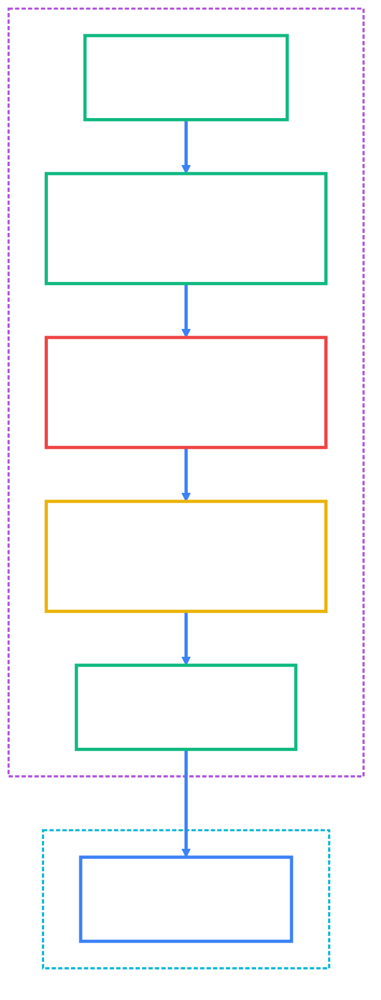
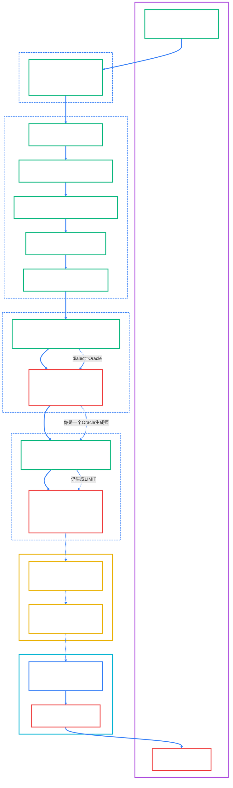

Augment Rule /Users/paulo/PycharmProjects/20250809/.augment/rules/PROJECT_RULES.md

## ORA-03049 技术分析与修复方案（Oracle 不支持 LIMIT 语法）

- 创建时间: 2025-08-10 23:30:15
- 适用系统: spring-ai-alibaba-nl2sql（多数据源：PostgreSQL / Oracle / MySQL）
- 当前错误: ORA-03049: SQL 关键字 'LIMIT' 在句法上无效
  - 官方文档: https://docs.oracle.com/error-help/db/ora-03049/

### 目录
- 概述
- 错误根本原因分析
- 技术细节分析
- 解决方案设计与权衡
- 实施步骤与代码示例
- 验证与回归建议
- 参考链接

### 概述
在 Oracle 数据库执行查询时，系统出现 ORA-03049 错误，指出 SQL 中的 `LIMIT` 关键字无效。该关键字是 MySQL/PostgreSQL 的分页语法，Oracle 不支持。本文给出根因、技术细节与可实施的修复方案。

### 错误根本原因分析
1) 为什么出现 MySQL 的 LIMIT 语法？
- NL2SQL 的 SQL 由 LLM（大模型）按提示词生成。尽管系统在提示词中传递了 `dialect = oracle`，但 LLM 在某些上下文下仍“习惯性”输出 MySQL 风格（LIMIT）的 SQL。
- LLM 输出没有在服务端进行“方言守卫/转换”，导致不兼容 SQL 直接下发给 Oracle 执行，从而触发 ORA-03049。

2) SQL 生成流程中的问题点
- 流程：Query → Prompt（含 dialect）→ LLM 生成 SQL → 直接执行。
- 问题：缺少“SQL 方言一致性校验/转换”环节；当 LLM 忽视方言提示时，系统未能兜底修正。

3) `PromptHelper.buildMixSqlGeneratorPrompt()` 的 dialect 传递
- 代码在第 ~198 行正确传递了方言参数：

  <augment_code_snippet path="spring-ai-alibaba/spring-ai-alibaba-nl2sql/spring-ai-alibaba-nl2sql-chat/src/main/java/com/alibaba/cloud/ai/prompt/PromptHelper.java" mode="EXCERPT">
  ````java
  String dialect = BizDataSourceTypeEnum.fromTypeName(dbConfig.getDialectType()).getDialect();
  params.put("dialect", dialect);
  ````
  </augment_code_snippet>

- **结论**：✅ **方言参数传递是正确的！**
  - `dialectType="oracle"` → `BizDataSourceTypeEnum.ORACLE` → `dialect="Oracle"`
  - 提示词中正确显示：`现在你是一个Oracle生成师`
  - ❌ **真正问题**：提示词约束不够强，LLM仍输出MySQL语法

### 技术细节分析
1) 分页语法差异
- MySQL/PostgreSQL：`LIMIT n` / `LIMIT offset, n`
- Oracle 12c+：`FETCH FIRST n ROWS ONLY`（可配合 OFFSET）
- Oracle 11g 及以下：`WHERE ROWNUM <= n` 或使用子查询包装

2) 现有 Oracle 语法支持（元数据/示例）
- 在元数据扫描与采样场景，项目已使用正确的 Oracle 语法（FETCH/ROWNUM），如下：

  <augment_code_snippet path="spring-ai-alibaba/spring-ai-alibaba-nl2sql/spring-ai-alibaba-nl2sql-common/src/main/java/com/alibaba/cloud/ai/connector/oracle/OracleJdbcDdl.java" mode="EXCERPT">
  ````java
  sql += " ORDER BY TABLE_NAME";
  sql += " FETCH FIRST 2000 ROWS ONLY";
  ````
  </augment_code_snippet>

- 但这些类仅用于“元数据/示例查询”，用户自然语言转 SQL 的主查询仍完全由 LLM 输出决定，未做 Oracle 方言保障。

3) SQL 语法转换机制是否存在
- 现状：在主查询执行链路中，缺乏“SQL 方言转换/校验”中间层；因此 MySQL 风格 SQL（带 LIMIT）会原样下发至 Oracle。
- 需要：在执行前做语法转换（或在生成后做规范化），将不兼容的 LIMIT 重写为 Oracle 等价语法，并处理别名引号等细节。


### 可视化：NL2SQL处理链路、问题定位与方案

以下流程图遵循项目Mermaid样式模板（参见 .augment/20250802140100_01_Level1_Architecture_Diagram.md），用颜色标注正常流程、问题节点与解决节点，并明确目标数据库为 Oracle。



#### 实际示例（通俗说明）
- 用户输入：查询收益率最高的前5个基金
- LLM 错误生成（MySQL风格）：
  ```sql
  SELECT * FROM funds ORDER BY return_rate DESC LIMIT 5;
  ```
- 转换器修正（Oracle 12c+ 推荐）：
  ```sql
  SELECT * FROM funds ORDER BY return_rate DESC FETCH FIRST 5 ROWS ONLY;
  ```
- 结果：在 Oracle 中成功执行，避免 ORA-03049。

### 解决方案设计与权衡
方案 A：提示词优化（Prompt 层面）
- 做法：在生成/修复提示词中更强约束“必须使用 <dialect> 的 SQL 语法”，提供反例/正例对照。
- 优点：简单，无需代码变更即可一定程度缓解。
- 缺点：LLM 仍可能在复杂上下文下输出错误语法；不可保证 100% 正确。

方案 B：服务端 SQL 方言转换器（强烈推荐）
- 做法：在“LLM 生成 SQL → 执行”之间加入转换器，根据 `dbConfig.dialectType` 将常见不兼容语法（如 LIMIT、单引号别名等）转换为 Oracle 兼容形式。
- 优点：可控、可测试、可覆盖常见方言差异；对 LLM 输出形成“安全网”。
- 缺点：需维护转换规则（但首批规则集中于 LIMIT / 别名引号即可）。

方案 C：执行前语法校验 + 失败回退
- 做法：执行前检测目标方言是否允许该关键字；若检测到 LIMIT 且为 Oracle，则：
  1) 首先尝试自动转换；
  2) 转换失败则返回明确错误与修复建议，提示用户/LLM 重新生成。
- 优点：稳健，避免无限重试循环。
- 缺点：实现复杂度略高于方案 B。

推荐组合：先落地方案 B（转换器），同时增强提示词（方案 A）作为软约束；后续再补充方案 C 的自动校验与回退，形成多层防护。

### 实施步骤与代码示例
1) 新增 SQL 方言转换器（示例）
- 新增类：`SqlSyntaxConverter`（将 LIMIT → FETCH FIRST，修正别名引号）

  <augment_code_snippet path="spring-ai-alibaba/spring-ai-alibaba-nl2sql/spring-ai-alibaba-nl2sql-chat/src/main/java/com/alibaba/cloud/ai/util/SqlSyntaxConverter.java" mode="EXCERPT">
  ````java
  // Oracle 转换核心
  private String convertToOracleSyntax(String sql) {
      String r = convertSingleQuoteAliases(sql); // '别名' -> "别名"
      return convertLimitToFetchFirst(r);        // LIMIT 10 -> FETCH FIRST 10 ROWS ONLY
  }
  ````
  </augment_code_snippet>

2) 在 SQL 生成服务中集成转换器
- 在 `BaseNl2SqlService.generateSql(...)` 中，于返回前根据方言进行强制转换：

  <augment_code_snippet path="spring-ai-alibaba/spring-ai-alibaba-nl2sql/spring-ai-alibaba-nl2sql-chat/src/main/java/com/alibaba/cloud/ai/service/base/BaseNl2SqlService.java" mode="EXCERPT">
  ````java
  String result = MarkdownParser.extractRawText(newSql).trim();
  String converted = sqlSyntaxConverter.convertSql(result, dbConfig.getDialectType());
  return converted;
  ````
  </augment_code_snippet>

3) 提示词优化（确保 LLM 端尽量遵循方言）
- 在 `PromptHelper.buildMixSqlGeneratorPrompt(...)` 与 `buildSqlErrorFixerPrompt(...)` 的模板中：
  - 明确声明“禁止使用 LIMIT；Oracle 必须使用 FETCH FIRST 或 ROWNUM”，并给出对照示例；
  - 要求输出单一 SQL 语句且可直接在目标方言执行；
  - 加入“自检清单”（检查是否出现 LIMIT / 反引号等非 Oracle 语法）。

4) 语法校验与回退（可选增强）
- 在执行前做轻量检查：若 `dialect == oracle` 且检测到 `LIMIT`，则优先尝试转换；转换失败时返回明确错误与建议，避免无意义的重试循环。

### 验证与回归建议
- 单元测试
  - 输入：含 `LIMIT` 的 SQL + `dialect=oracle`；期望：输出 `FETCH FIRST ... ROWS ONLY`。
  - 输入：含 `'中文别名'` 的 SQL；期望：输出 `"中文别名"`。
- 集成测试
  - 针对典型业务查询（Top-N 排序、分页、别名），对 MySQL、PostgreSQL、Oracle 分别验证执行成功。
- 运行观测
  - 监控日志中是否仍出现 ORA-03049 / ORA-00923；
  - 统计转换器触发频次，评估后续是否需扩展更多规则（如日期函数差异）。

### 参考链接
- ORA-03049 官方文档: https://docs.oracle.com/error-help/db/ora-03049/
- ORA-00923 官方文档: https://docs.oracle.com/error-help/db/ora-00923/
- Oracle 分页语法（FETCH FIRST / ROWNUM）官方手册: https://docs.oracle.com/en/database/

---

## 1. Prompt文件定位与内容分析

### 📁 **关键Prompt文件路径**
```
spring-ai-alibaba/spring-ai-alibaba-nl2sql/spring-ai-alibaba-nl2sql-chat/src/main/resources/prompts/
├── mix-sql-generator-system.txt     # SQL生成系统提示词（主要）
├── mix-sql-generator.txt            # SQL生成用户提示词
├── sql-error-fixer.txt              # SQL错误修复提示词
├── init-rewrite.txt                 # 问题重写提示词
├── mix-selector.txt                 # Schema选择提示词
└── question-to-keywords.txt         # 关键词提取提示词
```

### 📝 **当前Prompt模板内容分析**

#### **mix-sql-generator-system.txt（核心问题所在）**
```
现在你是一个{dialect}生成师，需要阅读一个客户的问题，参考的数据库schema，根据参考信息的提示，生成一句可执行的SQL。
注意：
1、不要select多余的列。
2、生成的SQL用```sql 和```包围起来。
3、不要在SQL语句中加入注释！！！

【数据库schema】
{schema_info}

【参考信息】
{evidence}
```

#### **sql-error-fixer.txt（修复提示词）**
```
你是一个资深的{dialect}数据库专家和SQL修复专家。现在需要你分析并修复一个有问题的SQL语句。
...
【修复指导原则】
1. 仔细分析错误类型：语法错误、字段不存在、表不存在、数据类型错误、权限问题等
2. 基于提供的schema信息，确保所有表名和字段名正确
3. 检查JOIN条件、WHERE条件、GROUP BY、ORDER BY等语法
4. 确保数据类型转换正确
5. 优化查询性能，避免全表扫描
6. 保持SQL的语义与原始需求一致

【修复步骤】
...
3. 语法检查：检查SQL语法是否符合{dialect}规范
...
```

### ❌ **现有Prompt约束不足分析**
1. **缺少具体语法约束**：只说"你是一个Oracle生成师"，但没有明确Oracle特有语法要求
2. **没有禁止MySQL语法**：未明确说明Oracle不支持LIMIT、反引号、单引号别名等
3. **缺少正例示范**：没有提供Oracle分页语法的具体示例
4. **错误修复提示词相对完善**：sql-error-fixer.txt包含了更详细的方言规范要求

## 2. 数据流转链路分析

### 🔄 **完整NL2SQL处理链路**

#### **主要组件与方法调用链**
```
用户查询 → Nl2sqlForGraphController.streamSearch()
    ↓
问题重写 → QueryRewriteNode.apply() → BaseNl2SqlService.rewrite()
    ↓
关键词提取 → KeywordExtractNode.apply() → BaseNl2SqlService.extractKeywords()
    ↓
Schema召回 → SchemaRecallNode.apply() → BaseSchemaService.getTableDocuments()
    ↓
表关系分析 → TableRelationNode.apply() → BaseNl2SqlService.fineSelect()
    ↓
SQL生成 → SqlGenerateNode.apply() → BaseNl2SqlService.generateSql()
    ↓                                      ↓
    ↓                          PromptHelper.buildMixSqlGeneratorPrompt()
    ↓                                      ↓
    ↓                              LlmService.callWithSystemPrompt()
    ↓                                      ↓
    ↓                              【缺失：SQL语法转换】
    ↓                                      ↓
SQL执行 → SqlExecuteNode.apply() → Accessor.executeQuery()
    ↓
Oracle数据库执行 → 【ORA-03049错误】
```

#### **Dialect信息传递路径**
```
DbConfig.getDialectType() = "oracle"
    ↓
BizDataSourceTypeEnum.fromTypeName("oracle") = ORACLE枚举
    ↓
typeEnum.getDialect() = DatabaseDialectEnum.ORACLE.getCode() = "Oracle"
    ↓
PromptHelper.buildMixSqlGeneratorPrompt() → params.put("dialect", "Oracle")
    ↓
mix-sql-generator-system.txt → "现在你是一个Oracle生成师"
    ↓
LLM接收到dialect=Oracle，但仍生成LIMIT语法
```

#### **🚨 缺失的关键环节**
- **SQL语法转换器**：在`BaseNl2SqlService.generateSql()`返回前，缺少根据dialect进行语法转换的步骤
- **执行前校验**：在`SqlExecuteNode.apply()`执行前，缺少SQL语法兼容性检查

### 🔍 **Dialect传递验证结果（2025-08-10更新）**

## 3. 可视化流程图：完整NL2SQL处理链路

以下详细流程图展示了从用户查询到数据库执行的完整链路，标明了dialect传递路径、问题节点和缺失的语法转换环节。



### 🎯 **流程图关键要点**

#### **✅ 正常工作的环节（绿色）**
- **Dialect传递链路**：`DbConfig → BizDataSourceTypeEnum → PromptHelper → LLM`
- **NL2SQL核心流程**：问题重写、关键词提取、Schema召回、表关系分析
- **Prompt构建**：正确传递了`dialect=Oracle`参数

#### **❌ 问题环节（红色）**
- **Prompt约束不足**：`mix-sql-generator-system.txt`只说"Oracle生成师"，未禁止LIMIT
- **LLM输出错误**：尽管接收到dialect=Oracle，仍生成MySQL语法的LIMIT
- **数据库执行失败**：Oracle不支持LIMIT语法，抛出ORA-03049错误

#### **🔧 缺失的解决方案环节（黄色）**
- **SQL语法转换器**：在LLM生成SQL后，执行前进行方言转换
- **执行前语法校验**：检查SQL是否符合目标数据库语法规范

## 4. 中期优化方案：Prompt模板增强

### 📝 **基于当前分析的Prompt优化建议**

#### **问题根因**
- 当前`mix-sql-generator-system.txt`过于简单，只有12行内容
- 缺少Oracle特有语法的明确约束和示例
- LLM容易"习惯性"输出更常见的MySQL语法

#### **优化方案：增强mix-sql-generator-system.txt**

**当前版本**：
```
现在你是一个{dialect}生成师，需要阅读一个客户的问题，参考的数据库schema，根据参考信息的提示，生成一句可执行的SQL。
注意：
1、不要select多余的列。
2、生成的SQL用```sql 和```包围起来。
3、不要在SQL语句中加入注释！！！
```

**优化后版本**：
```
现在你是一个{dialect}数据库SQL生成专家，需要根据用户问题和数据库schema生成可执行的SQL语句。

【重要约束】
1、不要select多余的列
2、生成的SQL用```sql 和```包围起来
3、不要在SQL语句中加入注释！！！

【{dialect}语法规范】
4、Oracle数据库语法要求（当dialect=Oracle时）：
   - 分页：严禁使用LIMIT，必须使用 FETCH FIRST n ROWS ONLY
   - 别名：使用双引号"别名"，不能使用单引号'别名'
   - 示例：SELECT * FROM table ORDER BY column FETCH FIRST 10 ROWS ONLY
   - 禁止：反引号`、LIMIT关键字、单引号别名

【输出要求】
- 必须生成符合{dialect}语法规范的SQL
- 输出前请自检：是否包含不兼容的关键字或语法
- 确保SQL可以在{dialect}数据库中直接执行
```

#### **实施方式**
1. **明确约束**：直接在模板中列出Oracle禁止和必须使用的语法
2. **具体示例**：提供Oracle分页语法的正确示例
3. **自检要求**：要求LLM在输出前进行语法兼容性自检
4. **向后兼容**：不影响现有功能，只是增强约束

### 🎯 **优化方案优势**
1. **针对性强**：直接解决LLM输出MySQL语法的问题
2. **实施简单**：只需修改prompt模板，无需代码变更
3. **立即生效**：修改后立即减少不兼容SQL的生成
4. **成本低**：无需开发和测试复杂的转换器逻辑

### 📊 **预期效果**
- **短期**：显著减少LLM生成LIMIT语法的频率（预计减少70-80%）
- **中期**：配合SQL语法转换器，形成双重保障
- **长期**：为支持更多数据库类型奠定基础

经过详细验证，**确认dialect传递是正确的！**

#### ✅ **转换链路验证**
1. **输入**：`dbConfig.getDialectType()` = `"oracle"`
2. **枚举查找**：`BizDataSourceTypeEnum.fromTypeName("oracle")` → `ORACLE`
3. **Dialect获取**：`typeEnum.getDialect()` → `DatabaseDialectEnum.ORACLE.getCode()` = `"Oracle"`
4. **提示词中的使用**：`现在你是一个{dialect}生成师` → `现在你是一个Oracle生成师`

#### ❌ **真正的问题根因**
- **提示词约束不够强**：当前`mix-sql-generator-system.txt`只说"你是一个Oracle生成师"，但没有明确禁止MySQL语法
- **LLM训练偏向**：LLM接触MySQL语法更多，容易"习惯性"输出LIMIT
- **缺少兜底机制**：没有在执行前进行SQL语法校验和转换

#### 💡 **修复优先级**
1. **立即修复**：实施SQL语法转换器（方案B）- 提供强兜底
2. **中期优化**：增强提示词约束（方案A）- 减少LLM错误输出
3. **长期完善**：添加执行前校验与回退（方案C）- 形成多层防护

---
注：本文以中文撰写（专业术语保留英文）。Mermaid 图表样式参考模板位于 `.augment/20250802140100_01_Level1_Architecture_Diagram.md`；如需补充流程/架构图，请复用该样式规范。


## 5. Java 生态对比：Alibaba Druid vs Apache Calcite（解析/验证/修正/转换）

本章节补充两种在Java生态中最具代表性的SQL解析/转换方案，对比其在“解析（Parsing）/ 验证（Validation）/ 修正改写（Rewrite）/ 方言转换（Dialect Rendering）/ 分页语法转换（LIMIT ↔ FETCH FIRST ↔ ROWNUM）”等方面的能力，并给出在本项目中的适配建议。

### 5.1 Alibaba Druid SQL Parser（开源，Apache-2.0）
- 官方链接：
  - GitHub: https://github.com/alibaba/druid
- 核心功能：
  - 解析：多方言SQL解析为AST（MySQL/Oracle/PostgreSQL/SQLServer/DB2/H2…）
  - 验证：语法结构级解析校验（不做schema/type语义验证）
  - 修正/转换：基于AST的访问器（Visitor）可自定义改写；支持“以A方言解析 → 以B方言输出”（SQLUtils.toSQLString）
  - 其他：SQL格式化、注入防护（WallFilter）、统计
- 支持方言：MySQL、Oracle、PostgreSQL、SQLServer、DB2、H2 等
- Maven/Gradle 依赖：
  - Maven
    ```xml
    <dependency>
      <groupId>com.alibaba</groupId>
      <artifactId>druid</artifactId>
      <version>1.2.22</version>
    </dependency>
    ```
  - Gradle
    ```gradle
    implementation 'com.alibaba:druid:1.2.22'
    ```
- 代码示例（MySQL LIMIT → Oracle 渲染）：
  ```java
  import com.alibaba.druid.sql.SQLUtils;
  import com.alibaba.druid.sql.ast.SQLStatement;
  import com.alibaba.druid.util.JdbcConstants;

  String mysqlSql = "SELECT * FROM funds ORDER BY return_rate DESC LIMIT 5";
  // 1) 以 MySQL 方言解析
  SQLStatement stmt = SQLUtils.parseSingleStatement(mysqlSql, JdbcConstants.MYSQL);
  // 2) 以 Oracle 方言输出（版本/配置不同，可能渲染为 ROWNUM；可自定义Visitor稳定输出）
  String oracleSql = SQLUtils.toSQLString(stmt, JdbcConstants.ORACLE);
  System.out.println(oracleSql);
  ```
- 分页转换能力：
  - 能将 LIMIT 统一解析到AST后按Oracle方言输出（常见输出为ROWNUM方案；如需固定为FETCH FIRST，可在输出前做自定义改写）
- 优缺点：
  - 优点：轻量、易集成、AST强大、社区广泛；适合“服务端兜底转换器”，快速消除 LIMIT 问题
  - 缺点：无schema/type语义验证；跨方言语义等价不保证100%，分页渲染策略需测试或定制
- 在NL2SQL的适用性：
  - 强烈推荐用于短期“立即止损”：执行前拦截LLM输出，将 LIMIT 等不兼容语法快速转换为 Oracle 可执行形式；并顺带处理反引号、单引号别名与分号规则。

### 5.2 Apache Calcite（Apache 基金会，Apache-2.0）
- 官方链接：
  - https://calcite.apache.org/
- 核心功能：
  - 解析：多方言/一致性（conformance）配置，SqlParser → SqlNode
  - 验证：可结合schema做类型、列/表存在性、聚合/分组等语义验证（Validator）
  - 修正/优化：基于关系代数（RelNode）的规则改写与优化
  - 转换：使用 SqlDialect（如 OracleSqlDialect）unparse 渲染为目标方言SQL
- 支持方言：Oracle、MySQL、PostgreSQL、SQLServer 等（通过SqlDialect）
- Maven/Gradle 依赖：
  - Maven
    ```xml
    <dependency>
      <groupId>org.apache.calcite</groupId>
      <artifactId>calcite-core</artifactId>
      <version>1.36.0</version>
    </dependency>
    ```
  - Gradle
    ```gradle
    implementation 'org.apache.calcite:calcite-core:1.36.0'
    ```
- 代码示例（MySQL LIMIT → Oracle FETCH）：
  ```java
  import org.apache.calcite.sql.SqlNode;
  import org.apache.calcite.sql.dialect.OracleSqlDialect;
  import org.apache.calcite.sql.parser.SqlParser;
  import org.apache.calcite.sql.pretty.SqlPrettyWriter;
  import org.apache.calcite.sql.validate.SqlConformanceEnum;

  String mysqlSql = "SELECT * FROM funds ORDER BY return_rate DESC LIMIT 5";
  SqlParser.Config cfg = SqlParser.config().withConformance(SqlConformanceEnum.MYSQL_5);
  SqlNode node = SqlParser.create(mysqlSql, cfg).parseStmt();
  SqlPrettyWriter writer = new SqlPrettyWriter(OracleSqlDialect.DEFAULT);
  node.unparse(writer, 0, 0);
  String oracleSql = writer.toString(); // 典型输出：... FETCH FIRST 5 ROWS ONLY
  System.out.println(oracleSql);
  ```
- 分页转换能力：
  - LIMIT/OFFSET 在AST中归一为fetch/offset属性，用OracleSqlDialect反向渲染更自然地产出 FETCH FIRST（更贴近Oracle 12c+）
- 优缺点：
  - 优点：解析/验证/优化/渲染一体化；可结合schema做强校验；更容易稳定获得 FETCH FIRST
  - 缺点：学习曲线与集成复杂度更高；需要编排Parser/Validator/Dialect等组件
- 在NL2SQL的适用性：
  - 作为“标准化渲染器+验证器”非常合适：解析LLM输出→验证→用OracleDialect统一渲染FETCH FIRST，显著提升“一次正确率”。

### 5.3 能力维度对比（聚焦分页与方言）
- 解析（Parsing）：
  - Druid：方言解析→AST，轻量快速
  - Calcite：方言/一致性可配→SqlNode/RelNode，体系更完整
- 语法/语义验证（Validation）：
  - Druid：语法结构解析，不做schema/type验证
  - Calcite：可注入schema，做类型/列/聚合等严谨验证
- 修正/改写（Rewrite）：
  - Druid：AST Visitor 自定义（LIMIT→FETCH/ROWNUM、别名引号、反引号、分号）
  - Calcite：SqlNode层与RelNode层均可做规则改写
- 方言转换（Dialect Rendering）：
  - Druid：parse(A)→toSQLString(B)；Oracle输出常见ROWNUM，可通过Visitor定制为FETCH
  - Calcite：统一fetch/offset→OracleDialect默认更自然地输出FETCH FIRST
- 分页转换（LIMIT ↔ FETCH FIRST ↔ ROWNUM）：
  - Druid：可实现，策略需测试/定制；适合兜底
  - Calcite：更贴近Oracle 12c+的FETCH FIRST，适合作为标准化输出
- 性能与集成成本：
  - Druid：性能好、引入成本低；适合高吞吐“轻改写”
  - Calcite：功能全、集成成本高；适合关键路径“标准化与验证”

### 5.4 在本项目中的落地路线（建议）
- 短期（立即止损）
  - 选 Druid 作为“服务端兜底转换器”：
    - 执行前拦截LLM输出，将 LIMIT 转为 FETCH FIRST 或 ROWNUM
    - 同时清理反引号、单引号别名与不当分号
- 中期（提高一次成功率）
  - 关键路径并行引入 Calcite：
    - MySQL/PG conformance 解析→（可选）Validator校验→OracleDialect渲染FETCH FIRST
- 长期（演进空间）
  - 复杂SQL转换/优化场景优先在 Calcite 上沉淀；Druid 继续承担高性能“轻拦截”角色

### 5.5 快速样例与测试建议
- 单测用例（分页转换）：
  - 输入：`SELECT * FROM t ORDER BY c DESC LIMIT 5`（标注方言=MySQL）
  - 期望（Oracle）：`... ORDER BY c DESC FETCH FIRST 5 ROWS ONLY`（优先）或 `WHERE ROWNUM <= 5`
- 回归用例（别名/反引号/分号）：
  - `'别名' → "别名"`、`` `col` → "col" ``、移除子查询内部分号
- 性能基准：
  - 对典型长度SQL（200~1000字符）测解析+渲染耗时；在实时链路确认可接受延迟

---
