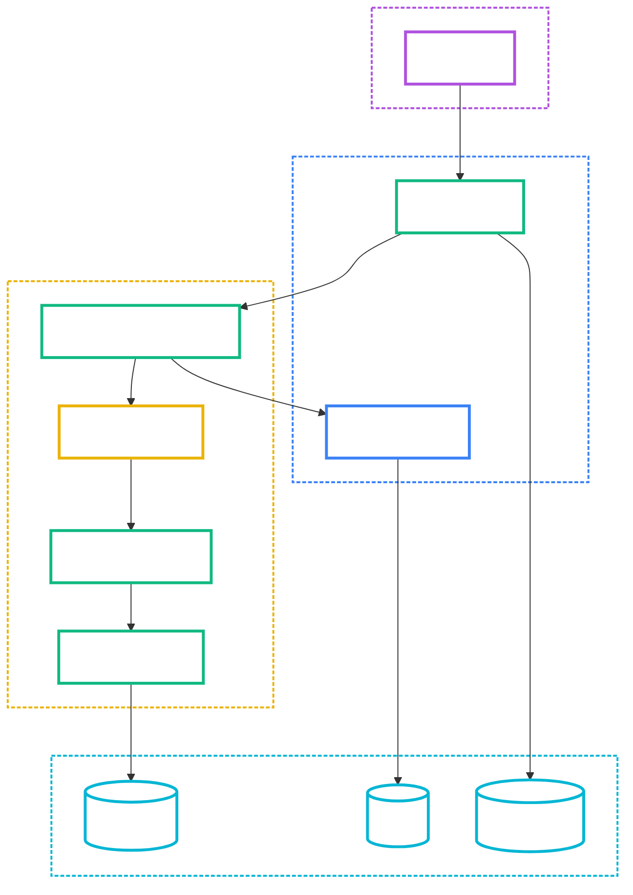
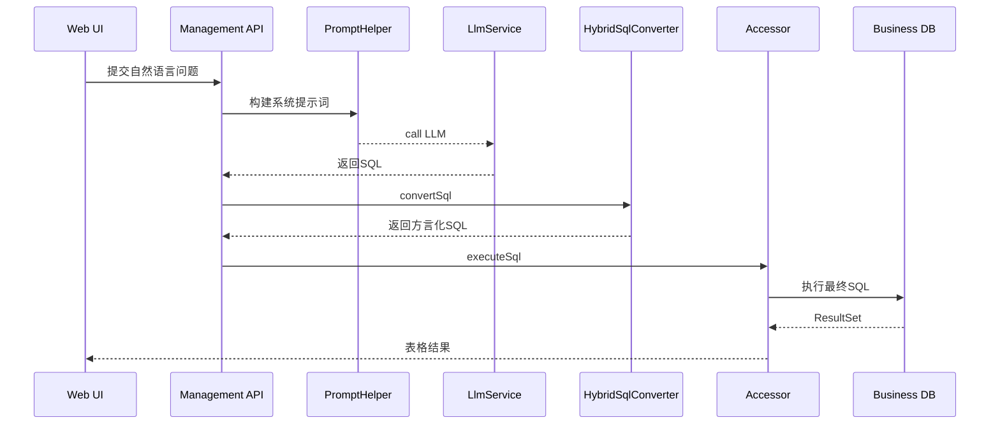
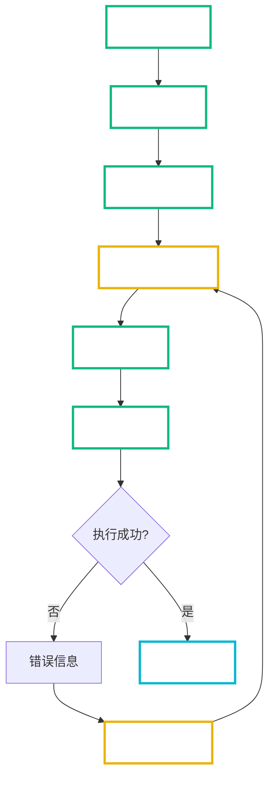

# Spring AI Alibaba NL2SQL 深度技术分析

作者: Augment Agent
创建时间: 2025-08-11 02:36:30

## 目录
- 概述与参考
- 详细操作指南分析
  - 安装、配置、启动全流程
  - 常见使用场景与操作步骤
  - 配置参数说明与最佳实践
- 深度原理分析
  - NL2SQL 核心算法与处理链路
  - 自然语言到 SQL 的技术实现
  - 向量化检索与语义匹配机制
  - 多数据库方言支持机制
- 架构图解释与重绘（Mermaid）
  - 系统架构图
  - 数据流图
  - 组件交互图
  - 处理流程图
- 本质元知识提取
  - 核心概念与设计模式
  - 技术选型与权衡
  - 可复用架构思想
- 故障排查与最佳实践
  - ORA-03048（分号无效）根因与修复
  - 其它常见问题与建议
- 附录：代码与配置示例

---

## 概述与参考
- 在线文档（GitHub）：spring-ai-alibaba-nl2sql/README.md
- 本地文档：../spring-ai-alibaba/spring-ai-alibaba-nl2sql/README.md
- 本分析覆盖四个模块：
  - spring-ai-alibaba-nl2sql-chat（核心链路与提示词）
  - spring-ai-alibaba-nl2sql-common（数据库连接/执行、访问器抽象）
  - spring-ai-alibaba-nl2sql-management（可运行的管理端）
  - spring-ai-alibaba-nl2sql-web-ui（前端）

图像资源在：../spring-ai-alibaba/spring-ai-alibaba-nl2sql/img/
- 首页/智能体: homepage-agents.png
- 发布/配置: publish-agent.png, agent-config.png
- 数据源: datasource-config.png, datasource-validation.png
- 预设问题: preset-questions.png
- 调试/初始化: agent-debug.png, vector-initialization.png
- 体验: natural-language-query.png, query-results.png, metadata-update.png, publish-complete.png, analyze-question.png, analyze-result.png

---

## 详细操作指南分析

### 安装、配置、启动全流程
1) 准备业务数据库（示例使用 MySQL）
- 从样例仓库导入 schema 和数据
- 验证业务库可连通

2) 配置管理端数据源
- 修改 spring-ai-alibaba-nl2sql-management/src/main/resources/application.yml 中的 spring.datasource.*
- 程序将自动初始化管理端所需表

3) 配置 LLM（OpenAI 兼容接口）
- spring.ai.openai.base-url/api-key/model/embedding.model
- 建议将 key 置于环境变量

4) 启动管理端
- 运行 com.alibaba.cloud.ai.Application（management 模块）
- 打开前端 web-ui（npm/yarn 安装依赖，npm run dev）
- 访问 http://localhost:3000 体验端到端流程

5) 在管理端中：
- 新建智能体、配置数据源（指向业务库）
- 初始化向量库（schema/字段/业务术语嵌入）
- 进行自然语言查询调试
- 满意后发布智能体

### 使用场景与操作步骤
- 场景A：临时查询（调试页）
  1. 选择智能体与数据源
  2. 点击初始化向量库（如首次或变更后）
  3. 输入自然语言并提交
  4. 查看 SQL、执行结果与过程分析

- 场景B：知识管理
  1. 维护预设问题（引导/常见问法）
  2. 管理业务知识与术语（影响检索与映射）

- 场景C：发布与集成
  1. 发布智能体（将调试阶段元数据固化）
  2. 前端或第三方系统通过后端 API 调用

### 配置参数作用与最佳实践
- spring.datasource.*：管理端自身数据库（建议开启连接池与合理超时）
- spring.ai.openai.*：LLM 访问配置（注意并发与限流）
- 业务数据库连接（在智能体数据源中配置）：建议最小授权、只读账号
- 向量库（Qdrant/PGVector 等）：根据规模调整 collection 分片、副本、距离度量
- 提示词模板（prompts/）：按方言、场景进行约束和自检清单

---

## 深度原理分析

### 核心算法与处理链路（概览）
- 输入：自然语言 Query + Schema 描述 + 业务证据（Evidence）
- 检索：向量化检索候选表/字段/业务知识（召回）
- 规划：构建提示词（系统+用户），引导 LLM 生成候选 SQL
- 转换：根据目标方言进行 SQL 语法转换与规范化（如 Oracle）
- 校验：语义一致性、基础安全检查
- 执行：通过统一访问器执行，获得结构化结果

### 自然语言到 SQL 的实现要点
- Prompt Orchestration：PromptHelper 统一构建多种提示（生成/修复/校验）
- MarkdownParser：从 LLM 输出提取 code block 纯 SQL 文本
- 生成 + 修复循环：若执行失败，将错误、原始 SQL 与 Schema 反馈到修复提示词

### 向量化检索与语义匹配
- 将表/字段元信息与业务知识嵌入向量库
- 基于 Query 向量近邻搜索，召回候选对象，作为提示词证据段
- 召回质量直接影响 SQL 生成质量；需定期刷新向量、维护术语

### 多数据库方言支持机制
- 运行时识别目标 dialect（如 Oracle/MySQL/PostgreSQL）
- 通过 HybridSqlConverter + HybridSqlConversionStrategy 进行转换
  - Calcite：解析/标准化渲染（复杂 SQL）
  - Druid：MySQL→Oracle 渲染与 round-trip 规范化（简单 SQL）
- 执行器层（Accessor/SqlExecutor）根据 dialect 设置 session/schema，执行 SQL

---

## 架构图解释与重绘（Mermaid）

### 系统架构图


### 数据流图


### 组件交互图


### 处理流程图（含回退修复）


---

## 本质元知识提取

### 核心概念与设计模式
- Orchestration over Model：通过提示词与管线编排，降低对模型“一次成功”的依赖
- Two-pass Conversion：先生成通用或近似SQL，再通过 Calcite/Druid 进行方言化和标准化
- Evidence-augmented Prompting：以召回的Schema/知识作为上下文，提升精确性
- Accessor/Executor 抽象：隔离数据库连接/执行细节，便于扩展多方言与连接池

### 技术选型与权衡
- LLM 提示词增强 vs. 代码转换器：提示词减少错误概率，转换器兜底保障执行
- 向量库选型（Qdrant/PGVector）：取决于部署易用性、性能与生态
- Calcite vs. Druid：Calcite适于复杂SQL的AST级标准化，Druid适于MySQL/Oracle渲染链路与Round-Trip规范化

### 可复用架构思想
- Prompt模板 + Evidence注入 + Post-Process 校验/修复 的闭环
- 统一“接入层（Accessor）”与“连接池（Pool Context）”，支持多数据源/方言
- 在“执行端兜底”放置小型、可审计的修复逻辑，防止上游抖动放大

---

## 故障排查与最佳实践

### 案例：Oracle ORA-03048（SQL保留字';'在句法上无效）
- 现象：在 JDBC 环境中，Oracle 不接受尾部分号；若 SQL 末尾存在“;”，会报 ORA-03048
- 根因：链路后段存在“最终清理逻辑”或其它环节追加了分号（与“提示词不输出分号”冲突）
- 修复（执行端兜底，方案B）：在 Accessor 执行前，仅对 Oracle 去除尾部分号
  - 优点：对上游无侵入、集中修复
  - 风险：极小；可通过日志追踪修复行为
- 预防：
  - 提示词明确“JDBC 环境不输出分号”
  - 对生成节点避免强制补分号

### 其它常见问题
- ORA-03049（LIMIT无效）：将 LIMIT 转换为 FETCH FIRST n ROWS ONLY 或 ROWNUM
- ORA-00923（FROM关键字相关）：检查列别名是否使用单引号，改为双引号
- 表/字段不存在：增强向量召回质量，维护业务术语词表
- 安全与性能：
  - 禁用 SELECT *，最小列集合
  - 合理 WHERE 条件与分页
  - 只读账号、SQL 超时与最大行数限制

---

## 附录：代码与配置示例

### 管理端数据库与AI配置（application.yml）
```yaml
spring:
  datasource:
    url: jdbc:mysql://127.0.0.1:3306/nl2sql?useUnicode=true&characterEncoding=utf-8&allowMultiQueries=true&useSSL=false
    username: ${MYSQL_USERNAME:root}
    password: ${MYSQL_PASSWORD:root}
    driver-class-name: com.mysql.cj.jdbc.Driver
    type: com.alibaba.druid.pool.DruidDataSource
  ai:
    openai:
      base-url: https://dashscope.aliyuncs.com/compatible-mode
      api-key: ${AI_DASHSCOPE_API_KEY}
      model: qwen-max
      embedding:
        model: text-embedding-v4
```

### 生成→转换→执行（关键调用链）
```java
// BaseNl2SqlService.generateSql(...)
String raw = MarkdownParser.extractRawText(newSql).trim();
String converted = hybridSqlConverter.convertSql(raw, dbConfig.getDialectType());
return converted;
```

```java
// HybridSqlConversionStrategy.maybeConvert(...)
// 若目标为 oracle，先尝试 ORACLE→ORACLE 规范化，失败则走 Hybrid/回退
```

```java
// 执行端兜底（方案B）示例（仅Oracle）
String sqlToRun = param.getSql();
String trimmed = sqlToRun != null ? sqlToRun.trim() : null;
if (trimmed != null && trimmed.endsWith(";") && "oracle".equalsIgnoreCase(dbConfig.getDialectType())) {
    logger.info("[SQL-Conv/Fix] Oracle dialect detected, stripping trailing semicolon before execution");
    sqlToRun = trimmed.substring(0, trimmed.length() - 1);
}
```

### 提示词编排建议（片段）
```text
- 严格遵循目标方言：
  - Oracle：禁止 LIMIT；用 FETCH FIRST n ROWS ONLY 或 ROWNUM
  - 别名使用双引号
  - JDBC 环境：不要输出分号
- 输出：仅单条可执行 SQL，使用```sql 包裹
```

---

## 图片详细说明
- homepage-agents.png：展示可选智能体入口，便于按业务域划分 NL2SQL 能力
- agent-config.png：核心参数配置（数据源绑定、提示词模板选择、向量化初始化入口）
- datasource-config.png：输入 JDBC 连接串/凭证，建议使用只读账号，限制权限范围
- datasource-validation.png：连通性与权限验证，失败时优先检查白名单、防火墙、驱动版本
- preset-questions.png：标准问法库，提升召回与一致性
- agent-debug.png：调试台，串联“召回-提示词-生成-执行”全链路
- vector-initialization.png：将 Schema/列名/业务术语嵌入向量库，建议定期增量刷新
- natural-language-query.png：自然语言输入入口，可回显生成 SQL
- query-results.png：表格化结果展示，便于验收与溯源
- metadata-update.png / publish-complete.png：发布路径，将调试态元数据固化为线上可用版本
- analyze-question.png / analyze-result.png：分析链路可视化，便于排障与优化

---

## 端到端用例与最佳实践
- Postman/HTTP 用例：
  - GET /nl2sql/stream/search?query=上月新增客户Top10
  - 观察日志中 Prompt、生成SQL、转换后SQL与最终执行SQL（确认无分号）
- SQL 质量基线：
  - 禁止 SELECT *，明确列集合
  - WHERE 条件必备；分页规范化（Oracle 使用 FETCH FIRST）
  - 只读账号、设置超时（QueryTimeout）、限制最大行数（MaxRows）
- 提示词建议：
  - 明确目标方言、分页示例与别名规范
  - JDBC 环境不输出分号
  - 提供自检清单（是否出现 LIMIT/反引号/单引号别名）

---

## 多方言案例（前后对照）
- MySQL → Oracle：
  - 输入：SELECT name FROM t ORDER BY score DESC LIMIT 10
  - 输出：SELECT name FROM t ORDER BY score DESC FETCH FIRST 10 ROWS ONLY
- MySQL → PostgreSQL：
  - 输入：SELECT name FROM t ORDER BY score DESC LIMIT 10 OFFSET 20
  - 输出：SELECT name FROM t ORDER BY score DESC LIMIT 10 OFFSET 20
- 反引号/别名：
  - 输入：SELECT `col` AS '中文名' FROM `tbl`
  - Oracle：SELECT "col" AS "中文名" FROM "tbl"

---

## 性能与安全建议清单
- 性能
  - 尽量走索引列过滤；避免全表扫描
  - 合理分页；仅必要字段入 SELECT 列表
  - 向量库维持轻量字段，避免过大文档内容
- 安全
  - 最小权限，只读账号
  - 执行前校验：黑名单关键字（DROP/ALTER等），限制多语句执行
  - 统一参数化（如后续引入预编译）与限流

---

## 总结
本项目采用“向量检索 + 提示词编排 + 方言转换 + 执行端兜底”的多层防护体系：
- 向量语义召回保证相关性
- 提示词规范与自检降低错误率
- Hybrid 转换器处理方言差异
- 执行端小修复消除环境差异（如 Oracle JDBC 不接受分号）

在工程化上，建议持续完善：
- Prompt 约束与示例库
- 执行前的静态/动态校验（SQL 安全、性能）
- 召回质量与术语治理（迭代式提升精度）

