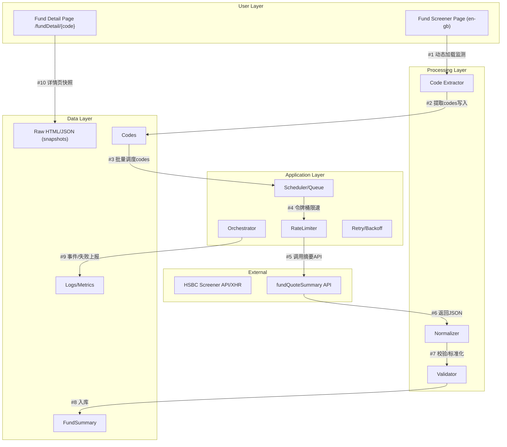

# HSBC基金筛选器数据采集系统——核心技术需求分析报告

创建时间：2025-08-13 15:30:00

## 目录
- [1. 项目概述](#1-项目概述)
- [2. 系统架构设计](#2-系统架构设计)
- [3. 数据采集策略](#3-数据采集策略)
- [4. API调用方案](#4-api调用方案)
- [5. 数据存储结构](#5-数据存储结构)
- [6. 采集流程与节流策略](#6-采集流程与节流策略)
- [7. 数据验证与错误处理](#7-数据验证与错误处理)
- [8. 安全与合规](#8-安全与合规)
- [9. 最小可行实现（示例代码）](#9-最小可行实现示例代码)
- [10. 里程碑与验收标准](#10-里程碑与验收标准)

## 1. 项目概述
- 目标：从HSBC基金筛选器获取全部约1407只基金的“产品代码”，并基于代码拉取基金详情与行情摘要信息，形成结构化数据。
- 目标页面：
  - 筛选结果页：https://investments3.personal-banking.hsbc.com.hk/public/utb/en-gb/fundScreenerResult
  - 详情页模式：https://investments3.personal-banking.hsbc.com.hk/public/utb/en-gb/fundDetail/{产品代码}
  - 摘要API：/wmds/fundQuoteSummary?body={JSON}
- 关键挑战：
  - 页面为动态加载（可能通过XHR/Fetch），需正确获取全量1407个产品代码。
  - API带JSON body参数，需URL编码，且存在频率限制与防刷策略。
  - 保障采集过程的稳定性、可追溯性与数据质量。

## 2. 系统架构设计



说明：
- UI层使用紫色（#af52de），外部服务蓝色（#3b82f6），数据层青色（#06b6d4），快速操作绿色（#10b981），处理环节黄色（#eab308）。
- 流程采用 #1, #2 编号。

## 3. 数据采集策略
1) 优先利用网络请求拦截识别真实数据源：
   - 使用无头浏览器（Playwright）打开筛选页面，监听所有XHR/Fetch请求。
   - 过滤返回JSON且包含基金列表的接口（可能包含分页参数、排序、locale等）。
   - 若获取到列表API，则直接循环分页抓取，避免对DOM解析的脆弱依赖。
2) DOM回退策略：
   - 当无法发现列表API时，解析页面DOM：
     - 定位每条基金项中的详情链接，其href应包含 /fundDetail/{code}，从中提取产品代码（如U43051）。
     - 处理分页：自动点击“下一页”或滚动加载，直到汇总数量达到1407或无更多条目。
3) 代码唯一性与完整性：
   - 使用集合去重，记录首次出现位置与来源URL。
   - 当最终数量少于1407时，自动重试缺失页或切换回退策略（API⇄DOM）。
4) 抓取节奏与反爬：
   - 浏览器层：随机User-Agent、Referer保持一致、启用隐身上下文、引入随机等待（50–250ms）与页面可见延时。
   - 网络层：全局并发限制+令牌桶（如5–8 RPS），带指数回退与抖动，优先串行化列表分页请求。

## 4. API调用方案
- 详情摘要API（GET）：
  - 形如：
    https://investments3.personal-banking.hsbc.com.hk/shp/wealth-mobile-mds-shp-api-hk-hbap-prod-proxy/v0/wmds/fundQuoteSummary?body={URL_ENCODED_JSON}
  - body样例：
    {"productType":"UT","prodAltNum":"U43051","prodCdeAltClassCde":"M","market":"HK"}
- 调用规范：
  - 使用HTTP GET，严格URL编码body参数（如JavaScript的encodeURIComponent / Python的urllib.parse.quote）。
  - Header：Accept: application/json；可设置Accept-Language: en-GB；必要时保持与页面一致的Cookie/Headers。
  - 重试：对429/5xx采用指数回退（初始500ms，倍数2.0，最大重试5），加入抖动±20%。
  - 限流：全局并发≤8；对同一产品代码失败则隔离重试，避免级联失败。
  - 健壮性：对空字段、缺失键采用容错映射，严禁崩溃；记录原始响应至Raw快照。

## 5. 数据存储结构
- 存储介质：
  - 开发期：JSONL（原始）、Parquet（结构化）、CSV（导出）。
  - 生产期：PostgreSQL（推荐）或SQLite（轻量）。
- 表设计（核心字段示例）：
  - codes（产品代码表）：
    - id (PK), code (唯一), source_url, first_seen_at, last_seen_at, status
  - fund_summary（摘要信息）：
    - id (PK), code (FK→codes.code), name, currency, nav, nav_date, risk_level,
      management_fee, ongoing_charges, isin, market, raw_json, fetched_at, etag
  - logs（运行日志）：
    - id, level, msg, context, created_at
- 文件布局：
  - data/raw/{yyyymmdd}/fund_list_page_{n}.json
  - data/raw/{yyyymmdd}/fund_summary/{code}.json
  - data/curated/codes.parquet, data/curated/fund_summary.parquet

## 6. 采集流程与节流策略
- 全量流程：
  1) 启动Orchestrator→打开Screener→监听网络
  2) 优先抓取列表API分页→提取产品代码→去重→计数目标=1407
  3) 将codes推入任务队列→令牌桶控速（5–8 RPS）
  4) 批量调用fundQuoteSummary API→写Raw快照→解析标准化→写入fund_summary
  5) 指标上报：成功数、失败数、吞吐、95/99延迟、重试分布
- 优化点：
  - 分页请求串行，详情请求并行（受令牌桶控制）
  - 请求批间隔（group pacing）+随机抖动，避免稳定节律触发风控
  - 失败隔离队列（dead-letter）与延迟重试

## 7. 数据验证与错误处理
- 验证项：
  - 产品代码总数应≥1407（考虑页面波动允差±2），如不足则触发回补策略
  - code格式校验：大写字母+数字（例U43051），异常记录入logs并隔离
  - 详情JSON必要字段非空率≥98%，关键数值（NAV）可解析且范围合理
- 错误处理：
  - 429/5xx：指数回退+抖动重试；>5次标记暂挂
  - 超时：超时阈值（5–8s）→切换备用线路/延长后重试
  - 解析失败：保留raw_json，记录解析版本，便于回放
  - 一致性：同一code多次拉取若hash变化→记录etag与版本号

## 8. 安全与合规
- 尊重robots.txt与网站条款，仅用于内部合规分析与测试。
- 控制并发与请求频率，避免对目标站点造成压力。
- 脱敏日志，避免记录个人信息或敏感标识。

## 9. 最小可行实现（示例代码）

示例A：使用Playwright提取产品代码（优先监听XHR，其次DOM回退）

```ts
// Node.js + Playwright
import { chromium } from 'playwright';

async function extractFundCodes(): Promise<Set<string>> {
  const browser = await chromium.launch({ headless: true });
  const ctx = await browser.newContext({ userAgent: undefined });
  const page = await ctx.newPage();
  const codes = new Set<string>();

  page.on('response', async (resp) => {
    try {
      const url = resp.url();
      if (url.includes('fund') && url.includes('screener')) {
        const ct = resp.headers()['content-type'] || '';
        if (ct.includes('application/json')) {
          const data = await resp.json();
          const items = Array.isArray(data?.items) ? data.items : (data?.data?.items || []);
          for (const it of items) {
            const code = it?.code || it?.prodAltNum || it?.productCode;
            if (code) codes.add(String(code));
          }
        }
      }
    } catch {}
  });

  await page.goto('https://investments3.personal-banking.hsbc.com.hk/public/utb/en-gb/fundScreenerResult', { waitUntil: 'networkidle' });

  // DOM回退：扫描详情链接
  const anchors = await page.$$('a');
  for (const a of anchors) {
    const href = await a.getAttribute('href');
    const m = href?.match(/\/fundDetail\/([A-Z0-9]+)/);
    if (m?.[1]) codes.add(m[1]);
  }

  // TODO: 自动翻页/滚动直至无更多内容
  await browser.close();
  return codes;
}
```

示例B：批量调用fundQuoteSummary（Python + aiohttp）

```python
import asyncio, json, time, random
from urllib.parse import quote
import aiohttp

API = "https://investments3.personal-banking.hsbc.com.hk/shp/wealth-mobile-mds-shp-api-hk-hbap-prod-proxy/v0/wmds/fundQuoteSummary?body={body}"

async def fetch_summary(session, code, sem, retries=5):
    payload = {"productType":"UT","prodAltNum":code,"prodCdeAltClassCde":"M","market":"HK"}
    url = API.format(body=quote(json.dumps(payload), safe=''))
    backoff = 0.5
    for attempt in range(retries):
        async with sem:
            try:
                async with session.get(url, timeout=8) as r:
                    if r.status in (429, 500, 502, 503, 504):
                        raise RuntimeError(f"retryable status {r.status}")
                    r.raise_for_status()
                    return await r.json()
            except Exception:
                await asyncio.sleep(backoff + random.uniform(0, 0.2))
                backoff = min(backoff * 2, 8)
    return None

async def run(codes):
    sem = asyncio.Semaphore(8)  # 全局并发限制
    headers = {"Accept":"application/json","Accept-Language":"en-GB"}
    async with aiohttp.ClientSession(headers=headers) as session:
        tasks = [fetch_summary(session, c, sem) for c in codes]
        return await asyncio.gather(*tasks)
```

## 10. 里程碑与验收标准
- M1（采集代码）：能稳定提取≥1407个唯一产品代码；多次运行差异≤1%
- M2（API拉取）：对全量代码调用摘要API成功率≥98%，失败自动重试与隔离
- M3（数据质量）：关键字段非空率≥98%，NAV解析成功率≥99%
- M4（可观测性）：完整日志、错误报告与指标；支持断点续跑与补采

— 以上为核心技术需求与可行性方案，建议先实现MVP并进行一轮全量试跑，校准限速与重试参数。
