# HSBC基金筛选器完全规范化PostgreSQL数据模型设计（禁止JSONB）

创建时间：2025-08-18 12:45:30
适用数据：U43051 全量8个JSON响应
目标库：hsbc_fund_multi（容器：postgresql-hsbc-fund-screener）

## 目录
- 设计目标与约束
- 数据结构分析（逐文件，字段与含义）
- 完全规范化关系模型（DDL）
- 数组与嵌套处理（ETL策略与SQL模板）
- NL2SQL优化与索引设计
- 示例自然语言→SQL
- 数据完整性验证SQL
- Mermaid数据库关系图

## 设计目标与约束
- 完全规范化：不使用 JSON/JSONB；所有数据拆解为多表，用主键/外键表达层级与数组关系
- 零数据丢失：
  - attributeMap 全量扁平为专用列表 d_fund_attr；数组字段（如 ccyProdTradeCde）以子表并按序保存
  - priceQuote 全量扁平为 f_quote_detail 专用列（不使用KV）；若出现新增字段，追加表列处理
- NL2SQL友好：业务语义清晰的表/列名，统一fund_code（U代码）作为主外键
- 类型精确：数值类使用NUMERIC合适精度，日期DATE，布尔BOOLEAN，字符串TEXT

## 数据结构分析（逐文件，字段与含义）
以下基于 001_U43051.* 样本（同类文件结构相同）：

1) amh_ut_product_response_body.json
- payload[].productAlternativeNumber: 基金U代码（如 U43051）
- payload[].attributeMap: 键值对（示例键）：
  - allowSellProdInd(Y/N), prodBidPrcAmt, prcEffDt, fundSwOutMinAmt, fundCatCde/fundCatDesc,
    fundSwInMinAmt, minMipAmountCurrency, topSellProdInd, ccyProdTradeCde(["HKD","USD"] 数组),
    gbaAcctTrdb, finDocURL_*, prodStatCde, ccyInvstCde, utSwOutRtainMinNum, productDocumentSid,
    allowSellMipProdInd, siFundInd, dcmlPlaceTradeUnitNum, productPerformanceId(如 0P00000B0I),
    riskLvlCde(风险等级), prodName(基金名称), prodNavPrcAmt, fundHouseName/Code, ccyProdCde,
    invstInitMinAmt 等
- 含义：产品静态/半静态配置。attributeMap 为可扩展键值集合

2) wmds_advanceChart_response_body.json
- result[].prodAltNumSegs[]: 多重外部标识映射
  - prodCdeAltClassCde: 标识类型（P/F/M/I/O/T/W）
  - prodAltNum: 对应值（如 ISIN、PerformanceId 等）
- result[].data[]: NAV时间序列
  - date, navPrice, cumulativeReturn

3) wmds_fundQuoteSummary_response_body.json
- summary.bid/offer/weekRangeLow/weekRangeHigh/weekRangeCurrency
- summary.calendarYearTotalReturns.items[]: 每年收益
  - year, fundCalendarYearReturn, fundStubYearEndReturn, stubYearEndReturnIndicator,
    bestFitIndexCalendarYearReturn, categoryCalendarYearReturn,
    prospectusPrimaryIndexYearReturns[]: {indexId, indexName, weighting, prospectusPrimaryIndex}
  - lastUpdatedDate, dailyLastUpdatedDate
- summary.cumulativeTotalReturns.items[]: 分段累计收益（YTD/1M/3M/6M/1Y/3Y/5Y/10Y...）
  - period, totalReturn, totalDailyReturn, bestFitIndexReturn, categoryReturn, categoryDailyReturn,
    primaryIndexReturn, prospectusPrimaryIndexReturns[] 同上

4) wmds_fundSearchCriteria_response_body.json
- minMaxCriterias[]: {criteriaKey, minimum, maximum}
- listCriterias[]: {criteriaKey, items[]: {itemKey, itemValue, parent}}
- 含义：全局筛选范围与字典（非特定基金）

5) wmds_holdingAllocation_response_body.json
- holdingAllocation[]: 每项一类方法
  - methods: assetAllocations | globalStockSectors | regionalExposures |
             globalBondSectors | bondRegionalExposures
  - portfolioDate
  - breakdowns[]: {name, weighting}

6) wmds_otherFundClasses_response_body.json
- assetClasses: 可能为 null 或数组（样本为 null）

7) wmds_quoteDetail_response_body.json
- priceQuote: 详尽报价/属性（示例字段）
  - symbol, market, productType, productSubTypeCode, quoteIndicator, priceQuote, currency,
    companyName, changeAmount, changePercent, bidPrice, bidPriceDate, askPrice,
    dividendYield, exchangeUpdatedTime, allowSellMipProdInd, topPerformersIndicator,
    topSellProdIndex, riskLvlCde, performanceId, tradableCurrency, allowBuy, allowSell,
    categoryLevel1Code/Name, launchDate, 等大量可为空字段（ric/eps/marketCap/...）
- calendarReturns.items[]: {year, annualCalendarYearReturn} + monthEndDate
- cumulativeReturns.items[]: {period, trailingTotalReturn, dailyPerformanceNAV} + monthEndDate, dayEndDate
- prodAltNumSegs[]: 同 advanceChart
- entityUpdatedTime

8) wmds_topTenHoldings_response_body.json
- top10Holdings.items[]: {market, productType, prodCdeAltClassCde, prodAltNum,
                          securityName, weighting, currency, marketValue}
- top10Holdings.lastUpdatedDate

## 完全规范化关系模型（DDL）
说明：统一 schema = hsbc；所有表含基础元数据列（source_file, ingested_at）。

```sql
CREATE SCHEMA IF NOT EXISTS hsbc;

-- 基金主数据（聚合关键字段，便于NL2SQL）
CREATE TABLE IF NOT EXISTS hsbc.d_fund (
  fund_id           BIGSERIAL PRIMARY KEY,
  fund_code         TEXT UNIQUE NOT NULL,        -- U43051
  fund_name         TEXT,
  fund_house_code   TEXT,
  fund_house_name   TEXT,
  risk_level_code   TEXT,
  product_type      TEXT,                        -- 如 UT
  product_subtype   TEXT,                        -- 如 CF
  currency          TEXT,                        -- 主显示币种
  tradable_currency TEXT,
  category_l1_code  TEXT,
  category_l1_name  TEXT,
  performance_id    TEXT,
  isin              TEXT,
  launch_date       DATE,
  allow_buy         BOOLEAN,
  allow_sell        BOOLEAN,
  source_file       TEXT,
  ingested_at       TIMESTAMPTZ DEFAULT now()
);

-- 产品 attributeMap 扁平列表（零丢失）
CREATE TABLE IF NOT EXISTS hsbc.d_fund_attr (
  fund_id BIGINT PRIMARY KEY REFERENCES hsbc.d_fund(fund_id) ON DELETE CASCADE,
  allow_sell_prod_ind BOOLEAN,
  prod_bid_prc_amt NUMERIC(18,6),
  prc_eff_dt DATE,
  pi_fund_ind TEXT,
  ut_rdm_min_num NUMERIC(18,6),
  fund_sw_out_min_amt NUMERIC(18,6),
  fund_cat_cde TEXT,
  fund_sw_in_min_amt NUMERIC(18,6),
  min_mip_amount_currency TEXT,
  top_sell_prod_ind BOOLEAN,
  gba_acct_trdb BOOLEAN,
  fin_doc_url_intrmrpt TEXT,
  fin_doc_url_factsheet TEXT,
  prod_stat_cde TEXT,
  ccy_invst_cde TEXT,
  ut_sw_out_rtain_min_num NUMERIC(18,6),
  product_document_sid TEXT,
  allow_sell_mip_prod_ind BOOLEAN,
  si_fund_ind TEXT,
  fund_cat_desc TEXT,
  dcml_place_trade_unit_num NUMERIC(18,6),
  product_performance_id TEXT,
  risk_lvl_cde TEXT,
  prod_name TEXT,
  prod_nav_prc_amt NUMERIC(18,6),
  ut_rtain_min_num NUMERIC(18,6),
  restr_onl_scrib_ind TEXT,
  fund_house_name_attr TEXT,
  fund_house_cde_attr TEXT,
  rdm_min_amt NUMERIC(18,6),
  ccy_prod_cde TEXT,
  invst_mip_incrm_min_amt NUMERIC(18,6),
  de_auth_fund_ind TEXT,
  fin_doc_url_prospectus TEXT,
  fund_sw_out_rtain_min_amt NUMERIC(18,6),
  setl_lead_tm_scrib NUMERIC(18,6),
  invst_mip_min_amt NUMERIC(18,6),
  fund_rtain_min_amt NUMERIC(18,6),
  allow_buy_prod_ind BOOLEAN,
  ccy_prod_mkt_prc_cde TEXT,
  setl_lead_tm_rdm NUMERIC(18,6),
  allow_sw_out_prod_ind BOOLEAN,
  fin_doc_url_anulrpt TEXT,
  esg_ind TEXT,
  invst_init_min_amt NUMERIC(18,6)
);

-- attributeMap 数组字段：ccyProdTradeCde
CREATE TABLE IF NOT EXISTS hsbc.d_fund_attr_trade_ccy (
  fund_id BIGINT REFERENCES hsbc.d_fund(fund_id) ON DELETE CASCADE,
  position INT NOT NULL,
  currency_code TEXT NOT NULL,
  PRIMARY KEY (fund_id, position)
);

-- 多重外部标识（出现于多个源，按来源留痕）
CREATE TABLE IF NOT EXISTS hsbc.fund_identifier (
  fund_id   BIGINT REFERENCES hsbc.d_fund(fund_id) ON DELETE CASCADE,
  src       TEXT NOT NULL,                    -- advanceChart / quoteDetail 等
  id_type   TEXT NOT NULL,                    -- P/F/M/I/O/T/W
  id_value  TEXT,
  PRIMARY KEY (fund_id, src, id_type)
);

-- NAV时间序列（advanceChart.data）- 冗余存储fund_code/fund_name以简化查询
CREATE TABLE IF NOT EXISTS hsbc.f_nav_daily (
  fund_id             BIGINT REFERENCES hsbc.d_fund(fund_id) ON DELETE CASCADE,
  fund_code           TEXT,
  fund_name           TEXT,
  nav_date            DATE NOT NULL,
  nav_price           NUMERIC(18,6),
  cumulative_return   NUMERIC(18,6),
  source_file         TEXT,
  ingested_at         TIMESTAMPTZ DEFAULT now(),
  PRIMARY KEY (fund_id, nav_date)
);

-- 报价摘要（fundQuoteSummary.summary 顶层）
CREATE TABLE IF NOT EXISTS hsbc.f_quote_summary (
  fund_id                 BIGINT REFERENCES hsbc.d_fund(fund_id) ON DELETE CASCADE,
  bid                     NUMERIC(18,6),
  offer                   NUMERIC(18,6),
  week_range_low          NUMERIC(18,6),
  week_range_high         NUMERIC(18,6),
  week_range_currency     TEXT,
  cytr_last_updated_date  DATE,   -- calendarYearTotalReturns.lastUpdatedDate
  daily_last_updated_date DATE,   -- calendarYearTotalReturns.dailyLastUpdatedDate
  source_file             TEXT,
  ingested_at             TIMESTAMPTZ DEFAULT now(),
  PRIMARY KEY (fund_id)
);

-- 年度收益明细（summary.calendarYearTotalReturns.items[]）
CREATE TABLE IF NOT EXISTS hsbc.f_quote_summary_cytr_item (
  fund_id        BIGINT REFERENCES hsbc.d_fund(fund_id) ON DELETE CASCADE,
  year           INT NOT NULL,
  fund_return    NUMERIC(18,6),
  stub_return    NUMERIC(18,6),
  stub_indicator TEXT,
  bestfit_index_return NUMERIC(18,6),
  category_return     NUMERIC(18,6),
  PRIMARY KEY (fund_id, year)
);

-- 年度收益对应的招募说明书主指数（prospectusPrimaryIndexYearReturns[]）
CREATE TABLE IF NOT EXISTS hsbc.f_quote_summary_cytr_index (
  fund_id     BIGINT REFERENCES hsbc.d_fund(fund_id) ON DELETE CASCADE,
  year        INT NOT NULL,
  index_id    TEXT,
  index_name  TEXT,
  weighting   NUMERIC(10,6),
  index_return NUMERIC(18,6),           -- prospectusPrimaryIndex
  PRIMARY KEY (fund_id, year, index_id)
);

-- 累计收益（summary.cumulativeTotalReturns.items[]）- 冗余基金信息，便于单表查询
CREATE TABLE IF NOT EXISTS hsbc.f_quote_summary_ctr_item (
  fund_id              BIGINT REFERENCES hsbc.d_fund(fund_id) ON DELETE CASCADE,
  fund_code            TEXT,
  fund_name            TEXT,
  category_l1_name     TEXT,
  risk_level_code      TEXT,
  period               TEXT NOT NULL,                 -- YTD/1M/3M/...
  total_return         NUMERIC(18,6),
  total_daily_return   NUMERIC(18,6),
  bestfit_index_return NUMERIC(18,6),
  category_return      NUMERIC(18,6),
  category_daily_return NUMERIC(18,6),
  primary_index_return NUMERIC(18,6),
  PRIMARY KEY (fund_id, period)
);

-- 累计收益对应主指数（prospectusPrimaryIndexReturns[]）
CREATE TABLE IF NOT EXISTS hsbc.f_quote_summary_ctr_index (
  fund_id     BIGINT REFERENCES hsbc.d_fund(fund_id) ON DELETE CASCADE,
  period      TEXT NOT NULL,
  index_id    TEXT,
  index_name  TEXT,
  weighting   NUMERIC(10,6),
  index_return NUMERIC(18,6),
  PRIMARY KEY (fund_id, period, index_id)
);

-- 详细报价（quoteDetail.priceQuote）- 完全扁平化，无KV
CREATE TABLE IF NOT EXISTS hsbc.f_quote_detail (
  fund_id               BIGINT PRIMARY KEY REFERENCES hsbc.d_fund(fund_id) ON DELETE CASCADE,
  product_status        TEXT,
  ric                   TEXT,
  symbol                TEXT,
  market                TEXT,
  product_type          TEXT,
  product_subtype_code  TEXT,
  prod_alt_class_code   TEXT,
  quote_indicator       BOOLEAN,
  price_quote           NUMERIC(18,6),
  currency              TEXT,
  company_name          TEXT,
  security_description  TEXT,
  change_amount         NUMERIC(18,6),
  change_percent        NUMERIC(18,6),
  bid_price             NUMERIC(18,6),
  bid_price_date        DATE,
  bid_size              NUMERIC(18,6),
  ask_price             NUMERIC(18,6),
  ask_size              NUMERIC(18,6),
  day_range_low         NUMERIC(18,6),
  day_range_high        NUMERIC(18,6),
  trading_volume        NUMERIC(28,6),
  open_price            NUMERIC(18,6),
  year_low_price        NUMERIC(18,6),
  year_high_price       NUMERIC(18,6),
  average_volume        NUMERIC(28,6),
  pe_ratio              NUMERIC(18,6),
  market_cap            NUMERIC(28,6),
  shares_outstanding    NUMERIC(28,6),
  beta                  NUMERIC(18,6),
  previous_close_price  NUMERIC(18,6),
  dividend              NUMERIC(18,6),
  dividend_yield        NUMERIC(18,6),
  ex_dividend_date      DATE,
  board_lot             NUMERIC(18,6),
  cas_eligible_flag     TEXT,
  status                TEXT,
  history_close_date    DATE,
  turn_over             NUMERIC(28,6),
  market_closed         BOOLEAN,
  nominal_price_type    TEXT,
  spread_bid            NUMERIC(18,6),
  spread_ask            NUMERIC(18,6),
  eps                   NUMERIC(18,6),
  iep                   NUMERIC(18,6),
  iev                   NUMERIC(18,6),
  turnover_amount       NUMERIC(28,6),
  turnover_include_amount NUMERIC(28,6),
  quote_sector          TEXT,
  quote_industry        TEXT,
  quote_exchange        TEXT,
  quote_1m_perc_change  NUMERIC(18,6),
  quote_3m_perc_change  NUMERIC(18,6),
  quote_6m_perc_change  NUMERIC(18,6),
  quote_12m_perc_change NUMERIC(18,6),
  exchange_timezone     TEXT,
  exchange_updated_time DATE,
  unsigned_agreement_id TEXT,
  quote_vma50d          NUMERIC(18,6),
  prod_shore_loc_code   TEXT,
  allow_sell_mip_prod_ind BOOLEAN,
  upper_trading_limit   NUMERIC(18,6),
  lower_trading_limit   NUMERIC(18,6),
  risk_alert            TEXT,
  risk_rating           TEXT,
  risk_level_code       TEXT,
  option_info           TEXT,
  bond_info             TEXT,
  interest_rate_info    TEXT,
  commodity_info        TEXT,
  performance_id        TEXT,
  tradable_currency     TEXT,
  agreement_sign_status TEXT,
  agreement_id          TEXT,
  in_daylight_time      BOOLEAN,
  trade_units           NUMERIC(18,6),
  distribution_frequency TEXT,
  top_performers_indicator TEXT,
  top_sell_prod_index   TEXT,
  category_l1_code      TEXT,
  category_l1_name      TEXT,
  allow_buy             BOOLEAN,
  allow_sell            BOOLEAN,
  pi_fund_ind           TEXT,
  de_auth_fund_ind      TEXT,
  launch_date           DATE,
  entity_updated_time   TIMESTAMPTZ,
  source_file           TEXT,
  ingested_at           TIMESTAMPTZ DEFAULT now()
);

-- quoteDetail: 已全部扁平至 f_quote_detail 专用列（不使用KV）

-- quoteDetail: calendarReturns.items[]
CREATE TABLE IF NOT EXISTS hsbc.f_quote_detail_calendar_return (
  fund_id   BIGINT REFERENCES hsbc.d_fund(fund_id) ON DELETE CASCADE,
  year      INT NOT NULL,
  annual_return NUMERIC(18,6),
  month_end_date DATE,
  PRIMARY KEY (fund_id, year)
);

-- quoteDetail: cumulativeReturns.items[]
CREATE TABLE IF NOT EXISTS hsbc.f_quote_detail_cum_return (
  fund_id    BIGINT REFERENCES hsbc.d_fund(fund_id) ON DELETE CASCADE,
  period     TEXT NOT NULL,
  trailing_total_return NUMERIC(18,6),
  daily_performance_nav NUMERIC(18,6),
  month_end_date DATE,
  day_end_date   DATE,
  PRIMARY KEY (fund_id, period)
);

-- 前十大持仓
CREATE TABLE IF NOT EXISTS hsbc.f_top10_holdings_header (
  fund_id     BIGINT REFERENCES hsbc.d_fund(fund_id) ON DELETE CASCADE,
  last_updated_date DATE,
  source_file  TEXT,
  ingested_at  TIMESTAMPTZ DEFAULT now(),
  PRIMARY KEY (fund_id)
);

CREATE TABLE IF NOT EXISTS hsbc.f_top10_holdings_item (
  fund_id        BIGINT REFERENCES hsbc.d_fund(fund_id) ON DELETE CASCADE,
  fund_code      TEXT,
  fund_name      TEXT,
  as_of_date     DATE NOT NULL,                   -- 同 last_updated_date
  rank           INT NOT NULL,
  market         TEXT,
  product_type   TEXT,
  alt_class_code TEXT,       -- prodCdeAltClassCde
  alt_num        TEXT,       -- prodAltNum
  security_name  TEXT,
  weighting      NUMERIC(18,6),
  currency       TEXT,
  market_value   NUMERIC(28,6),
  PRIMARY KEY (fund_id, as_of_date, rank)
);

-- 资产配置/暴露
CREATE TABLE IF NOT EXISTS hsbc.f_allocation_method (
  fund_id        BIGINT REFERENCES hsbc.d_fund(fund_id) ON DELETE CASCADE,
  portfolio_date DATE NOT NULL,
  method         TEXT NOT NULL,      -- assetAllocations / regionalExposures 等
  source_file    TEXT,
  ingested_at    TIMESTAMPTZ DEFAULT now(),
  PRIMARY KEY (fund_id, portfolio_date, method)
);

CREATE TABLE IF NOT EXISTS hsbc.f_allocation_breakdown (
  fund_id        BIGINT REFERENCES hsbc.d_fund(fund_id) ON DELETE CASCADE,
  portfolio_date DATE NOT NULL,
  method         TEXT NOT NULL,
  name           TEXT NOT NULL,      -- 细分项（如 Stock/US/BM 等）
  weighting      NUMERIC(18,6),
  PRIMARY KEY (fund_id, portfolio_date, method, name)
);

-- 其他基金类别
CREATE TABLE IF NOT EXISTS hsbc.f_other_fund_classes_meta (
  fund_id       BIGINT REFERENCES hsbc.d_fund(fund_id) ON DELETE CASCADE,
  observed_null BOOLEAN,            -- 记录该响应assetClasses是否为null
  source_file   TEXT,
  ingested_at   TIMESTAMPTZ DEFAULT now(),
  PRIMARY KEY (fund_id)
);

CREATE TABLE IF NOT EXISTS hsbc.f_other_fund_class_item (
  fund_id     BIGINT REFERENCES hsbc.d_fund(fund_id) ON DELETE CASCADE,
  class_code  TEXT,
  class_name  TEXT,
  currency    TEXT,
  share_type  TEXT,
  PRIMARY KEY (fund_id, class_code)
);

-- 全局筛选条件
CREATE TABLE IF NOT EXISTS hsbc.d_criteria_minmax (
  criteria_key TEXT PRIMARY KEY,
  minimum      NUMERIC(18,6),
  maximum      NUMERIC(18,6)
);

CREATE TABLE IF NOT EXISTS hsbc.d_criteria_list_item (
  criteria_key TEXT,
  item_key     TEXT,
  item_value   TEXT,
  parent       TEXT,
  PRIMARY KEY (criteria_key, item_key)
);
```

## 数组与嵌套处理（ETL策略与SQL模板）
- 原则：每遇数组即新建明细表；嵌套对象拆为父表（头）+子表（明细）。
- 建议ETL：使用Python读取JSON（禁止将原文存库），按下列映射执行批量INSERT/UPSERT。
- 映射要点：
  1) d_fund：
     - fund_code ← productAlternativeNumber 或 quoteDetail.priceQuote.symbol
     - 其他字段来自 quoteDetail.priceQuote 与 attributeMap（优先quoteDetail，缺失回退attributeMap）
  2) d_fund_attr：将 attributeMap 全部字段映射到专用列；空字符串按 NULL 处理，Y/N 转 BOOLEAN
     d_fund_attr_trade_ccy：对 attributeMap.ccyProdTradeCde 数组逐项插入，position 为原始顺序
  3) fund_identifier：遍历 prodAltNumSegs，src=文件名类别（advanceChart/quoteDetail）
  4) f_nav_daily：插入 data[] 中每日记录
  5) f_quote_summary_*：插入 summary 顶层与其 items/indices 数组
  6) f_quote_detail：将 priceQuote 全字段映射到专用列；cum_return/calendar_return：分别插入对应表
  7) f_top10_holdings_header/item：header一行，item按数组顺序赋 rank（1..n）
  8) f_allocation_method/breakdown：每 methods 一行 header，breakdowns 多行明细
  9) f_other_fund_classes_meta/item：若assetClasses为null，则 observed_null=true；若为数组则逐项插入 item

- SQL模板（示例）
```sql
-- d_fund（存在则更新）
INSERT INTO hsbc.d_fund (fund_code, fund_name, fund_house_code, fund_house_name,
  risk_level_code, product_type, product_subtype, currency, tradable_currency,
  category_l1_code, category_l1_name, performance_id, isin, launch_date, allow_buy, allow_sell,
  source_file)
VALUES ($1,$2,$3,$4,$5,$6,$7,$8,$9,$10,$11,$12,$13,$14,$15,$16,$17)
ON CONFLICT (fund_code) DO UPDATE SET
  fund_name=EXCLUDED.fund_name,
  risk_level_code=EXCLUDED.risk_level_code,
  performance_id=EXCLUDED.performance_id,
  category_l1_code=EXCLUDED.category_l1_code,
  category_l1_name=EXCLUDED.category_l1_name,
  launch_date=EXCLUDED.launch_date,
  allow_buy=EXCLUDED.allow_buy,
  allow_sell=EXCLUDED.allow_sell,
  source_file=EXCLUDED.source_file,
  ingested_at=now();
```

## NL2SQL优化与索引设计
- 命名规范：fund/return/holding/allocation等直接映射业务语义
- 建议索引：
```sql
CREATE INDEX IF NOT EXISTS idx_d_fund_risk ON hsbc.d_fund(risk_level_code);
CREATE INDEX IF NOT EXISTS idx_d_fund_cat ON hsbc.d_fund(category_l1_code);
CREATE INDEX IF NOT EXISTS idx_nav_by_fund_date ON hsbc.f_nav_daily(fund_id, nav_date DESC);
CREATE INDEX IF NOT EXISTS idx_ctr_period ON hsbc.f_quote_summary_ctr_item(fund_id, period);
CREATE INDEX IF NOT EXISTS idx_top10_by_date ON hsbc.f_top10_holdings_item(fund_id, as_of_date DESC, rank);
CREATE INDEX IF NOT EXISTS idx_alloc_by_method ON hsbc.f_allocation_breakdown(fund_id, portfolio_date DESC, method);
```

## 示例自然语言→SQL
1) 查找收益率最高的基金（近1年）
```sql
SELECT f.fund_code, f.fund_name, c.total_return AS return_1y
FROM hsbc.f_quote_summary_ctr_item c
JOIN hsbc.d_fund f ON f.fund_id = c.fund_id
WHERE c.period = '1Y'
ORDER BY c.total_return DESC NULLS LAST
LIMIT 10;
```
2) 显示某基金的前十大持仓
```sql
SELECT i.rank, i.security_name, i.weighting, i.market, i.currency, i.market_value
FROM hsbc.f_top10_holdings_item i
JOIN hsbc.d_fund f ON f.fund_id = i.fund_id
WHERE f.fund_code = 'U43051'
ORDER BY i.as_of_date DESC, i.rank ASC;
```
3) 比较不同基金类别的表现（近1年）
```sql
SELECT f.category_l1_name, AVG(c.total_return) AS avg_return_1y, COUNT(*) AS fund_count
FROM hsbc.f_quote_summary_ctr_item c
JOIN hsbc.d_fund f ON f.fund_id = c.fund_id
WHERE c.period = '1Y'
GROUP BY f.category_l1_name
ORDER BY avg_return_1y DESC NULLS LAST;
```
4) 查询特定风险等级的基金（风险=5）
```sql
SELECT fund_code, fund_name, risk_level_code, category_l1_name
FROM hsbc.d_fund
WHERE risk_level_code = '5'
ORDER BY fund_name;
```

## 数据完整性验证SQL
- 验证外部标识齐全（期望包含 P/F/M/I/O/T/W 中的若干）
```sql
SELECT fund_code,
       ARRAY_AGG(DISTINCT id_type ORDER BY id_type) AS id_types
FROM hsbc.fund_identifier i
JOIN hsbc.d_fund f ON f.fund_id = i.fund_id
WHERE f.fund_code='U43051'
GROUP BY fund_code;
```
- 验证前十大持仓条数为10
```sql
SELECT as_of_date, COUNT(*)
FROM hsbc.f_top10_holdings_item i
JOIN hsbc.d_fund f ON f.fund_id = i.fund_id
WHERE f.fund_code='U43051'
GROUP BY as_of_date;
```
- 验证NAV时间序列存在最近一段日期
```sql
SELECT MIN(nav_date), MAX(nav_date), COUNT(*)
FROM hsbc.f_nav_daily n
JOIN hsbc.d_fund f ON f.fund_id = n.fund_id
WHERE f.fund_code='U43051';
```
- 验证累计收益期覆盖
```sql
SELECT ARRAY_AGG(period ORDER BY period)
FROM hsbc.f_quote_summary_ctr_item c
JOIN hsbc.d_fund f ON f.fund_id = c.fund_id
WHERE f.fund_code='U43051';
```
- 验证attributeMap已全部扁平入库（存在一行）
```sql
SELECT COUNT(*) FROM hsbc.d_fund_attr a
JOIN hsbc.d_fund f ON f.fund_id = a.fund_id
WHERE f.fund_code='U43051';
```
- 验证交易货币数组入库（按序）
```sql
SELECT position, currency_code
FROM hsbc.d_fund_attr_trade_ccy t
JOIN hsbc.d_fund f ON f.fund_id = t.fund_id
WHERE f.fund_code='U43051'
ORDER BY position;
```

## Mermaid数据库关系图

```mermaid
erDiagram
  d_fund ||--|| d_fund_attr : has
  d_fund ||--o{ d_fund_attr_trade_ccy : has
  d_fund ||--o{ fund_identifier : has
  d_fund ||--o{ f_nav_daily : has
  d_fund ||--|| f_quote_summary : has
  d_fund ||--o{ f_quote_summary_cytr_item : has
  d_fund ||--o{ f_quote_summary_cytr_index : maps
  d_fund ||--o{ f_quote_summary_ctr_item : has
  d_fund ||--o{ f_quote_summary_ctr_index : maps
  d_fund ||--|| f_quote_detail : has
  %% f_quote_detail 全量扁平化，无KV表
  d_fund ||--o{ f_quote_detail_calendar_return : has
  d_fund ||--o{ f_quote_detail_cum_return : has
  d_fund ||--|| f_top10_holdings_header : has
  d_fund ||--o{ f_top10_holdings_item : has
  d_fund ||--o{ f_allocation_method : has
  d_fund ||--o{ f_allocation_breakdown : has
  d_fund ||--|| f_other_fund_classes_meta : has
  d_fund ||--o{ f_other_fund_class_item : has
  d_criteria_minmax ||--o{ d_criteria_list_item : groups
```


