# HSBC基金筛选器 — 完全扁平化PostgreSQL模型（NL2SQL优先，禁止JSONB）

创建时间：2025-08-18 13:20:00
目标库：hsbc_fund_multi（容器：postgresql-hsbc-fund-screener）
适用数据：U43051 全量8个JSON响应

## 目录
- 设计原则与目标
- 扁平化分析（逐JSON）
- 完整DDL脚本（扁平化结构）
- ETL转换规则（类型转换与数组展开）
- 索引与NL2SQL验证查询
- 数据完整性检查
- Mermaid关系图（扁平化）

## 设计原则与目标
- 禁止JSONB；零数据丢失
- 扁平化优先：对象→专列，数组→明细表；接受合理冗余（含fund_code/fund_name重复）
- 反范式以换取NL2SQL构造简洁、稳定、正确；常见查询不超过1-2个JOIN
- 数据类型：Y/N→BOOLEAN；数值→NUMERIC；日期→DATE；时间→TIMESTAMPTZ/DATE

## 扁平化分析（逐JSON）

## 扁平化统计分析（自动统计）

### 1) JSON文件统计

| JSON文件类型 | 文件数量 | 占比 |
|---|---:|---:|
| amh_ut_product | 1407 | 12.50% |
| wmds_advanceChart | 1407 | 12.50% |
| wmds_fundQuoteSummary | 1407 | 12.50% |
| wmds_fundSearchCriteria | 1407 | 12.50% |
| wmds_holdingAllocation | 1407 | 12.50% |
| wmds_otherFundClasses | 1407 | 12.50% |
| wmds_quoteDetail | 1407 | 12.50% |
| wmds_topTenHoldings | 1407 | 12.50% |
| 合计 | 11256 | 100.00% |

说明：共8种类型，每种1407个实例，总计11256个JSON文件。

### 2) 基金数据集统计

| 指标 | 数值 |
|---|---:|
| 覆盖基金数量 | 1407 |
| 每只基金JSON文件数（平均/中位） | 8 / 8 |
| 拥有完整8类JSON的基金数 | 1407 |
| 数据完整基金占比 | 100.00% |

### 3) 数据库表结构统计（扁平化模型）

| 数据库表名 | 表类型 | 列数 | 主要用途 |
|---|---|---:|---|
| hsbc.d_fund | 维度表 | 13 | 基金主数据（冗余基金基础信息） |
| hsbc.d_fund_attr | 维度表 | 46 | attributeMap完整扁平化专列 |
| hsbc.d_fund_attr_trade_ccy | 维度表 | 3 | attributeMap.ccyProdTradeCde 数组展开 |
| hsbc.fund_identifier | 事实/明细表 | 4 | 外部标识映射（P/F/M/I/O/T/W） |
| hsbc.f_nav_daily_flat | 事实/明细表 | 6 | NAV日度时间序列（含fund_code冗余） |
| hsbc.f_quote_detail | 事实/明细表 | 90 | priceQuote完整扁平化专列 |
| hsbc.f_returns_period | 事实/明细表 | 15 | 分段收益（summary/detail来源） |
| hsbc.f_calendar_year_return | 事实/明细表 | 10 | 年度收益（summary/detail来源） |
| hsbc.f_calendar_year_index | 事实/明细表 | 7 | 年度收益对应主指数明细 |
| hsbc.f_holdings_top10 | 事实/明细表 | 13 | 前十大持仓明细（rank顺序） |
| hsbc.f_allocation_breakdown | 事实/明细表 | 7 | 资产配置/暴露明细 |
| hsbc.f_other_fund_classes_meta | 事实/明细表 | 3 | 其他类别元信息（是否为null） |
| hsbc.f_other_fund_class_item | 事实/明细表 | 5 | 其他类别明细 |
| hsbc.d_criteria_minmax | 维度表 | 3 | 全局筛选范围（最小/最大） |
| hsbc.d_criteria_list_item | 维度表 | 4 | 全局筛选字典项 |
| 合计 |  | 229 | 共15张表 |

### 4) 字段映射与数组展开统计

- attributeMap 扁平化列数：46 列
- priceQuote 扁平化列数：90 列
- 数组展开总行数估算：

| 数组来源 | 统计口径 | 行数合计 |
|---|---|---:|
| advanceChart.data（日度NAV） | 全部基金合计数据点 | 966,431 |
| topTenHoldings.items | 全部基金合计持仓条目 | 14,044 |
| fundQuoteSummary.calendarYearTotalReturns.items | 年度收益条目 | 7,035 |
| fundQuoteSummary.cumulativeTotalReturns.items | 分段收益条目 | 11,256 |
| quoteDetail.calendarReturns.items | 年度收益条目 | 7,035 |
| quoteDetail.cumulativeReturns.items | 分段收益条目 | 11,256 |
| holdingAllocation[].breakdowns | 资产/行业/区域/债券条目 | 70,350 |
| attributeMap.ccyProdTradeCde | 交易货币代码条目 | 3,022 |

说明：以上统计来自当前 output 目录全量扫描，确保与扁平化DDL设计一一对应。


## 数据字典与预期数据量（用于ETL验证）

### A. 数据量预期统计表（按表）

> 基于：基金数=1407；来自实际output目录的全量扫描与扁平化DDL解析

| 表名 | 表类型 | 预期行数（公式/范围） | 列数 | 主键列数 | 外键列数 | 数据类型分布(BOOL/NUM/TEXT/DATE/TS) | 索引数(PK/FK/Biz) |
|---|---|---|---:|---:|---:|---|---:|
| hsbc.d_fund | 维度 | 1407 (=基金数) | 13 | 1 | 0 | 2 / 5 / 5 / 1 / 0 | 1 / 0 / 2 |
| hsbc.d_fund_attr | 维度 | 1407 (=基金数) | 46 | 1 | 1 | 4 / 22 / 16 / 4 / 0 | 1 / 1 / 0 |
| hsbc.d_fund_attr_trade_ccy | 维度 | 3022 (=Σ每基金2~3) | 3 | 1 | 1 | 0 / 0 / 1 / 0 / 0 | 1 / 1 / 0 |
| hsbc.fund_identifier | 明细 | 9821+9849≈19670 (=adv segs + detail segs) | 4 | 1 | 1 | 0 / 0 / 3 / 0 / 0 | 1 / 1 / 0 |
| hsbc.f_nav_daily_flat | 明细 | 966,431 (=Σ日度点) | 6 | 1 | 1 | 0 / 2 / 2 / 1 / 0 | 1 / 1 / 1 |
| hsbc.f_quote_detail | 事实 | 1407 (=基金数) | 90 | 1 | 1 | 5 / 53 / 24 / 7 / 1 | 1 / 1 / 0 |
| hsbc.f_returns_period | 明细 | 11,256×2来源=22,512 | 15 | 1 | 1 | 0 / 9 / 4 / 2 / 0 | 1 / 1 / 2 |
| hsbc.f_calendar_year_return | 明细 | 7,035×2来源=14,070 | 10 | 1 | 1 | 0 / 6 / 2 / 2 / 0 | 1 / 1 / 0 |
| hsbc.f_calendar_year_index | 明细 | 7,940 (summary索引条目) | 7 | 1 | 1 | 0 / 3 / 3 / 0 / 0 | 1 / 1 / 0 |
| hsbc.f_holdings_top10 | 明细 | 14,044 (=Σ前十持仓) | 13 | 1 | 1 | 0 / 3 / 7 / 2 / 0 | 1 / 1 / 1 |
| hsbc.f_allocation_breakdown | 明细 | 70,350 (=每基50条×1407) | 7 | 1 | 1 | 0 / 1 / 4 / 1 / 0 | 1 / 1 / 1 |
| hsbc.f_other_fund_classes_meta | 事实 | 1407 | 3 | 1 | 1 | 1 / 0 / 1 / 0 / 0 | 1 / 1 / 0 |
| hsbc.f_other_fund_class_item | 明细 | 7,131 | 5 | 1 | 1 | 0 / 0 / 4 / 0 / 0 | 1 / 1 / 0 |
| hsbc.d_criteria_minmax | 维度 | 变量（按源） | 3 | 1 | 0 | 0 / 2 / 0 / 0 / 0 | 1 / 0 / 0 |
| hsbc.d_criteria_list_item | 维度 | 变量（按源） | 4 | 1 | 0 | 0 / 0 / 4 / 0 / 0 | 1 / 0 / 0 |
| 合计 |  | ≈1,100,000+ | 229 | 15 | 12 |  |  |

注：数据类型分布为预估分类（依据DDL列定义）；TS指TIMESTAMPTZ。

### B. 表级数据字典

| 表名 | 表类型 | 业务用途 | 来源JSON |
|---|---|---|---|
| hsbc.d_fund | 维度 | 基金主档（便于NL2SQL少JOIN） | quoteDetail.priceQuote + product.attributeMap |
| hsbc.d_fund_attr | 维度 | attributeMap全量扁平化 | amh_ut_product.payload[].attributeMap |
| hsbc.d_fund_attr_trade_ccy | 维度 | attributeMap.ccyProdTradeCde 数组 | 同上 |
| hsbc.fund_identifier | 明细 | 外部标识映射 | advanceChart.result[].prodAltNumSegs / quoteDetail.prodAltNumSegs |
| hsbc.f_nav_daily_flat | 明细 | NAV日度序列 | wmds_advanceChart.result[].data[] |
| hsbc.f_quote_detail | 事实 | 详细报价与属性 | wmds_quoteDetail.priceQuote |
| hsbc.f_returns_period | 明细 | 分段收益（含来源） | fundQuoteSummary.summary.cumulativeTotalReturns.items / quoteDetail.priceQuote.cumulativeReturns.items |
| hsbc.f_calendar_year_return | 明细 | 年度收益（含来源） | fundQuoteSummary.summary.calendarYearTotalReturns.items / quoteDetail.priceQuote.calendarReturns.items |
| hsbc.f_calendar_year_index | 明细 | 年度收益主指数明细 | fundQuoteSummary.summary.calendarYearTotalReturns.items[].prospectusPrimaryIndexYearReturns[] |
| hsbc.f_holdings_top10 | 明细 | 前十大持仓 | topTenHoldings.items[] |
| hsbc.f_allocation_breakdown | 明细 | 资产/行业/区域/债券暴露 | holdingAllocation[].breakdowns[] |
| hsbc.f_other_fund_classes_meta | 事实 | 其他类别元信息（是否返回null） | wmds_otherFundClasses.assetClasses |
| hsbc.f_other_fund_class_item | 明细 | 其他类别明细 | wmds_otherFundClasses.assetClasses[] |
| hsbc.d_criteria_minmax | 维度 | 全局筛选范围 | wmds_fundSearchCriteria.minMaxCriterias[] |
| hsbc.d_criteria_list_item | 维度 | 全局筛选字典 | wmds_fundSearchCriteria.listCriterias[].items[] |

### C. 列级数据字典（示例节选）

| 表.列 | 数据类型 | 可空 | 业务含义 | 来源JSON路径 |
|---|---|---|---|---|
| d_fund.fund_code | TEXT | NOT NULL | 基金U代码 | productAlternativeNumber / priceQuote.symbol |
| d_fund.fund_name | TEXT | NULL | 基金名称 | priceQuote.companyName / attributeMap.prodName |
| d_fund.risk_level_code | TEXT | NULL | 风险等级 | priceQuote.riskLvlCde / attributeMap.riskLvlCde |
| d_fund.category_l1_name | TEXT | NULL | 基金一级类别 | priceQuote.categoryLevel1Name |
| d_fund.launch_date | DATE | NULL | 基金成立日期 | priceQuote.launchDate |
| d_fund_attr.allow_sell_prod_ind | BOOLEAN | NULL | 是否允许卖出 | attributeMap.allowSellProdInd |
| d_fund_attr.prod_bid_prc_amt | NUMERIC | NULL | 买入价 | attributeMap.prodBidPrcAmt |
| d_fund_attr.prc_eff_dt | DATE | NULL | 价格生效日期 | attributeMap.prcEffDt |
| d_fund_attr_trade_ccy.currency_code | TEXT | NOT NULL | 交易货币代码 | attributeMap.ccyProdTradeCde[] |
| f_nav_daily_flat.nav_date | DATE | NOT NULL | NAV日期 | advanceChart.result[].data[].date |
| f_nav_daily_flat.nav_price | NUMERIC | NULL | NAV价格 | advanceChart.result[].data[].navPrice |
| f_quote_detail.price_quote | NUMERIC | NULL | 报价 | priceQuote.priceQuote |
| f_returns_period.period | TEXT | NOT NULL | 期间（YTD/1M等） | summary.cumulativeTotalReturns.items[].period / priceQuote.cumulativeReturns.items[].period |
| f_calendar_year_return.year | INT | NOT NULL | 年份 | summary.calendarYearTotalReturns.items[].year / priceQuote.calendarReturns.items[].year |
| f_holdings_top10.rank | INT | NOT NULL | 排位 | top10Holdings.items[] 顺序 |
| f_allocation_breakdown.method | TEXT | NOT NULL | 方法（资产/行业/区域/债券） | holdingAllocation[].methods |

（完整列字典请按DDL逐列对照；如需我导出“表-列-类型-可空-来源路径”全量清单，可进一步自动生成并插入文档。）

### D. 关系字典与基数

| 关系 | 基数 | 连接键 |
|---|---|---|
| d_fund 1 — 1 d_fund_attr | 1:1 | fund_id |
| d_fund 1 — N d_fund_attr_trade_ccy | 1:N | fund_id |
| d_fund 1 — N fund_identifier | 1:N | fund_id |
| d_fund 1 — N f_nav_daily_flat | 1:N | fund_id |
| d_fund 1 — 1 f_quote_detail | 1:1 | fund_id |
| d_fund 1 — N f_returns_period | 1:N | fund_id |
| d_fund 1 — N f_calendar_year_return | 1:N | fund_id |
| d_fund 1 — N f_calendar_year_index | 1:N | fund_id |
| d_fund 1 — N f_holdings_top10 | 1:N | fund_id |
| d_fund 1 — N f_allocation_breakdown | 1:N | fund_id |
| d_fund 1 — 1 f_other_fund_classes_meta | 1:1 | fund_id |
| d_fund 1 — N f_other_fund_class_item | 1:N | fund_id |

### E. ETL验证基准

- 预期行数范围（示例）：
  - f_nav_daily_flat：每基金 ~687 点（中位 735，最大 778）；总计≈966,431
  - f_holdings_top10：每基金中位 10，合计≈14,044
  - f_returns_period：每基金8（summary）+8（detail）=16；总计≈22,512
  - f_calendar_year_return：每基金5（summary）+5（detail）=10；总计≈14,070
  - d_fund_attr_trade_ccy：每基金2~3；总计≈3,022
  - f_allocation_breakdown：每基金固定≈50；总计≈70,350
- 关键字段非空率（预期）：
  - d_fund.fund_code：100%
  - f_nav_daily_flat.nav_date：100%
  - f_returns_period.period：100%
  - f_holdings_top10.rank：100%
- 数据类型转换规则：Y/N→BOOLEAN；''→NULL；数值字符串→NUMERIC；日期字符串→DATE
- 数组展开校验：rank按原始顺序；position按数组序

- 数据完整性检查SQL（节选）：
```sql
-- 行数验收
SELECT 'd_fund', COUNT(*) FROM hsbc.d_fund
UNION ALL SELECT 'd_fund_attr', COUNT(*) FROM hsbc.d_fund_attr
UNION ALL SELECT 'f_nav_daily_flat', COUNT(*) FROM hsbc.f_nav_daily_flat;

-- 关键字段非空
SELECT 'fund_code_nulls', COUNT(*) FROM hsbc.d_fund WHERE fund_code IS NULL;
SELECT 'nav_date_nulls', COUNT(*) FROM hsbc.f_nav_daily_flat WHERE nav_date IS NULL;

-- 每基金NAV点位范围
SELECT fund_code, COUNT(*) AS pts
FROM hsbc.f_nav_daily_flat
GROUP BY fund_code
HAVING COUNT(*) BETWEEN 400 AND 800;  -- 经验范围

-- 分段收益期完整性（summary来源）
SELECT fund_code, COUNT(*) AS periods
FROM hsbc.f_returns_period
WHERE source='summary'
GROUP BY fund_code
HAVING COUNT(*) = 8;
```

1) amh_ut_product_response_body.json（payload[0].attributeMap 完全扁平化）
- 列示例：allowSellProdInd, prodBidPrcAmt, prcEffDt, fundSwOutMinAmt, fundCatCde, fundCatDesc,
  fundSwInMinAmt, minMipAmountCurrency, topSellProdInd, ccyProdTradeCde(数组→子表), gbaAcctTrdb,
  finDocURL_INTRMRPT/FACTSHEET/PROSPECTUS/ANULRPT, prodStatCde, ccyInvstCde, utSwOutRtainMinNum,
  productDocumentSid, allowSellMipProdInd, siFundInd, dcmlPlaceTradeUnitNum, productPerformanceId,
  riskLvlCde, prodName, prodNavPrcAmt, utRtainMinNum, restrOnlScribInd, fundHouseName, fundHouseCde,
  rdmMinAmt, ccyProdCde, invstMipIncrmMinAmt, deAuthFundInd, fundSwOutRtainMinAmt, setlLeadTmScrib,
  invstMipMinAmt, fundRtainMinAmt, allowBuyProdInd, ccyProdMktPrcCde, setlLeadTmRdm,
  allowSwOutProdInd, esgInd, invstInitMinAmt

2) wmds_advanceChart_response_body.json
- result[0].prodAltNumSegs[] → fund_identifier（src='advanceChart'）
- result[0].data[] → f_nav_daily_flat（每日一行，含fund_code、fund_name冗余）

3) wmds_fundQuoteSummary_response_body.json
- summary 顶层：bid/offer/weekRange*
- calendarYearTotalReturns.items[] → f_calendar_year_return（source='summary'）
- cumulativeTotalReturns.items[] → f_returns_period（source='summary'）
- 两处指数数组prospectusPrimaryIndex* → 对应索引明细表

4) wmds_fundSearchCriteria_response_body.json
- minMaxCriterias[] → d_criteria_minmax
- listCriterias[].items[] → d_criteria_list_item

5) wmds_holdingAllocation_response_body.json
- holdingAllocation[].breakdowns[] → f_allocation_breakdown（method + name + weighting）

6) wmds_otherFundClasses_response_body.json
- assetClasses 为 null → f_other_fund_classes_meta.observed_null=true
- 若为数组 → f_other_fund_class_item 明细

7) wmds_quoteDetail_response_body.json（priceQuote 完全扁平化）
- priceQuote 所有属性 → f_quote_detail 专列（含大量可空列）
- calendarReturns.items[] → f_calendar_year_return（source='detail'）
- cumulativeReturns.items[] → f_returns_period（source='detail'）
- prodAltNumSegs[] → fund_identifier（src='quoteDetail'）

8) wmds_topTenHoldings_response_body.json
- top10Holdings.items[] → f_holdings_top10（按数组顺序生成 rank）

## 完整DDL脚本（扁平化结构）
```sql
CREATE SCHEMA IF NOT EXISTS hsbc;

-- 基金主表（冗余关键字段，便于少JOIN）
CREATE TABLE IF NOT EXISTS hsbc.d_fund (
  fund_id BIGSERIAL PRIMARY KEY,
  fund_code TEXT UNIQUE NOT NULL,
  fund_name TEXT,
  fund_house_code TEXT,
  fund_house_name TEXT,
  risk_level_code TEXT,
  category_l1_code TEXT,
  category_l1_name TEXT,
  performance_id TEXT,
  isin TEXT,
  launch_date DATE,
  allow_buy BOOLEAN,
  allow_sell BOOLEAN
);

-- attributeMap 扁平化（完整列）
CREATE TABLE IF NOT EXISTS hsbc.d_fund_attr (
  fund_id BIGINT PRIMARY KEY REFERENCES hsbc.d_fund(fund_id) ON DELETE CASCADE,
  allow_sell_prod_ind BOOLEAN,
  prod_bid_prc_amt NUMERIC(18,6),
  prc_eff_dt DATE,
  pi_fund_ind TEXT,
  ut_rdm_min_num NUMERIC(18,6),
  fund_sw_out_min_amt NUMERIC(18,6),
  fund_cat_cde TEXT,
  fund_sw_in_min_amt NUMERIC(18,6),
  min_mip_amount_currency TEXT,
  top_sell_prod_ind BOOLEAN,
  ccy_invst_cde TEXT,
  gba_acct_trdb BOOLEAN,
  fin_doc_url_intrmrpt TEXT,
  fin_doc_url_factsheet TEXT,
  prod_stat_cde TEXT,
  ut_sw_out_rtain_min_num NUMERIC(18,6),
  product_document_sid TEXT,
  allow_sell_mip_prod_ind BOOLEAN,
  si_fund_ind TEXT,
  fund_cat_desc TEXT,
  dcml_place_trade_unit_num NUMERIC(18,6),
  product_performance_id TEXT,
  risk_lvl_cde TEXT,
  prod_name TEXT,
  prod_nav_prc_amt NUMERIC(18,6),
  ut_rtain_min_num NUMERIC(18,6),
  restr_onl_scrib_ind TEXT,
  fund_house_name_attr TEXT,
  fund_house_cde_attr TEXT,
  rdm_min_amt NUMERIC(18,6),
  ccy_prod_cde TEXT,
  invst_mip_incrm_min_amt NUMERIC(18,6),
  de_auth_fund_ind TEXT,
  fin_doc_url_prospectus TEXT,
  fund_sw_out_rtain_min_amt NUMERIC(18,6),
  setl_lead_tm_scrib NUMERIC(18,6),
  invst_mip_min_amt NUMERIC(18,6),
  fund_rtain_min_amt NUMERIC(18,6),
  allow_buy_prod_ind BOOLEAN,
  ccy_prod_mkt_prc_cde TEXT,
  setl_lead_tm_rdm NUMERIC(18,6),
  allow_sw_out_prod_ind BOOLEAN,
  fin_doc_url_anulrpt TEXT,
  esg_ind TEXT,
  invst_init_min_amt NUMERIC(18,6)
);

-- attributeMap 数组：交易货币
CREATE TABLE IF NOT EXISTS hsbc.d_fund_attr_trade_ccy (
  fund_id BIGINT REFERENCES hsbc.d_fund(fund_id) ON DELETE CASCADE,
  position INT NOT NULL,
  currency_code TEXT NOT NULL,
  PRIMARY KEY (fund_id, position)
);

-- 多重外部标识
CREATE TABLE IF NOT EXISTS hsbc.fund_identifier (
  fund_id BIGINT REFERENCES hsbc.d_fund(fund_id) ON DELETE CASCADE,
  src TEXT NOT NULL,      -- advanceChart/quoteDetail
  id_type TEXT NOT NULL,  -- P/F/M/I/O/T/W
  id_value TEXT,
  PRIMARY KEY (fund_id, src, id_type)
);

-- NAV日度（冗余fund_code/name，直查更简）
CREATE TABLE IF NOT EXISTS hsbc.f_nav_daily_flat (
  fund_id BIGINT REFERENCES hsbc.d_fund(fund_id) ON DELETE CASCADE,
  fund_code TEXT NOT NULL,
  fund_name TEXT,
  nav_date DATE NOT NULL,
  nav_price NUMERIC(18,6),
  cumulative_return NUMERIC(18,6),
  PRIMARY KEY (fund_id, nav_date)
);

-- 报价详情 priceQuote 完全扁平化
CREATE TABLE IF NOT EXISTS hsbc.f_quote_detail (
  fund_id BIGINT PRIMARY KEY REFERENCES hsbc.d_fund(fund_id) ON DELETE CASCADE,
  fund_code TEXT NOT NULL,
  fund_name TEXT,
  product_status TEXT,
  ric TEXT,
  symbol TEXT,
  market TEXT,
  product_type TEXT,
  product_subtype_code TEXT,
  prod_cde_alt_class_cde TEXT,
  quote_indicator BOOLEAN,
  price_quote NUMERIC(18,6),
  currency TEXT,
  company_name TEXT,
  security_description TEXT,
  change_amount NUMERIC(18,6),
  change_percent NUMERIC(18,6),
  bid_price NUMERIC(18,6),
  bid_price_date DATE,
  bid_size NUMERIC(18,6),
  ask_price NUMERIC(18,6),
  ask_size NUMERIC(18,6),
  day_range_low NUMERIC(18,6),
  day_range_high NUMERIC(18,6),
  trading_volume NUMERIC(18,6),
  open_price NUMERIC(18,6),
  year_low_price NUMERIC(18,6),
  year_high_price NUMERIC(18,6),
  average_volume NUMERIC(18,6),
  pe_ratio NUMERIC(18,6),
  market_cap NUMERIC(28,6),
  shares_outstanding NUMERIC(28,6),
  beta NUMERIC(18,6),
  previous_close_price NUMERIC(18,6),
  dividend NUMERIC(18,6),
  dividend_yield NUMERIC(18,6),
  ex_dividend_date DATE,
  board_lot NUMERIC(18,6),
  cas_eligible_flag TEXT,
  status TEXT,
  history_close_date DATE,
  turn_over NUMERIC(28,6),
  market_closed BOOLEAN,
  nominal_price_type TEXT,
  spread_bid NUMERIC(18,6),
  spread_ask NUMERIC(18,6),
  eps NUMERIC(18,6),
  iep NUMERIC(18,6),
  iev NUMERIC(18,6),
  turnover_amount NUMERIC(28,6),
  turnover_include_amount NUMERIC(28,6),
  quote_sector TEXT,
  quote_industry TEXT,
  quote_exchange TEXT,
  quote_1m_perc_change NUMERIC(18,6),
  quote_3m_perc_change NUMERIC(18,6),
  quote_6m_perc_change NUMERIC(18,6),
  quote_12m_perc_change NUMERIC(18,6),
  exchange_timezone TEXT,
  exchange_updated_time DATE,
  unsigned_agreement_id TEXT,
  quote_vma50d NUMERIC(18,6),
  prod_shore_loc_cde TEXT,
  allow_sell_mip_prod_ind TEXT,
  upper_trading_limit NUMERIC(18,6),
  lower_trading_limit NUMERIC(18,6),
  risk_alert TEXT,
  risk_rating TEXT,
  risk_lvl_cde TEXT,
  option TEXT,
  bond TEXT,
  interest_rate TEXT,
  commodity TEXT,
  performance_id TEXT,
  tradable_currency TEXT,
  agreement_sign_status TEXT,
  agreement_id TEXT,
  in_daylight_time TEXT,
  trade_units TEXT,
  distribution_frequency TEXT,
  top_performers_indicator TEXT,
  top_sell_prod_index TEXT,
  category_level1_code TEXT,
  category_level1_name TEXT,
  allow_buy TEXT,
  allow_sell TEXT,
  pi_fund_ind TEXT,
  de_auth_fund_ind TEXT,
  launch_date DATE,
  entity_updated_time TIMESTAMPTZ
);

-- 累计与年度收益（统一，保留来源）
CREATE TABLE IF NOT EXISTS hsbc.f_returns_period (
  fund_id BIGINT REFERENCES hsbc.d_fund(fund_id) ON DELETE CASCADE,
  fund_code TEXT NOT NULL,
  fund_name TEXT,
  source TEXT NOT NULL,      -- summary/detail
  period TEXT NOT NULL,      -- YTD/1M/...
  total_return NUMERIC(18,6),
  total_daily_return NUMERIC(18,6),
  trailing_total_return NUMERIC(18,6),
  daily_performance_nav NUMERIC(18,6),
  bestfit_index_return NUMERIC(18,6),
  category_return NUMERIC(18,6),
  category_daily_return NUMERIC(18,6),
  primary_index_return NUMERIC(18,6),
  month_end_date DATE,
  day_end_date DATE,
  PRIMARY KEY (fund_id, source, period)
);

CREATE TABLE IF NOT EXISTS hsbc.f_calendar_year_return (
  fund_id BIGINT REFERENCES hsbc.d_fund(fund_id) ON DELETE CASCADE,
  fund_code TEXT NOT NULL,
  fund_name TEXT,
  source TEXT NOT NULL,  -- summary/detail
  year INT NOT NULL,
  fund_calendar_year_return NUMERIC(18,6),
  fund_stub_year_end_return NUMERIC(18,6),
  stub_year_end_return_indicator TEXT,
  bestfit_index_calendar_year_return NUMERIC(18,6),
  category_calendar_year_return NUMERIC(18,6),
  PRIMARY KEY (fund_id, source, year)
);

CREATE TABLE IF NOT EXISTS hsbc.f_calendar_year_index (
  fund_id BIGINT REFERENCES hsbc.d_fund(fund_id) ON DELETE CASCADE,
  source TEXT NOT NULL,
  year INT NOT NULL,
  index_id TEXT,
  index_name TEXT,
  weighting NUMERIC(10,6),
  index_return NUMERIC(18,6),
  PRIMARY KEY (fund_id, source, year, index_id)
);

-- 前十大持仓（保留rank与日期）
CREATE TABLE IF NOT EXISTS hsbc.f_holdings_top10 (
  fund_id BIGINT REFERENCES hsbc.d_fund(fund_id) ON DELETE CASCADE,
  fund_code TEXT NOT NULL,
  fund_name TEXT,
  as_of_date DATE NOT NULL,
  rank INT NOT NULL,
  market TEXT,
  product_type TEXT,
  prod_cde_alt_class_cde TEXT,
  prod_alt_num TEXT,
  security_name TEXT,
  weighting NUMERIC(18,6),
  currency TEXT,
  market_value NUMERIC(28,6),
  PRIMARY KEY (fund_id, as_of_date, rank)
);

-- 资产配置/暴露（单表扁平）
CREATE TABLE IF NOT EXISTS hsbc.f_allocation_breakdown (
  fund_id BIGINT REFERENCES hsbc.d_fund(fund_id) ON DELETE CASCADE,
  fund_code TEXT NOT NULL,
  fund_name TEXT,
  portfolio_date DATE NOT NULL,
  method TEXT NOT NULL,   -- assetAllocations / regionalExposures 等
  name TEXT NOT NULL,     -- Stock/US/BM 等
  weighting NUMERIC(18,6),
  PRIMARY KEY (fund_id, portfolio_date, method, name)
);

-- 其他基金类别
CREATE TABLE IF NOT EXISTS hsbc.f_other_fund_classes_meta (
  fund_id BIGINT PRIMARY KEY REFERENCES hsbc.d_fund(fund_id) ON DELETE CASCADE,
  fund_code TEXT NOT NULL,
  observed_null BOOLEAN
);

CREATE TABLE IF NOT EXISTS hsbc.f_other_fund_class_item (
  fund_id BIGINT REFERENCES hsbc.d_fund(fund_id) ON DELETE CASCADE,
  class_code TEXT,
  class_name TEXT,
  currency TEXT,
  share_type TEXT,
  PRIMARY KEY (fund_id, class_code)
);

-- 全局筛选条件
CREATE TABLE IF NOT EXISTS hsbc.d_criteria_minmax (
  criteria_key TEXT PRIMARY KEY,
  minimum NUMERIC(18,6),
  maximum NUMERIC(18,6)
);

CREATE TABLE IF NOT EXISTS hsbc.d_criteria_list_item (
  criteria_key TEXT,
  item_key TEXT,
  item_value TEXT,
  parent TEXT,
  PRIMARY KEY (criteria_key, item_key)
);
```

## ETL转换规则（类型转换与数组展开）
- Y/N→BOOLEAN：allow*、top_sell_prod_ind等；空字符串→NULL
- 数值字符串→NUMERIC；日期字符串→DATE（YYYY-MM-DD）；时间→TIMESTAMPTZ/DATE
- attributeMap：逐键映射至 d_fund_attr 专列；ccyProdTradeCde 数组→d_fund_attr_trade_ccy(position,currency_code)
- prodAltNumSegs：写入 fund_identifier（src=文件来源）
- advanceChart.data[]：写入 f_nav_daily_flat（带fund_code/fund_name冗余）
- quoteSummary/quoteDetail的 cumulative & calendar：写入 f_returns_period 与 f_calendar_year_return，source=summary/detail
- prospectusPrimaryIndex*：写入 f_calendar_year_index
- topTenHoldings.items[]：写入 f_holdings_top10（rank=数组顺序）
- holdingAllocation.breakdowns[]：写入 f_allocation_breakdown
- otherFundClasses：null→meta.observed_null=true；数组→item

## 索引与NL2SQL验证查询
```sql
-- 索引
CREATE INDEX IF NOT EXISTS idx_fund_risk ON hsbc.d_fund(risk_level_code);
CREATE INDEX IF NOT EXISTS idx_fund_cat ON hsbc.d_fund(category_l1_code);
CREATE INDEX IF NOT EXISTS idx_ret_1y ON hsbc.f_returns_period(period, total_return DESC);
CREATE INDEX IF NOT EXISTS idx_holdings ON hsbc.f_holdings_top10(fund_code, as_of_date DESC, rank);
CREATE INDEX IF NOT EXISTS idx_nav ON hsbc.f_nav_daily_flat(fund_code, nav_date DESC);
CREATE INDEX IF NOT EXISTS idx_alloc ON hsbc.f_allocation_breakdown(fund_code, portfolio_date DESC, method);

-- 查找收益率最高的基金（近1年，单表）
SELECT fund_code, fund_name, total_return AS return_1y
FROM hsbc.f_returns_period
WHERE source='summary' AND period='1Y'
ORDER BY total_return DESC NULLS LAST
LIMIT 10;

-- 显示某基金的前十大持仓（直接按fund_code）
SELECT rank, security_name, weighting, market, currency, market_value
FROM hsbc.f_holdings_top10
WHERE fund_code='U43051'
ORDER BY as_of_date DESC, rank ASC;

-- 比较不同基金类别的表现
SELECT f.category_l1_name, AVG(r.total_return) AS avg_return_1y, COUNT(*) AS fund_count
FROM hsbc.f_returns_period r
JOIN hsbc.d_fund f ON f.fund_id=r.fund_id
WHERE r.source='summary' AND r.period='1Y'
GROUP BY f.category_l1_name
ORDER BY avg_return_1y DESC NULLS LAST;

-- 查询特定风险等级的基金
SELECT fund_code, fund_name, risk_level_code, category_l1_name
FROM hsbc.d_fund
WHERE risk_level_code='5'
ORDER BY fund_name;
```

## 数据完整性检查
```sql
-- attributeMap 已扁平：应存在一行
SELECT COUNT(*) FROM hsbc.d_fund_attr a
JOIN hsbc.d_fund f ON f.fund_id=a.fund_id
WHERE f.fund_code='U43051';

-- 交易货币数组：按序
SELECT position, currency_code
FROM hsbc.d_fund_attr_trade_ccy t
JOIN hsbc.d_fund f ON f.fund_id=t.fund_id
WHERE f.fund_code='U43051'
ORDER BY position;

-- NAV时间序列存在
SELECT MIN(nav_date), MAX(nav_date), COUNT(*)
FROM hsbc.f_nav_daily_flat
WHERE fund_code='U43051';

-- 前十大持仓数量=10
SELECT as_of_date, COUNT(*)
FROM hsbc.f_holdings_top10
WHERE fund_code='U43051'
GROUP BY as_of_date;
```


## 数据齐全性验证（基于数据库与JSON）

- 结论：不齐全（Not complete）
- 覆盖率（逐基金是否存在）
  - quote_detail: 1407/1407
  - attributeMap: 1407/1407
  - trade_ccy: 1407/1407
  - NAV: 1403/1407
  - Top10: 1406/1407
  - Returns（periods）: 1407/1407
  - Calendar Returns（years）: 1407/1407
  - Calendar Index（主指数明细）: 1347/1407
  - Allocation（配置/暴露）: 1406/1407
  - Other Fund Classes（meta/item）: 1407/0（assetClasses多为null，为预期）
- 缺失清单（CSV，便于排查源数据 vs 导入）：
  - tmp/completeness/missing_nav.csv（4只）
  - tmp/completeness/missing_top10.csv（1只）
  - tmp/completeness/missing_alloc.csv（1只）
  - tmp/completeness/missing_calidx.csv（60只）
- 说明：
  - 大多数缺失为上游JSON对应数组为空或字段缺失（源数据缺失）；
  - 对 allocation，若 portfolio_date/method/name 缺失，按照当前严格约束跳过写入以避免违反主键/非空约束；
  - other_fund_class_item 为0是因 wmds_otherFundClasses.assetClasses 通常为 null，已在 f_other_fund_classes_meta 记录 observed_null=true。

## Mermaid关系图（扁平化）


## Mermaid 数据模型图（修正版，可直接渲染）

### 1) ER 关系 + 关键字段（简化类型）

```mermaid
erDiagram
  d_fund {
    int fund_id
    string fund_code
    string fund_name
    string risk_level_code
    string category_l1_code
    string category_l1_name
    date launch_date
    boolean allow_buy
    boolean allow_sell
  }
  d_fund_attr {
    int fund_id
    boolean allow_sell_prod_ind
    float prod_bid_prc_amt
    date prc_eff_dt
    string product_performance_id
    string risk_lvl_cde
    float prod_nav_prc_amt
    float rdm_min_amt
    string ccy_prod_cde
    float invst_init_min_amt
  }
  d_fund_attr_trade_ccy {
    int fund_id
    int position
    string currency_code
  }
  fund_identifier {
    int fund_id
    string src
    string id_type
    string id_value
  }
  f_nav_daily_flat {
    int fund_id
    string fund_code
    date nav_date
    float nav_price
    float cumulative_return
  }
  f_quote_detail {
    int fund_id
    string fund_code
    float price_quote
    string currency
    string product_type
    string product_subtype_code
    string category_level1_code
    string category_level1_name
    string risk_lvl_cde
    date launch_date
  }
  f_returns_period {
    int fund_id
    string source
    string period
    float total_return
    float trailing_total_return
    date month_end_date
    date day_end_date
  }
  f_calendar_year_return {
    int fund_id
    string source
    int year
    float fund_calendar_year_return
    float category_calendar_year_return
  }
  f_calendar_year_index {
    int fund_id
    string source
    int year
    string index_id
    string index_name
    float weighting
    float index_return
  }
  f_holdings_top10 {
    int fund_id
    string fund_code
    date as_of_date
    int rank
    string security_name
    float weighting
    string market
    string currency
    float market_value
  }
  f_allocation_breakdown {
    int fund_id
    string fund_code
    date portfolio_date
    string method
    string name
    float weighting
  }
  f_other_fund_classes_meta {
    int fund_id
    string fund_code
    boolean observed_null
  }
  f_other_fund_class_item {
    int fund_id
    string class_code
    string class_name
    string currency
    string share_type
  }
  d_criteria_minmax {
    string criteria_key
    float minimum
    float maximum
  }
  d_criteria_list_item {
    string criteria_key
    string item_key
    string item_value
    string parent
  }

  d_fund ||--|| d_fund_attr : has
  d_fund ||--o{ d_fund_attr_trade_ccy : has
  d_fund ||--o{ fund_identifier : has
  d_fund ||--o{ f_nav_daily_flat : has
  d_fund ||--|| f_quote_detail : has
  d_fund ||--o{ f_returns_period : has
  d_fund ||--o{ f_calendar_year_return : has
  d_fund ||--o{ f_calendar_year_index : has
  d_fund ||--o{ f_holdings_top10 : has
  d_fund ||--o{ f_allocation_breakdown : has
  d_fund ||--|| f_other_fund_classes_meta : has
  d_fund ||--o{ f_other_fund_class_item : has
  d_criteria_minmax ||--o{ d_criteria_list_item : groups
```


### 2) Class Diagram（NL2SQL常用字段视角，逐行关系）


### 1-b) ER 关系 + 关键字段（分组版，虚线框）

