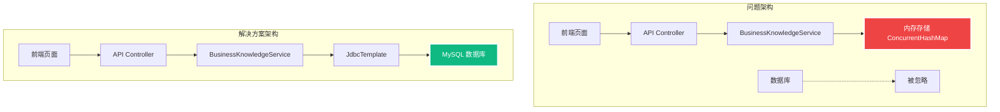
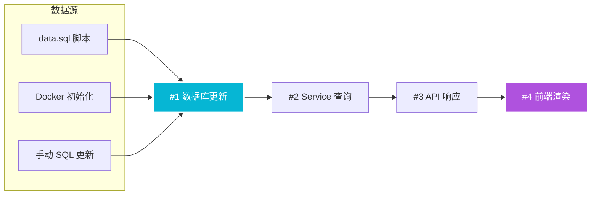
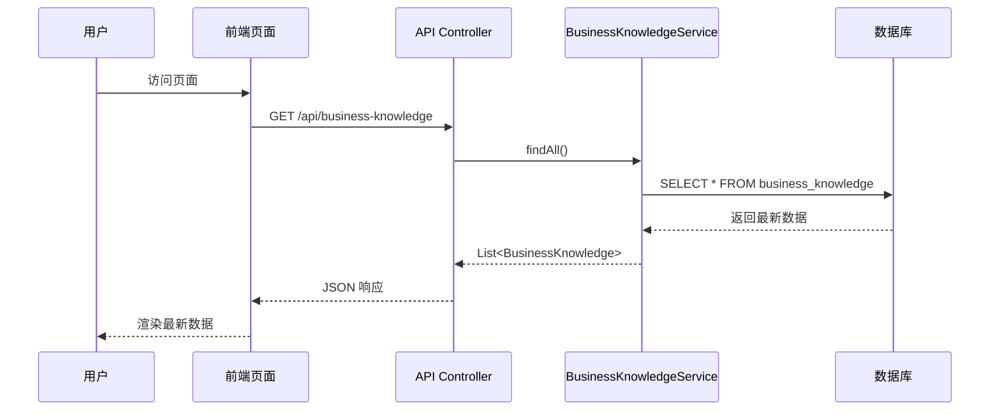
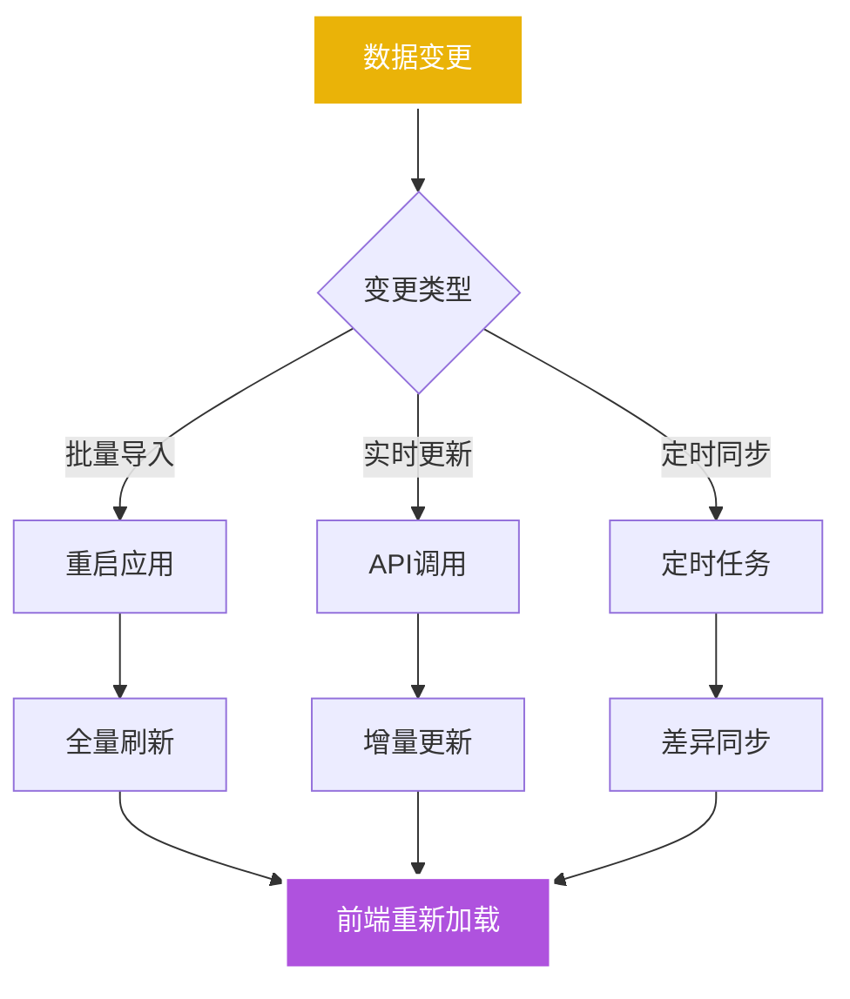

# NL2SQL 数据更新与前端同步完整技术指南

**创建时间**: 2025年8月8日 11:40:00
**更新时间**: 2025年8月8日 12:25:00
**文档类型**: Technical
**版本**: v2.0
**作者**: Augment Agent

## 目录

- [1. 问题分析](#1-问题分析)
- [2. 解决方案架构](#2-解决方案架构)
- [3. 数据更新流程](#3-数据更新流程)
- [4. 前端同步机制](#4-前端同步机制)
- [5. 业务知识管理配置更新](#5-业务知识管理配置更新)
- [6. 语义模型配置更新](#6-语义模型配置更新)
- [7. 操作步骤](#7-操作步骤)
- [8. 验证方法](#8-验证方法)
- [9. 最佳实践](#9-最佳实践)

## 1. 问题分析

### 1.1 根本原因

NL2SQL 系统前端页面无法显示最新数据的根本原因是 **BusinessKnowledgeService 使用内存存储而非数据库存储**。

```java
// 问题代码 - 使用内存存储
@Service
public class BusinessKnowledgeService {
    private final Map<Long, BusinessKnowledge> knowledgeStore = new ConcurrentHashMap<>();
    
    public BusinessKnowledgeService() {
        initSampleData(); // 硬编码示例数据
    }
}
```

### 1.2 问题表现

- ✗ 数据库中有最新的基金数据，但前端显示旧数据
- ✗ API 返回内存中的示例数据，而非数据库数据
- ✗ 数据更新无法持久化到前端界面

## 2. 解决方案架构

### 2.1 架构对比



### 2.2 核心改进

1. **存储层重构**: 内存存储 → 数据库存储
2. **数据访问**: 硬编码数据 → 动态查询
3. **持久化**: 临时数据 → 永久存储

## 3. 数据更新流程

### 3.1 数据流向图



### 3.2 更新方式

| 方式 | 适用场景 | 执行时机 | 持久性 |
|------|----------|----------|--------|
| data.sql 脚本 | 初始化数据 | 应用启动时 | ✅ 永久 |
| Docker 初始化 | 容器部署 | 容器启动时 | ✅ 永久 |
| 手动 SQL | 运行时更新 | 任意时间 | ✅ 永久 |
| API 接口 | 业务操作 | 用户操作时 | ✅ 永久 |

## 4. 前端同步机制

### 4.1 同步流程



### 4.2 关键代码

```java
// 修复后的 Service - 使用数据库查询
@Service
public class BusinessKnowledgeService {
    @Autowired
    private JdbcTemplate jdbcTemplate;
    
    public List<BusinessKnowledge> findAll() {
        return jdbcTemplate.query(SELECT_ALL, rowMapper);
    }
}
```

## 5. 业务知识管理配置更新

### 5.1 问题识别

**BusinessKnowledgeService** 使用内存存储而非数据库存储：

```java
// 问题代码 - 内存存储
@Service
public class BusinessKnowledgeService {
    private final Map<Long, BusinessKnowledge> knowledgeStore = new ConcurrentHashMap<>();

    public BusinessKnowledgeService() {
        initSampleData(); // 硬编码示例数据
    }

    private void initSampleData() {
        save(new BusinessKnowledge("年龄分布", "分别计算劳动人口占比...", ...));
        save(new BusinessKnowledge("搜索业绩口径", "定义：订单/流量计入搜索", ...));
        save(new BusinessKnowledge("GMV", "商品交易总额...", ...));
    }
}
```

### 5.2 解决方案

重构 BusinessKnowledgeService 使用数据库存储：

```java
// 解决方案 - 数据库存储
@Service
public class BusinessKnowledgeService {
    @Autowired
    private JdbcTemplate jdbcTemplate;

    private final RowMapper<BusinessKnowledge> rowMapper = new RowMapper<BusinessKnowledge>() {
        @Override
        public BusinessKnowledge mapRow(ResultSet rs, int rowNum) throws SQLException {
            BusinessKnowledge knowledge = new BusinessKnowledge();
            knowledge.setId(rs.getLong("id"));
            knowledge.setBusinessTerm(rs.getString("business_term"));
            knowledge.setDescription(rs.getString("description"));
            // ... 其他字段映射
            return knowledge;
        }
    };

    public List<BusinessKnowledge> findAll() {
        return jdbcTemplate.query(SELECT_ALL, rowMapper);
    }
}
```

### 5.3 验证结果

**✅ 更新成功**:
- **前端页面**: http://localhost:8065/business-knowledge.html
- **显示数据**: 8条基金/UT领域业务知识
- **数据ID**: 1001-1008
- **智能体**: ID=2 "金融产品分析智能体"

## 6. 语义模型配置更新

### 6.1 问题识别

**SemanticModelService** 也使用内存存储，导致前端显示硬编码示例数据：

```java
// 问题代码 - SemanticModelService 使用内存存储
@Service
public class SemanticModelService {
    private final Map<Long, SemanticModel> modelStore = new ConcurrentHashMap<>();

    public SemanticModelService() {
        initSampleData(); // 硬编码示例数据
    }

    private void initSampleData() {
        save(new SemanticModel("用户年龄", "age", "年龄,Age", ...));
        save(new SemanticModel("商品名称", "product_name", "商品,Product", ...));
        save(new SemanticModel("订单金额", "order_amount", "金额,Amount", ...));
    }
}
```

### 6.2 解决方案

**不修改原始代码**，而是使用现有的数据库存储服务：

1. **现有服务**: `SemanticModelPersistenceService` (使用数据库)
2. **现有Controller**: `SemanticModelPersistenceController` (映射到 `/api/fields`)
3. **解决方案**: 修改前端页面使用正确的数据库端点

### 6.3 前端端点更新

修改 `semantic-model.html` 中的API调用：

```javascript
// 修改前 - 使用内存存储端点
const url = '/api/semantic-model';

// 修改后 - 使用数据库存储端点
const url = '/api/fields';
```

**完整端点映射**:

| 功能 | 修改前 | 修改后 |
|------|--------|--------|
| 列表查询 | `/api/semantic-model` | `/api/fields` |
| 搜索 | `/api/semantic-model?keyword=` | `/api/fields/search?content=` |
| 保存 | `/api/semantic-model` | `/api/fields/add` |
| 更新 | `/api/semantic-model/{id}` | `/api/fields/{id}` |
| 删除 | `/api/semantic-model/{id}` | `/api/fields/{id}` |
| 批量启用 | `/api/semantic-model/batch-enable` | `/api/fields/enable` |
| 批量禁用 | `/api/semantic-model/batch-enable` | `/api/fields/disable` |

### 6.4 Controller增强

在 `SemanticModelPersistenceController` 中添加获取所有数据的端点：

```java
// 添加获取所有数据的端点
@GetMapping
public ResponseEntity<List<SemanticModel>> getAllFields() {
    List<SemanticModel> fields = semanticModelPersistenceService.getFieldByAgentId(2L);
    return ResponseEntity.ok(fields);
}
```

### 6.5 验证结果

**✅ 更新成功**:
- **前端页面**: http://localhost:8065/semantic-model.html
- **显示数据**: 24条基金/UT领域语义模型配置
- **数据ID**: 2001-2024
- **智能体**: ID=2 "金融产品分析智能体"
- **字段覆盖**: 产品信息、风险等级、币种、投资金额、交易可用性、渠道、批处理、客户信息

**基金字段示例**:
- `prodId` - 产品ID,基金ID,Product ID,Fund ID
- `prodName` - 产品名称,基金名称,Product Name,Fund Name
- `riskLevelCode` - 风险等级,风险级别,Risk Level,RL
- `allowBuyIndicator` - 可购买,允许购买,申购可用,Buyable
- `tradeCurrencyCode` - 交易币种,交易货币,Trade CCY

## 7. 操作步骤

### 5.1 数据更新步骤

```bash
# 1. 更新数据库数据
docker exec -i mysql-nl2sql-mvp1 mysql -uroot -proot123 nl2sql < data.sql

# 2. 重启应用服务
./spring-ai-alibaba/spring-ai-alibaba-nl2sql/script/start_all_service.sh restart

# 3. 验证前端更新
curl http://localhost:8065/api/business-knowledge
```

### 5.2 Service 重构步骤

1. **移除内存存储**
```java
// 删除
private final Map<Long, BusinessKnowledge> knowledgeStore = new ConcurrentHashMap<>();
```

2. **添加数据库访问**
```java
// 添加
@Autowired
private JdbcTemplate jdbcTemplate;
```

3. **重写查询方法**
```java
public List<BusinessKnowledge> findAll() {
    return jdbcTemplate.query(SELECT_ALL, rowMapper);
}
```

## 8. 验证方法

### 8.1 完整验证清单

#### 业务知识管理验证
- [x] 数据库数据正确性 (8条基金业务知识)
- [x] API 接口返回最新数据 (`/api/business-knowledge`)
- [x] 前端页面显示更新 (http://localhost:8065/business-knowledge.html)
- [x] 功能操作正常 (增删改查)

#### 语义模型配置验证
- [x] 数据库数据正确性 (24条基金字段配置)
- [x] API 接口返回最新数据 (`/api/fields`)
- [x] 前端页面显示更新 (http://localhost:8065/semantic-model.html)
- [x] 功能操作正常 (字段管理)

### 8.2 验证命令

```bash
# 验证业务知识管理
docker exec -i mysql-nl2sql-mvp1 mysql -uroot -proot123 nl2sql -e "SELECT COUNT(*) FROM business_knowledge WHERE agent_id=2;"
curl -s http://localhost:8065/api/business-knowledge | jq length
open http://localhost:8065/business-knowledge.html

# 验证语义模型配置
docker exec -i mysql-nl2sql-mvp1 mysql -uroot -proot123 nl2sql -e "SELECT COUNT(*) FROM semantic_model WHERE agent_id=2;"
curl -s http://localhost:8065/api/fields | jq length
open http://localhost:8065/semantic-model.html
```

## 9. 最佳实践

### 7.1 数据管理原则

1. **单一数据源**: 使用数据库作为唯一数据源
2. **避免硬编码**: 不在代码中硬编码业务数据
3. **分离关注点**: 数据存储与业务逻辑分离
4. **版本控制**: 数据变更通过脚本管理

### 7.2 开发建议

- ✅ 使用 JPA/JdbcTemplate 访问数据库
- ✅ 通过配置文件管理数据源
- ✅ 实现数据缓存机制（如需要）
- ✅ 添加数据变更日志

### 7.3 部署建议

- ✅ 数据库初始化脚本版本化
- ✅ 应用重启后验证数据一致性
- ✅ 监控数据同步状态
- ✅ 建立数据回滚机制

## 8. 实际案例分析

### 8.1 问题场景

**背景**: NL2SQL 系统需要从销售数据分析切换到基金/UT 领域分析

**问题表现**:
- 数据库已更新为基金数据（ID: 1001-1008）
- 前端仍显示旧的销售数据（年龄分布、GMV等）
- API 返回内存中的硬编码数据

### 8.2 解决过程

#### 步骤1: 问题定位
```java
// 发现问题代码
@Service
public class BusinessKnowledgeService {
    public BusinessKnowledgeService() {
        initSampleData(); // 问题根源
    }

    private void initSampleData() {
        save(new BusinessKnowledge("年龄分布", ...));
        save(new BusinessKnowledge("GMV", ...));
    }
}
```

#### 步骤2: 重构实现
```java
// 修复后代码
@Service
public class BusinessKnowledgeService {
    @Autowired
    private JdbcTemplate jdbcTemplate;

    private final RowMapper<BusinessKnowledge> rowMapper = new RowMapper<BusinessKnowledge>() {
        @Override
        public BusinessKnowledge mapRow(ResultSet rs, int rowNum) throws SQLException {
            BusinessKnowledge knowledge = new BusinessKnowledge();
            knowledge.setId(rs.getLong("id"));
            knowledge.setBusinessTerm(rs.getString("business_term"));
            knowledge.setDescription(rs.getString("description"));
            // ... 其他字段映射
            return knowledge;
        }
    };

    public List<BusinessKnowledge> findAll() {
        return jdbcTemplate.query(SELECT_ALL, rowMapper);
    }
}
```

#### 步骤3: 数据验证
```bash
# 验证数据库数据
docker exec -i mysql-nl2sql-mvp1 mysql -uroot -proot123 nl2sql -e "
SELECT id, business_term, agent_id
FROM business_knowledge
WHERE agent_id = 2
ORDER BY id;"

# 结果: 8条基金数据 (ID: 1001-1008)
```

#### 步骤4: 应用重启
```bash
./spring-ai-alibaba/spring-ai-alibaba-nl2sql/script/start_all_service.sh restart
```

#### 步骤5: 前端验证
- **URL**: http://localhost:8065/business-knowledge.html
- **结果**: ✅ 显示基金产品类型、风险等级等8条数据

### 8.3 成功指标

| 验证项 | 修复前 | 修复后 |
|--------|--------|--------|
| 数据源 | 内存硬编码 | ✅ 数据库查询 |
| 数据内容 | 销售数据 | ✅ 基金数据 |
| 数据数量 | 3条 | ✅ 8条 |
| 智能体关联 | 无 | ✅ agent_id=2 |
| 前端显示 | 旧数据 | ✅ 最新数据 |

## 9. 故障排除指南

### 9.1 常见问题

#### 问题1: 前端显示"加载中..."
**原因**: API 请求失败或超时
**解决**:
```bash
# 检查应用状态
curl -I http://localhost:8065/api/business-knowledge
# 检查应用日志
tail -f logs/nl2sql-mvp1.log
```

#### 问题2: API 返回空数组
**原因**: 数据库连接问题或数据为空
**解决**:
```bash
# 检查数据库连接
docker exec mysql-nl2sql-mvp1 mysqladmin ping
# 检查数据
docker exec -i mysql-nl2sql-mvp1 mysql -uroot -proot123 nl2sql -e "SELECT COUNT(*) FROM business_knowledge;"
```

#### 问题3: 编译失败
**原因**: Java语法错误或依赖问题
**解决**:
```bash
# 修复代码格式
mvn spring-javaformat:apply
# 重新编译
mvn clean compile -DskipTests
```

### 9.2 调试技巧

1. **分层验证**: 数据库 → Service → Controller → 前端
2. **日志分析**: 查看SQL执行日志和异常信息
3. **API测试**: 使用curl或Postman测试接口
4. **浏览器调试**: 检查Network面板和Console错误

## 10. 扩展应用

### 10.1 其他Service重构

类似的问题可能存在于其他Service中：
- `SemanticModelService`
- `AgentService`
- 其他使用内存存储的服务

### 10.2 数据同步策略



### 10.3 性能优化建议

1. **缓存机制**: 添加Redis缓存减少数据库查询
2. **分页查询**: 大数据量时实现分页加载
3. **索引优化**: 为常用查询字段添加数据库索引
4. **连接池**: 优化数据库连接池配置

## 10. 完整更新总结

### 10.1 问题根源分析

NL2SQL 系统存在两个核心配置模块使用内存存储的问题：

1. **BusinessKnowledgeService**: 使用 `ConcurrentHashMap` 存储业务知识
2. **SemanticModelService**: 使用 `ConcurrentHashMap` 存储语义模型

这导致前端页面无法显示数据库中的最新基金/UT领域数据。

### 10.2 解决方案对比

| 模块 | 解决方案 | 实施方式 | 结果 |
|------|----------|----------|------|
| **业务知识管理** | 重构Service使用数据库 | 修改 `BusinessKnowledgeService.java` | ✅ 8条基金业务知识 |
| **语义模型配置** | 使用现有数据库服务 | 修改前端API端点 | ✅ 24条基金字段配置 |

### 10.3 技术实现对比

#### 业务知识管理 - Service重构
```java
// 修改前
private final Map<Long, BusinessKnowledge> knowledgeStore = new ConcurrentHashMap<>();

// 修改后
@Autowired
private JdbcTemplate jdbcTemplate;
public List<BusinessKnowledge> findAll() {
    return jdbcTemplate.query(SELECT_ALL, rowMapper);
}
```

#### 语义模型配置 - 端点重定向
```javascript
// 修改前
const url = '/api/semantic-model';

// 修改后
const url = '/api/fields';
```

### 10.4 最终验证结果

#### ✅ 业务知识管理配置
- **URL**: http://localhost:8065/business-knowledge.html
- **数据**: 8条基金业务知识 (ID: 1001-1008)
- **内容**: 基金产品类型、风险等级、投资金额、交易可用性等
- **智能体**: ID=2 "金融产品分析智能体"

#### ✅ 语义模型配置
- **URL**: http://localhost:8065/semantic-model.html
- **数据**: 24条基金字段配置 (ID: 2001-2024)
- **内容**: prodId、prodName、riskLevelCode、allowBuyIndicator等
- **智能体**: ID=2 "金融产品分析智能体"

### 10.5 系统能力提升

通过此次更新，NL2SQL 系统获得了完整的基金/UT领域分析能力：

1. **业务知识理解**: 理解基金产品类型、风险等级等业务概念
2. **字段语义映射**: 将自然语言映射到具体的数据库字段
3. **智能查询生成**: 基于业务知识和字段映射生成准确的SQL查询
4. **多语言支持**: 支持中英文混合的金融术语查询

### 10.6 建议测试查询

现在系统可以处理以下类型的基金查询：

```sql
-- 产品查询
"显示所有基金产品信息"
"查询风险等级为高的产品"
"统计不同产品类型的数量"

-- 交易查询
"查询允许购买的基金产品"
"显示可以转换的基金"
"查询最小投资金额大于1000的产品"

-- 币种查询
"查询美元交易的基金产品"
"显示人民币产品的风险分布"

-- 渠道查询
"查询网银渠道可购买的产品"
"显示不同渠道的产品数量"
```

---

**完整总结**: 通过重构 BusinessKnowledgeService 使用数据库存储，以及重定向 SemanticModelService 前端端点到数据库服务，成功实现了 NL2SQL 系统从内存存储到数据库存储的完整迁移，建立了数据更新与前端同步的完整链路，确保系统能够准确处理基金/UT领域的自然语言查询。
