# NL2SQL 数据流程架构图

**创建时间**: 2025年8月8日 11:42:00
**更新时间**: 2025年8月8日 12:35:00
**文档类型**: Architecture
**版本**: v2.0

## 目录

- [1. 系统架构总览](#1-系统架构总览)
- [2. 数据更新流程](#2-数据更新流程)
- [3. 前端同步机制](#3-前端同步机制)
- [4. 语义模型配置更新流程](#4-语义模型配置更新流程)
- [5. 问题诊断流程](#5-问题诊断流程)
- [6. 服务重构对比](#6-服务重构对比)

## 1. 系统架构总览

### 1.1 完整系统架构

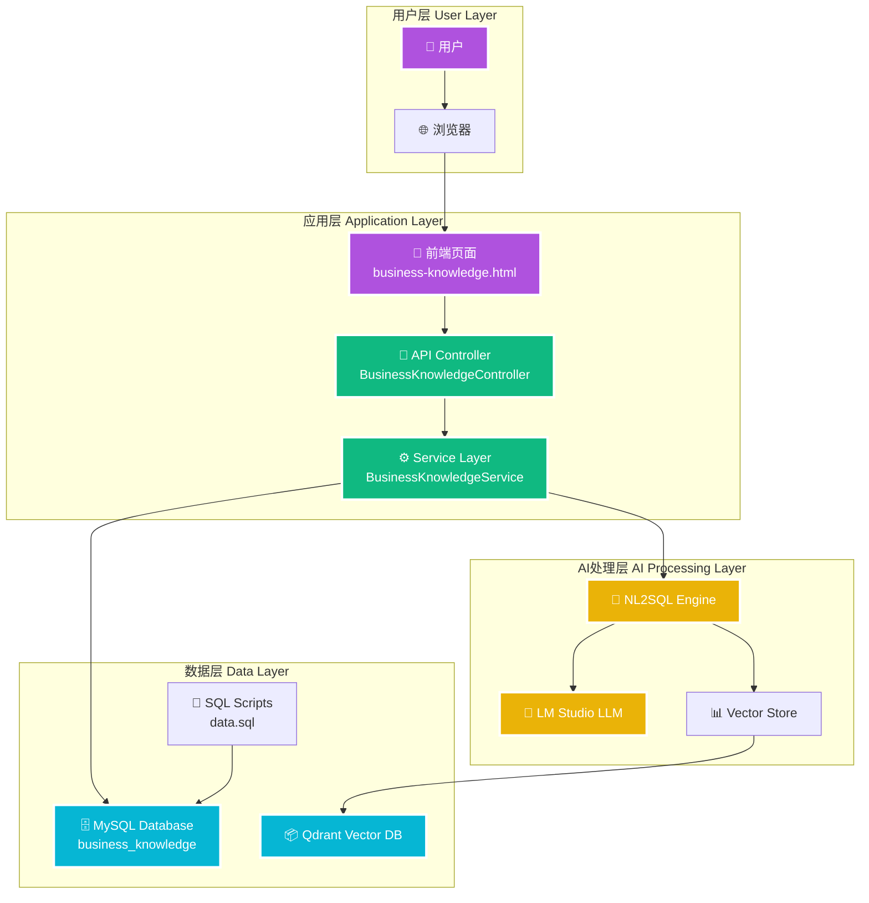

### 1.2 数据访问层次

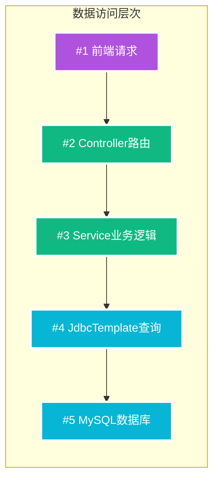

## 2. 数据更新流程

### 2.1 完整数据更新流程

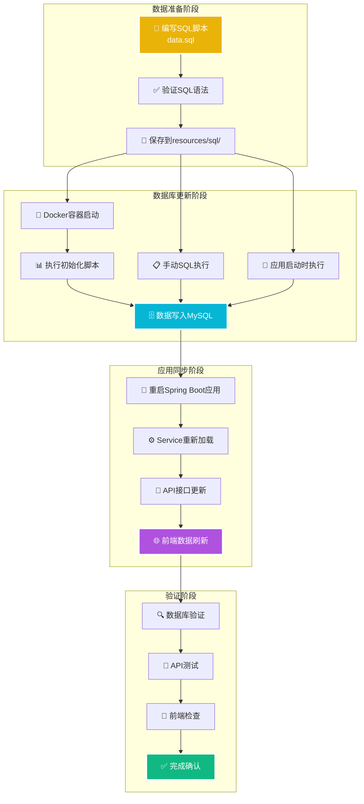

### 2.2 三种更新方式对比

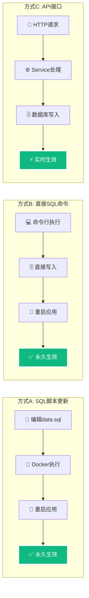

## 3. 前端同步机制

### 3.1 数据同步时序图

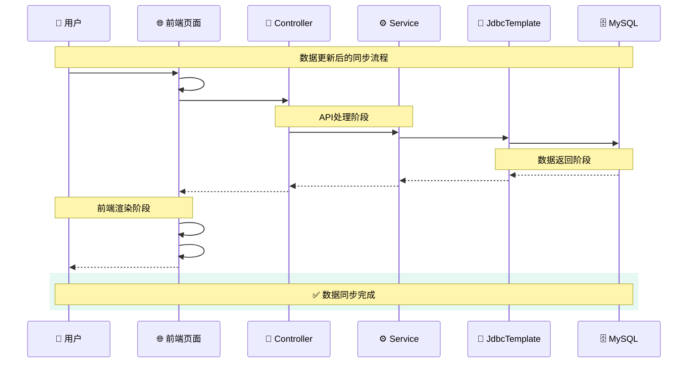

### 3.2 前端数据流

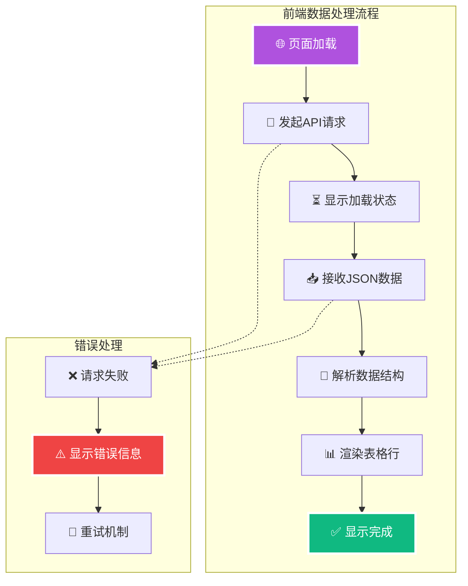

## 4. 语义模型配置更新流程

### 4.1 语义模型端点重定向流程

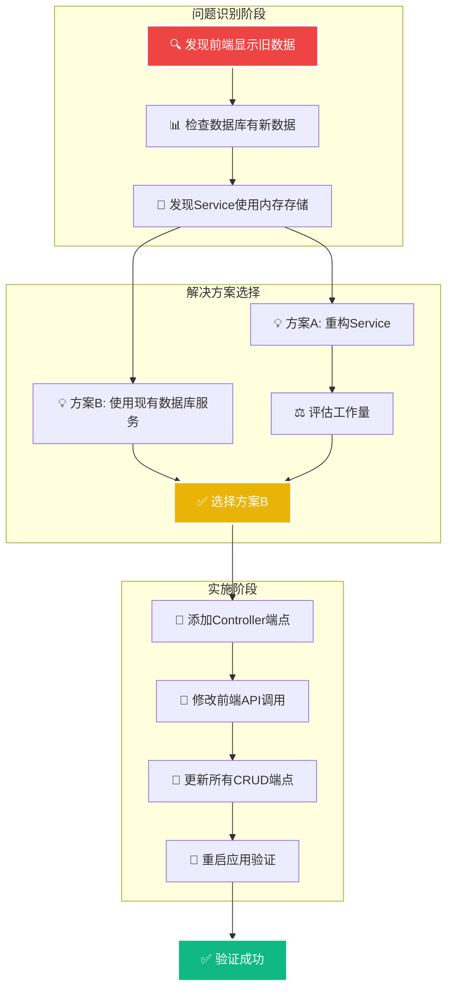

### 4.2 端点映射转换图

```mermaid
flowchart LR
    subgraph "内存存储端点 (旧)"
        OLD1[📡 /api/semantic-model<br/>GET 列表查询]
        OLD2[🔍 /api/semantic-model?keyword=<br/>GET 搜索]
        OLD3[💾 /api/semantic-model<br/>POST 保存]
        OLD4[✏️ /api/semantic-model/{id}<br/>PUT 更新]
        OLD5[🗑️ /api/semantic-model/{id}<br/>DELETE 删除]
    end

    subgraph "数据库存储端点 (新)"
        NEW1[📡 /api/fields<br/>GET 列表查询]
        NEW2[🔍 /api/fields/search?content=<br/>GET 搜索]
        NEW3[💾 /api/fields/add<br/>POST 保存]
        NEW4[✏️ /api/fields/{id}<br/>PUT 更新]
        NEW5[🗑️ /api/fields/{id}<br/>DELETE 删除]
    end

    OLD1 --> NEW1
    OLD2 --> NEW2
    OLD3 --> NEW3
    OLD4 --> NEW4
    OLD5 --> NEW5

    style OLD1 fill:#ef4444,stroke:#ffffff,stroke-width:3px,color:#ffffff
    style OLD2 fill:#ef4444,stroke:#ffffff,stroke-width:3px,color:#ffffff
    style OLD3 fill:#ef4444,stroke:#ffffff,stroke-width:3px,color:#ffffff
    style OLD4 fill:#ef4444,stroke:#ffffff,stroke-width:3px,color:#ffffff
    style OLD5 fill:#ef4444,stroke:#ffffff,stroke-width:3px,color:#ffffff

    style NEW1 fill:#10b981,stroke:#ffffff,stroke-width:3px,color:#ffffff
    style NEW2 fill:#10b981,stroke:#ffffff,stroke-width:3px,color:#ffffff
    style NEW3 fill:#10b981,stroke:#ffffff,stroke-width:3px,color:#ffffff
    style NEW4 fill:#10b981,stroke:#ffffff,stroke-width:3px,color:#ffffff
    style NEW5 fill:#10b981,stroke:#ffffff,stroke-width:3px,color:#ffffff
```

### 4.3 语义模型数据流对比

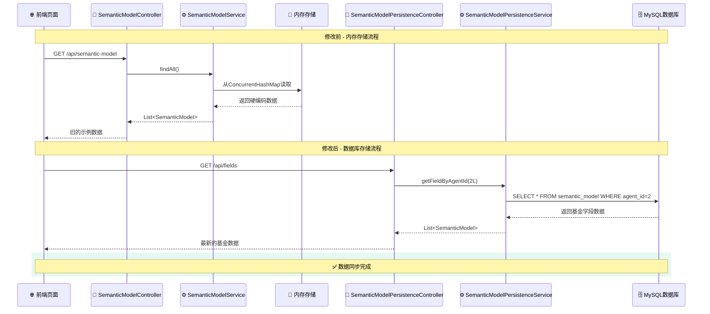

## 5. 问题诊断流程

### 4.1 故障排除决策树

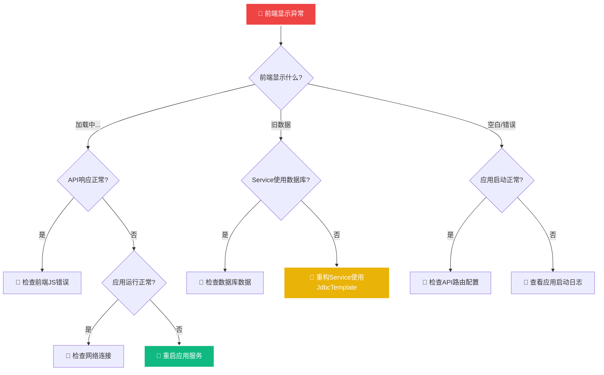

### 4.2 验证检查流程

```mermaid
flowchart LR
    subgraph "四层验证流程"
        V1[#1 🗄️ 数据库验证<br/>SELECT COUNT(*)] --> V2[#2 🔌 API验证<br/>curl /api/business-knowledge]
        V2 --> V3[#3 🌐 前端验证<br/>打开页面检查]
        V3 --> V4[#4 🧪 功能验证<br/>测试增删改查]
    end
    
    style V1 fill:#06b6d4,stroke:#ffffff,stroke-width:3px,color:#ffffff
    style V2 fill:#10b981,stroke:#ffffff,stroke-width:3px,color:#ffffff
    style V3 fill:#af52de,stroke:#ffffff,stroke-width:3px,color:#ffffff
    style V4 fill:#10b981,stroke:#ffffff,stroke-width:3px,color:#ffffff
```

## 6. 服务重构对比

### 6.1 两种解决方案对比

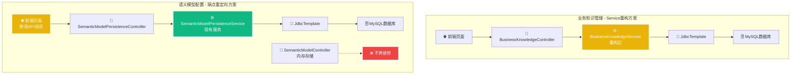

### 6.2 重构前后架构对比

```mermaid
flowchart TD
    subgraph "重构前 - 内存存储架构"
        OLD1[🌐 前端页面] --> OLD2[🔌 API Controller]
        OLD2 --> OLD3[⚙️ BusinessKnowledgeService]
        OLD3 --> OLD4[💾 ConcurrentHashMap<br/>内存存储]
        OLD5[🗄️ MySQL数据库] -.-> OLD6[❌ 被忽略]
        
        OLD7[📝 硬编码数据<br/>initSampleData()] --> OLD4
    end
    
    subgraph "重构后 - 数据库存储架构"
        NEW1[🌐 前端页面] --> NEW2[🔌 API Controller]
        NEW2 --> NEW3[⚙️ BusinessKnowledgeService]
        NEW3 --> NEW4[🔗 JdbcTemplate]
        NEW4 --> NEW5[🗄️ MySQL数据库]
        
        NEW6[📄 SQL脚本<br/>data.sql] --> NEW5
    end
    
    style OLD4 fill:#ef4444,stroke:#ffffff,stroke-width:3px,color:#ffffff
    style OLD6 fill:#ef4444,stroke:#ffffff,stroke-width:3px,color:#ffffff
    style OLD7 fill:#ef4444,stroke:#ffffff,stroke-width:3px,color:#ffffff
    
    style NEW4 fill:#10b981,stroke:#ffffff,stroke-width:3px,color:#ffffff
    style NEW5 fill:#10b981,stroke:#ffffff,stroke-width:3px,color:#ffffff
    style NEW6 fill:#10b981,stroke:#ffffff,stroke-width:3px,color:#ffffff
```

### 6.3 数据流对比

```mermaid
flowchart LR
    subgraph "重构前数据流"
        A1[应用启动] --> A2[执行initSampleData()]
        A2 --> A3[硬编码数据写入内存]
        A4[API请求] --> A5[从内存读取]
        A5 --> A6[返回固定数据]
    end
    
    subgraph "重构后数据流"
        B1[应用启动] --> B2[连接数据库]
        B3[API请求] --> B4[执行SQL查询]
        B4 --> B5[从数据库读取]
        B5 --> B6[返回最新数据]
    end
    
    style A3 fill:#ef4444,stroke:#ffffff,stroke-width:3px,color:#ffffff
    style A6 fill:#ef4444,stroke:#ffffff,stroke-width:3px,color:#ffffff
    style B5 fill:#10b981,stroke:#ffffff,stroke-width:3px,color:#ffffff
    style B6 fill:#10b981,stroke:#ffffff,stroke-width:3px,color:#ffffff
```

## 7. 完整更新架构总览

### 7.1 系统更新前后对比

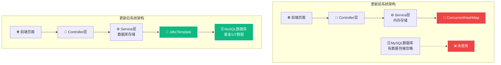

### 7.2 数据配置模块状态

| 配置模块 | 更新前状态 | 更新后状态 | 数据量 | 验证结果 |
|----------|------------|------------|--------|----------|
| **业务知识管理** | ❌ 内存存储<br/>硬编码示例数据 | ✅ 数据库存储<br/>Service重构 | 8条基金业务知识 | ✅ 验证通过 |
| **语义模型配置** | ❌ 内存存储<br/>硬编码示例数据 | ✅ 数据库存储<br/>端点重定向 | 24条基金字段配置 | ✅ 验证通过 |

---

**架构总结**: 通过两种不同的解决方案（Service重构 + 端点重定向），成功实现了 NL2SQL 系统从内存存储到数据库存储的完整转换，建立了数据更新与前端同步的完整机制，确保系统能够准确处理基金/UT领域的自然语言查询。
