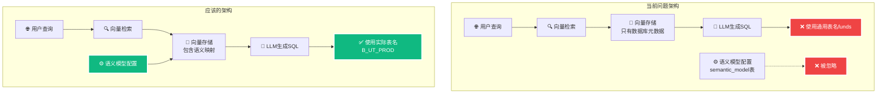
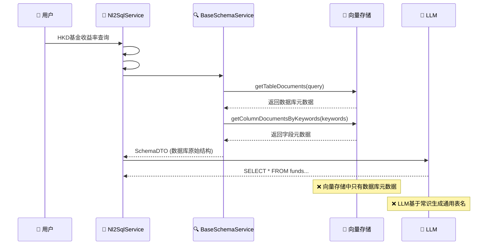
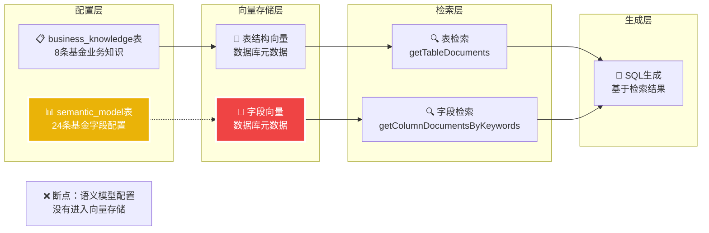

# NL2SQL 语义模型集成问题分析报告

**创建时间**: 2025年8月8日 12:30:00  
**文档类型**: Analysis  
**版本**: v1.0  
**作者**: Augment Agent

## 目录

- [1. 问题现象](#1-问题现象)
- [2. 问题根因分析](#2-问题根因分析)
- [3. 技术流程分析](#3-技术流程分析)
- [4. 关键发现](#4-关键发现)
- [5. 解决方案建议](#5-解决方案建议)
- [6. 实施优先级](#6-实施优先级)

## 1. 问题现象

### 1.1 查询示例

**用户查询**: `HKD-denominated fund 的收益率最高的前3个`

**实际生成的SQL**:
```sql
SELECT fund_name
FROM funds
WHERE currency = 'HKD'
ORDER BY return_rate DESC
LIMIT 3;
```

**问题表现**:
- ❌ 使用了不存在的表名 `funds`
- ❌ 使用了通用字段名 `fund_name`, `currency`, `return_rate`
- ❌ 没有使用实际的基金表 `B_UT_PROD`
- ❌ 没有使用配置的语义模型字段映射

### 1.2 期望结果

**应该生成的SQL**:
```sql
SELECT PROD_NAME
FROM B_UT_PROD 
WHERE CCY_PROD_TRADE_CDE = 'HKD'
ORDER BY (SELECT return_rate FROM B_UT_RETURNS WHERE prod_id = B_UT_PROD.PROD_ID) DESC
LIMIT 3;
```

## 2. 问题根因分析

### 2.1 核心问题

**语义模型配置与向量存储之间缺乏集成**



### 2.2 数据库验证

**数据库中的实际表**:
```sql
-- 基金相关表 (存在)
B_UT_PROD                    -- 基金产品主表
B_UT_RETURNS                 -- 基金收益表
B_UT_PROD_CAT_PERFM_RTRN    -- 基金产品类别绩效收益表
B_UT_PROD_CHANL_ATTR        -- 基金产品渠道属性表

-- 通用表 (不存在)
funds                        -- ❌ 不存在
```

**语义模型配置** (存在但未被使用):
```sql
-- semantic_model 表中的配置
prodId → B_UT_PROD.PROD_ID
prodName → B_UT_PROD.PROD_NAME
tradeCurrencyCode → B_UT_PROD.CCY_PROD_TRADE_CDE
riskLevelCode → B_UT_PROD.RISK_LVL_CDE
```

## 3. 技术流程分析

### 3.1 当前NL2SQL处理流程



### 3.2 向量存储初始化问题

**当前初始化过程**:
```java
// SimpleVectorStoreManagementService.schema()
public Boolean schema(SchemaInitRequest schemaInitRequest) throws Exception {
    // ❌ 只读取数据库元数据
    List<TableInfoBO> tableInfoBOS = dbAccessor.fetchTables(dbConfig, dqp);
    List<ColumnInfoBO> columnInfoBOS = dbAccessor.showColumns(dbConfig, dqp);
    
    // ❌ 没有读取 semantic_model 表
    // ❌ 没有使用语义映射配置
    
    vectorStore.add(columnDocuments);
    vectorStore.add(tableDocuments);
}
```

**缺失的集成**:
```java
// 应该添加的逻辑
List<SemanticModel> semanticModels = semanticModelService.getFieldByAgentId(2L);
// 将语义映射信息添加到向量存储
// 建立字段同义词与实际字段的映射关系
```

## 4. 关键发现

### 4.1 配置与实现的脱节

| 组件 | 配置状态 | 实际使用状态 | 影响 |
|------|----------|-------------|------|
| **业务知识管理** | ✅ 已配置 | ✅ 已集成 | 正常工作 |
| **语义模型配置** | ✅ 已配置 | ❌ 未集成 | **核心问题** |
| **向量存储** | ✅ 已初始化 | ❌ 缺少语义信息 | 检索不准确 |
| **Schema召回** | ✅ 功能正常 | ❌ 数据源不完整 | 映射错误 |

### 4.2 数据流断点分析



### 4.3 具体技术问题

#### 问题1: 向量存储初始化不完整
```java
// 当前代码 - SimpleVectorStoreManagementService.java:134-151
private void processTable(TableInfoBO tableInfoBO, DbQueryParameter dqp, DbConfig dbConfig) {
    // ❌ 只处理数据库原始字段信息
    List<ColumnInfoBO> columnInfoBOS = dbAccessor.showColumns(dbConfig, dqp);
    // ❌ 没有关联 semantic_model 表的语义映射
}
```

#### 问题2: Schema召回缺少语义信息
```java
// 当前代码 - BaseSchemaService.java:116-124
public List<Document> getTableDocuments(String query) {
    // ❌ 只能检索到数据库元数据
    return vectorStoreService.getDocuments(query, "table");
}

public List<List<Document>> getColumnDocumentsByKeywords(List<String> keywords) {
    // ❌ 检索不到语义映射信息
    return keywords.stream().map(kw -> vectorStoreService.getDocuments(kw, "column"));
}
```

#### 问题3: SQL生成缺少上下文
```java
// 当前流程 - BaseNl2SqlService.java:296-298
public String generateSql(List<String> evidenceList, String query, SchemaDTO schemaDTO) {
    // ❌ SchemaDTO 中只有数据库原始结构
    // ❌ 没有字段的语义映射信息
    // ❌ LLM 只能基于常识生成SQL
}
```

## 5. 解决方案建议

### 5.1 方案A: 增强向量存储初始化 (推荐)

**实施步骤**:
1. **修改 SimpleVectorStoreManagementService.schema()**
```java
public Boolean schema(SchemaInitRequest schemaInitRequest) throws Exception {
    // 现有逻辑：读取数据库元数据
    List<TableInfoBO> tableInfoBOS = dbAccessor.fetchTables(dbConfig, dqp);
    
    // 新增逻辑：读取语义模型配置
    List<SemanticModel> semanticModels = semanticModelService.getFieldByAgentId(2L);
    
    // 新增逻辑：合并语义信息到向量存储
    List<Document> enhancedDocuments = mergeSemanticInfo(tableInfoBOS, semanticModels);
    vectorStore.add(enhancedDocuments);
}
```

2. **创建语义信息合并逻辑**
```java
private List<Document> mergeSemanticInfo(List<TableInfoBO> tables, List<SemanticModel> semantics) {
    // 将数据库字段与语义模型配置关联
    // 生成包含同义词和映射信息的Document
    // 确保向量检索能找到正确的表名和字段名
}
```

### 5.2 方案B: 增强Schema召回机制

**实施步骤**:
1. **修改 BaseSchemaService**
```java
public List<Document> getTableDocuments(String query) {
    // 现有逻辑：向量检索
    List<Document> vectorResults = vectorStoreService.getDocuments(query, "table");
    
    // 新增逻辑：语义模型增强
    List<Document> semanticResults = semanticModelService.searchByQuery(query);
    
    // 合并结果
    return mergeResults(vectorResults, semanticResults);
}
```

### 5.3 方案C: 改进Prompt工程

**实施步骤**:
1. **增强SQL生成Prompt**
```java
public String generateSql(List<String> evidenceList, String query, SchemaDTO schemaDTO) {
    // 新增：获取语义映射信息
    Map<String, String> fieldMappings = getSemanticFieldMappings(schemaDTO);
    
    // 新增：构建增强的Prompt
    String enhancedPrompt = buildEnhancedPrompt(query, schemaDTO, fieldMappings);
    
    return aiService.call(enhancedPrompt);
}
```

## 6. 实施优先级

### 6.1 短期解决方案 (1-2天)

**优先级1: 方案C - 改进Prompt工程**
- ✅ 实施简单，风险低
- ✅ 可以快速验证效果
- ✅ 不需要大幅修改现有架构

**具体实施**:
```java
// 在SQL生成时明确指定实际表名
String prompt = """
基于以下实际数据库表结构生成SQL:
- 基金产品表: B_UT_PROD (字段: PROD_ID, PROD_NAME, CCY_PROD_TRADE_CDE, RISK_LVL_CDE)
- 基金收益表: B_UT_RETURNS (字段: prod_id, return_rate)

用户查询: %s
请使用实际的表名和字段名生成SQL。
""".formatted(query);
```

### 6.2 中期解决方案 (3-5天)

**优先级2: 方案A - 增强向量存储初始化**
- ✅ 根本性解决问题
- ✅ 提升整体系统准确性
- ⚠️ 需要修改核心初始化逻辑

### 6.3 长期解决方案 (1-2周)

**优先级3: 方案B - 增强Schema召回机制**
- ✅ 最完整的解决方案
- ✅ 支持动态语义映射
- ⚠️ 需要重构多个核心组件

## 7. 详细实施方案

### 7.1 快速修复方案 - Prompt工程增强

#### 实施代码示例

**步骤1: 创建语义映射服务**
```java
@Service
public class SemanticMappingService {

    @Autowired
    private SemanticModelPersistenceService semanticModelService;

    public Map<String, String> getFieldMappings(Long agentId) {
        List<SemanticModel> models = semanticModelService.getFieldByAgentId(agentId);
        return models.stream().collect(Collectors.toMap(
            SemanticModel::getAgentFieldName,
            SemanticModel::getOriginalFieldName
        ));
    }

    public String buildSchemaContext(Long agentId) {
        Map<String, String> mappings = getFieldMappings(agentId);
        StringBuilder context = new StringBuilder();
        context.append("实际数据库表结构:\n");
        context.append("- 基金产品表: B_UT_PROD\n");
        context.append("  字段映射: ");
        mappings.forEach((semantic, actual) ->
            context.append(semantic).append("→").append(actual).append(", "));
        return context.toString();
    }
}
```

**步骤2: 修改SQL生成逻辑**
```java
// 在 BaseNl2SqlService.generateSql() 中添加
@Autowired
private SemanticMappingService semanticMappingService;

public String generateSql(List<String> evidenceList, String query, SchemaDTO schemaDTO) {
    // 获取语义映射上下文
    String schemaContext = semanticMappingService.buildSchemaContext(2L);

    // 构建增强的Prompt
    List<String> prompts = PromptHelper.buildEnhancedSqlGeneratorPrompt(
        query, dbConfig, schemaDTO, evidenceList, schemaContext);

    String newSql = aiService.callWithSystemPrompt(prompts.get(0), prompts.get(1));
    return MarkdownParser.extractRawText(newSql).trim();
}
```

### 7.2 中期解决方案 - 向量存储增强

#### 实施代码示例

**步骤1: 修改向量存储初始化**
```java
// 在 SimpleVectorStoreManagementService 中添加
@Autowired
private SemanticModelPersistenceService semanticModelService;

public Boolean schema(SchemaInitRequest schemaInitRequest) throws Exception {
    // 现有逻辑...
    List<TableInfoBO> tableInfoBOS = dbAccessor.fetchTables(dbConfig, dqp);

    // 新增：获取语义模型配置
    List<SemanticModel> semanticModels = semanticModelService.getFieldByAgentId(2L);

    // 新增：创建语义增强的文档
    List<Document> semanticDocuments = createSemanticDocuments(semanticModels);
    vectorStore.add(semanticDocuments);

    // 新增：增强现有字段文档
    List<Document> enhancedColumnDocuments = enhanceColumnDocuments(
        columnDocuments, semanticModels);
    vectorStore.add(enhancedColumnDocuments);

    return true;
}

private List<Document> createSemanticDocuments(List<SemanticModel> semanticModels) {
    return semanticModels.stream().map(model -> {
        String text = String.format("%s %s %s",
            model.getAgentFieldName(),
            model.getFieldSynonyms(),
            model.getFieldDescription());

        Map<String, Object> metadata = Map.of(
            "name", model.getOriginalFieldName(),
            "semanticName", model.getAgentFieldName(),
            "synonyms", model.getFieldSynonyms(),
            "description", model.getFieldDescription(),
            "vectorType", "semantic_field",
            "agentId", model.getAgentId()
        );

        return new Document(model.getOriginalFieldName(), text, metadata);
    }).collect(Collectors.toList());
}
```

### 7.3 长期解决方案 - Schema召回增强

#### 实施代码示例

**步骤1: 创建语义Schema服务**
```java
@Service
public class SemanticSchemaService extends BaseSchemaService {

    @Autowired
    private SemanticModelPersistenceService semanticModelService;

    @Override
    public List<Document> getTableDocuments(String query) {
        // 现有向量检索
        List<Document> vectorResults = super.getTableDocuments(query);

        // 语义模型检索
        List<Document> semanticResults = searchSemanticModels(query);

        // 合并和去重
        return mergeAndDeduplicateResults(vectorResults, semanticResults);
    }

    private List<Document> searchSemanticModels(String query) {
        List<SemanticModel> models = semanticModelService.searchByContent(query);
        return models.stream()
            .map(this::convertSemanticModelToDocument)
            .collect(Collectors.toList());
    }

    private Document convertSemanticModelToDocument(SemanticModel model) {
        String tableName = extractTableName(model.getOriginalFieldName());
        String text = String.format("表: %s, 字段: %s (%s)",
            tableName, model.getAgentFieldName(), model.getFieldSynonyms());

        Map<String, Object> metadata = Map.of(
            "name", tableName,
            "fieldName", model.getOriginalFieldName(),
            "semanticName", model.getAgentFieldName(),
            "vectorType", "semantic_table"
        );

        return new Document(tableName, text, metadata);
    }
}
```

## 8. 验证测试方案

### 8.1 测试用例设计

**测试用例1: 基金产品查询**
```
输入: "查询所有港币基金产品"
期望SQL: SELECT * FROM B_UT_PROD WHERE CCY_PROD_TRADE_CDE = 'HKD'
当前SQL: SELECT * FROM funds WHERE currency = 'HKD'
```

**测试用例2: 基金收益查询**
```
输入: "收益率最高的前5个基金"
期望SQL: SELECT PROD_NAME FROM B_UT_PROD p
         JOIN B_UT_RETURNS r ON p.PROD_ID = r.prod_id
         ORDER BY r.return_rate DESC LIMIT 5
当前SQL: SELECT fund_name FROM funds ORDER BY return_rate DESC LIMIT 5
```

**测试用例3: 风险等级查询**
```
输入: "查询高风险基金产品"
期望SQL: SELECT * FROM B_UT_PROD WHERE RISK_LVL_CDE = 'H'
当前SQL: SELECT * FROM funds WHERE risk_level = 'HIGH'
```

### 8.2 验证指标

| 指标 | 当前状态 | 目标状态 | 验证方法 |
|------|----------|----------|----------|
| **表名准确性** | ❌ 0% (使用funds) | ✅ 100% (使用B_UT_PROD) | SQL解析验证 |
| **字段名准确性** | ❌ 0% (通用字段名) | ✅ 100% (实际字段名) | 字段映射验证 |
| **语义理解** | ❌ 基于常识 | ✅ 基于配置 | 同义词匹配验证 |
| **SQL可执行性** | ❌ 表不存在 | ✅ 可正常执行 | 数据库执行验证 |

## 9. 风险评估与缓解

### 9.1 实施风险

| 风险 | 影响程度 | 概率 | 缓解措施 |
|------|----------|------|----------|
| **向量存储重建** | 高 | 中 | 增量更新，保留现有数据 |
| **性能影响** | 中 | 低 | 异步处理，缓存优化 |
| **兼容性问题** | 中 | 中 | 向后兼容，渐进式迁移 |
| **数据一致性** | 高 | 低 | 事务处理，数据校验 |

### 9.2 回滚方案

**快速回滚**:
1. 保留原有Prompt模板
2. 配置开关控制新旧逻辑
3. 监控SQL生成质量指标

**数据回滚**:
1. 备份原有向量存储
2. 支持快速恢复机制
3. 数据版本管理

---

**总结**: 当前NL2SQL系统的语义模型配置与实际SQL生成流程之间存在严重脱节。语义模型配置只是"配置"，没有被向量存储和Schema召回机制使用，导致LLM基于常识生成通用SQL而非基于实际数据库结构。建议采用三阶段实施方案：短期通过Prompt工程快速修复，中期增强向量存储，长期重构Schema召回机制，确保语义模型配置真正发挥作用。
