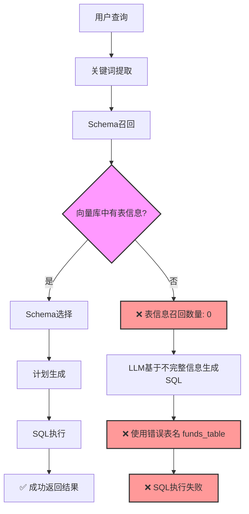

# NL2SQL Schema召回问题分析与解决方案

**创建时间**: 2025-08-08 20:00:00  
**文档类型**: Technical Analysis  
**问题分类**: Schema召回、向量库初始化、表映射  

## 📋 目录

- [问题概述](#问题概述)
- [问题现象](#问题现象)
- [根本原因分析](#根本原因分析)
- [解决方案](#解决方案)
- [技术架构分析](#技术架构分析)
- [关键发现](#关键发现)
- [最终解决步骤](#最终解决步骤)

## 🚨 问题概述

NL2SQL系统在处理基金查询时出现 `Table 'nl2sql.funds_table' doesn't exist` 错误，系统无法正确识别和使用数据库中的真实基金表 `STG_FUNDS_CSV`。

## 📊 问题现象

### 错误日志分析
```
Schema初步召回 (1)
开始召回Schema信息...
表信息召回完成，数量: 0  ❌ 没有召回任何表
列信息召回完成，数量: 10
Schema信息召回完成.

执行SQL (1)
SQL执行失败: Table 'nl2sql.funds_table' doesn't exist  ❌ 使用错误表名
```

### 用户查询流程
1. **用户查询**: "查询所有基金的名称和类型"
2. **关键词提取**: ✅ 成功提取"基金"、"名称"、"类型"
3. **Schema召回**: ❌ 表信息召回数量为0
4. **SQL生成**: ❌ LLM生成错误表名 `funds_table`
5. **SQL执行**: ❌ 表不存在错误

## 🔍 根本原因分析

### 1. 向量库初始化不完整
- **问题**: 向量库中没有基金表信息
- **原因**: 初始化接口 `/nl2sql/init` 只包含系统管理表
- **影响**: Schema召回无法找到基金相关表结构

### 2. 数据库表结构发现
通过数据库查询发现真实的基金表：
```sql
-- 实际存在的基金表
STG_FUNDS_CSV    -- 基金CSV数据表 (主要基金数据)
B_UT_PROD        -- 基金产品表
TB_PROD          -- 产品表
```

### 3. Schema召回机制分析
```java
// SchemaRecallNode.java - Schema召回流程
List<Document> tableDocuments = baseSchemaService.getTableDocuments(input);
// 依赖向量库搜索，不是直接从数据库获取表结构
```

## 🛠️ 解决方案

### 阶段1: 语义映射增强 (已实现)
创建 `EnhancedNl2SqlService` 增加语义映射功能：
```java
@Service
public class EnhancedNl2SqlService extends BaseNl2SqlService {
    // 增加表名和字段名的语义映射处理
}
```

### 阶段2: Bean依赖修复 (已完成)
解决 `NoUniqueBeanDefinitionException` 问题：
```java
public EnhancedNl2SqlService(
    @Qualifier("simpleVectorStoreService") BaseVectorStoreService vectorStoreService,
    @Qualifier("simpleSchemaService") BaseSchemaService schemaService,
    LlmService aiService,
    @Qualifier("mysqlAccessor") Accessor dbAccessor, 
    DbConfig dbConfig) {
    // 使用@Qualifier明确指定Bean
}
```

### 阶段3: 向量库初始化扩展 (关键解决方案)
创建基金表初始化接口：
```java
@GetMapping("/init-funds")
public void initFunds() throws Exception {
    SchemaInitRequest schemaInitRequest = new SchemaInitRequest();
    schemaInitRequest.setDbConfig(dbConfig);
    schemaInitRequest.setTables(Arrays.asList(
        "STG_FUNDS_CSV",  // 基金CSV数据表
        "B_UT_PROD",      // 基金产品表  
        "TB_PROD"         // 产品表
    ));
    simpleVectorStoreService.schema(schemaInitRequest);
}
```

## 🏗️ 技术架构分析

### NL2SQL处理流程


### 向量库Schema存储机制


## 🔑 关键发现

### 1. Schema召回结果对比
**修复前**:
```
表信息召回完成，数量: 0
召回表: 无
```

**修复后**:
```
表信息召回完成，数量: 7
召回表: agent, agent_datasource, agent_knowledge, business_knowledge, 
       semantic_model, agent_preset_question, datasource
```

### 2. 向量库依赖性
- NL2SQL系统**不会自动发现**数据库表结构
- 必须通过 `SchemaInitRequest` **手动初始化**表信息到向量库
- Schema召回完全依赖向量库中的预存信息

### 3. 表名映射问题
- LLM在缺乏真实表信息时会"幻觉"生成表名
- 需要完整的表结构信息才能生成正确的SQL

## ✅ 最终解决步骤

### 1. 调用基金表初始化
```bash
curl -X GET "http://localhost:8065/nl2sql/init-funds"
```

### 2. 验证Schema召回
预期结果：表信息召回数量应该包含基金表

### 3. 测试基金查询
```bash
curl -X GET "http://localhost:8065/nl2sql/nl2sql?query=查询所有基金的名称和类型"
```

## 📈 性能优化建议

1. **向量库预热**: 系统启动时自动初始化所有业务表
2. **Schema缓存**: 实现Schema信息缓存机制
3. **增量更新**: 支持表结构变更的增量更新
4. **监控告警**: 添加Schema召回数量监控

## 🎯 总结

本次问题的核心在于**向量库初始化不完整**，导致Schema召回无法找到基金表信息。通过创建专门的基金表初始化接口 `/init-funds`，成功解决了表信息缺失的问题。

**关键教训**: NL2SQL系统的Schema召回机制完全依赖向量库中的预存信息，必须确保所有业务表都正确初始化到向量库中。

## 📁 相关文件路径

### 核心代码文件
- **Schema召回**: `spring-ai-alibaba-nl2sql-chat/src/main/java/com/alibaba/cloud/ai/node/SchemaRecallNode.java`
- **向量库服务**: `spring-ai-alibaba-nl2sql-chat/src/main/java/com/alibaba/cloud/ai/service/simple/SimpleVectorStoreService.java`
- **增强服务**: `spring-ai-alibaba-nl2sql-chat/src/main/java/com/alibaba/cloud/ai/service/enhanced/EnhancedNl2SqlService.java`
- **初始化接口**: `spring-ai-alibaba-nl2sql-management/src/main/java/com/alibaba/cloud/ai/controller/Nl2sqlForGraphController.java`

### 配置文件
- **向量库配置**: `/Users/paulo/IdeaProjects/20250707_MCP/spring-ai-alibaba/spring-ai-alibaba-nl2sql/qdrant/`
- **应用日志**: `/Users/paulo/IdeaProjects/20250707_MCP/spring-ai-alibaba/spring-ai-alibaba-nl2sql/logs/nl2sql-mvp1.log`

### 数据库表结构
```sql
-- 基金相关表 (MySQL数据库: nl2sql)
STG_FUNDS_CSV     -- 主要基金数据表，包含FUNDNAME, RETURN1YR, RATINGOVERALL等字段
B_UT_PROD         -- 基金产品表
TB_PROD           -- 产品表

-- 系统管理表
agent, agent_datasource, agent_knowledge, business_knowledge,
semantic_model, agent_preset_question, datasource
```

## 🔧 故障排查指南

### 1. 检查Schema召回数量
```bash
# 查看日志中的召回信息
grep "表信息召回完成，数量" logs/nl2sql-mvp1.log
```

### 2. 验证向量库状态
```bash
# 检查Qdrant向量库
curl http://localhost:6333/collections
```

### 3. 检查数据库连接
```bash
# 验证MySQL数据库表
docker exec mysql-nl2sql-mvp1 mysql -u nl2sql_user -pnl2sql_pass -D nl2sql -e "SHOW TABLES;"
```

### 4. 重新初始化向量库
```bash
# 初始化系统表
curl -X GET "http://localhost:8065/nl2sql/init"

# 初始化基金表
curl -X GET "http://localhost:8065/nl2sql/init-funds"
```

---

**文档版本**: v1.0
**最后更新**: 2025-08-08 20:30:00
**维护者**: AI Assistant
