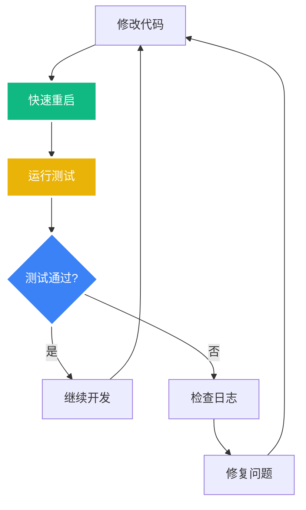

# NL2SQL启动脚本和测试步骤指南

**创建时间**: 2025-08-08 15:20:00  
**文档类型**: Guide  
**版本**: v1.0  
**作者**: Augment Agent

## 目录

- [概述](#概述)
- [启动脚本详解](#启动脚本详解)
- [测试脚本使用](#测试脚本使用)
- [开发工作流](#开发工作流)
- [故障排除](#故障排除)
- [最佳实践](#最佳实践)

## 概述

本文档详细介绍了NL2SQL项目的启动脚本和测试工具的使用方法，帮助开发者快速上手和高效开发。

### 核心脚本

1. **`start_all_service.sh`** - 主启动脚本
2. **`test_api.sh`** - API测试脚本
3. **`start_all_external_services.sh`** - 外部服务管理脚本

## 启动脚本详解

### 1. 主启动脚本 (`start_all_service.sh`)

#### 基本用法

```bash
# 进入项目目录
cd /Users/paulo/IdeaProjects/20250707_MCP/spring-ai-alibaba/spring-ai-alibaba-nl2sql

# 赋予执行权限
chmod +x script/start_all_service.sh

# 查看帮助
./script/start_all_service.sh help
```

#### 命令详解

| 命令 | 功能描述 | 使用场景 | 执行时间 |
|------|----------|----------|----------|
| `start` | 智能启动所有服务 | 首次启动、完整启动 | 2-3分钟 |
| `restart` | 重启所有服务 | 外部服务异常时 | 3-4分钟 |
| `quick` | 快速重启Spring Boot | 代码修改后 | 30-60秒 |
| `rebuild` | 强制重新编译 | 编译问题时 | 1-2分钟 |
| `stop` | 停止Spring Boot应用 | 停止服务 | 5-10秒 |
| `status` | 检查服务状态 | 状态检查 | 5-10秒 |

#### 详细步骤说明

##### 1.1 首次启动 (`start`)

```bash
./script/start_all_service.sh start
```

**执行流程**:
1. ✅ 创建必要目录 (`logs/`)
2. ✅ 检查Java环境 (Zulu JDK 17)
3. ✅ 智能启动外部服务 (跳过已运行的)
   - MySQL数据库 (端口3306)
   - Qdrant向量库 (端口6333)
   - LM Studio LLM服务 (端口1234)
4. ✅ 智能Maven编译
   - 检查chat模块是否需要编译
   - 检查management模块是否需要编译
   - 应用代码格式化
5. ✅ 启动Spring Boot应用 (端口8065)
6. ✅ 验证服务可用性
7. ✅ 显示服务信息

##### 1.2 快速重启 (`quick`) - 开发常用

```bash
./script/start_all_service.sh quick
```

**执行流程**:
1. ✅ 验证外部服务状态
2. ✅ 停止Spring Boot应用
3. ✅ 增量编译 (仅编译有变更的模块)
4. ✅ 启动Spring Boot应用
5. ✅ 显示服务信息

**优势**:
- 🚀 跳过外部服务检查 (节省时间)
- 🚀 增量编译 (只编译变更的代码)
- 🚀 快速反馈 (30-60秒完成)

##### 1.3 强制重编译 (`rebuild`)

```bash
./script/start_all_service.sh rebuild
```

**使用场景**:
- 编译缓存问题
- 依赖版本冲突
- 清理编译产物

### 2. 智能编译特性

#### 2.1 增量编译逻辑

```bash
# 检查是否需要重新编译
needs_rebuild() {
    # 1. 检查target目录是否存在
    # 2. 检查Java源码是否有更新
    # 3. 检查pom.xml是否有变更
}
```

#### 2.2 模块依赖管理


**编译顺序**:
1. **chat模块**: 先编译并安装到本地Maven仓库
2. **management模块**: 依赖chat模块，后编译

## 测试脚本使用

### 1. API测试脚本 (`test_api.sh`)

#### 基本用法

```bash
# 赋予执行权限
chmod +x script/test_api.sh

# 运行预定义测试用例
./script/test_api.sh test

# 交互式测试
./script/test_api.sh interactive

# 性能测试
./script/test_api.sh performance

# 检查服务状态
./script/test_api.sh check
```

#### 测试用例详解

##### 1.1 预定义测试用例 (`test`)

```bash
./script/test_api.sh test
```

**测试内容**:
1. **货币和基金类型查询**: "查询港币基金"
   - 验证表名映射: `funds` → `B_UT_PROD`
   - 验证字段映射: `currency` → `CCY_PROD_TRADE_CDE`

2. **美元货币查询**: "查找美元产品"
   - 验证货币代码映射: USD

3. **基础查询**: "显示所有基金信息"
   - 验证基本SQL生成

4. **风险等级查询**: "查询高风险基金"
   - 验证风险等级字段映射

5. **数值条件查询**: "找出收益率大于5%的产品"
   - 验证数值条件处理

**预期输出示例**:
```
[SUCCESS] ✅ 语义映射: 表名映射正常 (funds → B_UT_PROD)
[SUCCESS] ✅ 语义映射: 字段名映射正常 (currency → CCY_PROD_TRADE_CDE)
[INFO] 成功: 5/5
[SUCCESS] 所有测试用例通过！
```

##### 1.2 交互式测试 (`interactive`)

```bash
./script/test_api.sh interactive
```

**使用方法**:
```
请输入查询 > 查询人民币基金
请输入查询 > 找出低风险产品
请输入查询 > quit  # 退出
```

##### 1.3 性能测试 (`performance`)

```bash
./script/test_api.sh performance
```

**测试内容**:
- 执行5次相同查询
- 计算平均响应时间
- 评估系统性能

## 开发工作流

### 1. 日常开发流程



#### 步骤详解

1. **修改代码**
   ```bash
   # 编辑语义映射规则
   vim spring-ai-alibaba-nl2sql-chat/src/main/java/com/alibaba/cloud/ai/service/Nl2SqlService.java
   ```

2. **快速重启**
   ```bash
   ./script/start_all_service.sh quick
   ```

3. **运行测试**
   ```bash
   ./script/test_api.sh test
   ```

4. **检查日志** (如果测试失败)
   ```bash
   tail -f logs/nl2sql-mvp1.log
   ```

### 2. 首次环境搭建

```bash
# 1. 首次完整启动
./script/start_all_service.sh start

# 2. 验证所有功能
./script/test_api.sh test

# 3. 检查服务状态
./script/start_all_service.sh status
```

### 3. 故障恢复流程

```bash
# 1. 检查服务状态
./script/start_all_service.sh status

# 2. 如果外部服务异常
./script/start_all_service.sh restart

# 3. 如果编译问题
./script/start_all_service.sh rebuild

# 4. 验证修复结果
./script/test_api.sh test
```

## 故障排除

### 1. 常见问题及解决方案

#### 1.1 编译失败

**问题**: Maven编译失败
```
[ERROR] Chat模块编译失败，停止构建
```

**解决方案**:
```bash
# 1. 强制重新编译
./script/start_all_service.sh rebuild

# 2. 检查Java环境
java -version

# 3. 清理Maven缓存
rm -rf ~/.m2/repository/com/alibaba/cloud/ai/
```

#### 1.2 端口占用

**问题**: 端口8065被占用
```
[WARNING] 端口8065已被占用，尝试停止现有进程...
```

**解决方案**:
```bash
# 1. 停止现有服务
./script/start_all_service.sh stop

# 2. 检查端口占用
lsof -i :8065

# 3. 强制终止进程
kill -9 $(lsof -t -i :8065)
```

#### 1.3 外部服务异常

**问题**: MySQL或Qdrant服务异常
```
[ERROR] 外部服务状态异常
```

**解决方案**:
```bash
# 1. 重启外部服务
./script/start_all_external_services.sh restart

# 2. 检查Docker状态
docker ps

# 3. 查看容器日志
docker logs mysql-nl2sql-mvp1
docker logs qdrant-nl2sql-mvp1
```

### 2. 日志分析

#### 2.1 主要日志文件

```bash
# Spring Boot应用日志
tail -f logs/nl2sql-mvp1.log

# 外部服务日志
docker logs -f mysql-nl2sql-mvp1
docker logs -f qdrant-nl2sql-mvp1
```

#### 2.2 关键日志标识

```bash
# 语义增强功能日志
grep "🎯" logs/nl2sql-mvp1.log

# 错误日志
grep "ERROR" logs/nl2sql-mvp1.log

# SQL生成日志
grep "Enhanced SQL" logs/nl2sql-mvp1.log
```

## 最佳实践

### 1. 开发建议

1. **使用快速重启**: 代码修改后使用 `quick` 命令
2. **定期测试**: 每次修改后运行测试用例
3. **监控日志**: 保持日志窗口开启
4. **版本控制**: 重要修改前备份代码

### 2. 性能优化

1. **增量编译**: 利用智能编译特性
2. **服务复用**: 避免频繁重启外部服务
3. **缓存利用**: 保持Maven本地仓库

### 3. 安全注意事项

1. **端口管理**: 确保端口不冲突
2. **进程清理**: 及时清理僵尸进程
3. **资源监控**: 监控内存和CPU使用

## 总结

通过这套完整的启动脚本和测试工具，开发者可以：

- 🚀 **快速启动**: 30秒内完成代码修改后的重启
- 🔧 **智能编译**: 自动检测变更，只编译必要的模块
- 📊 **自动测试**: 一键验证语义增强功能
- 🛠️ **故障诊断**: 快速定位和解决问题

这大幅提升了开发效率和用户体验！
